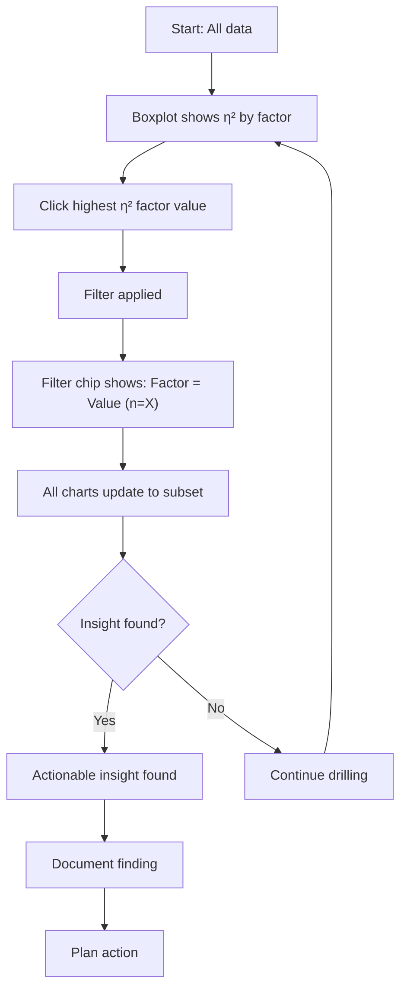

# Drill-Down Analysis Workflow

<!-- journey-phase: scout -->

VariScout's signature interaction pattern—progressive stratification using filter chips to isolate variation sources.

<div class="process-map">
  <div class="process-step">
    <div class="process-step__box process-step__box--input">
      <div class="process-step__title">Paste Data</div>
      <div class="process-step__detail">Ctrl+V in paste area</div>
    </div>
    <div class="process-step__clicks">2 actions</div>
  </div>
  <div class="process-arrow"></div>
  <div class="process-step">
    <div class="process-step__box process-step__box--navigate">
      <div class="process-step__title">Analyze</div>
      <div class="process-step__detail">Click "Analyze Data"</div>
    </div>
    <div class="process-step__clicks">1 click</div>
  </div>
  <div class="process-arrow"></div>
  <div class="process-step">
    <div class="process-step__box process-step__box--navigate">
      <div class="process-step__title">Map Columns</div>
      <div class="process-step__detail">Outcome + 2 factors + "Start"</div>
    </div>
    <div class="process-step__clicks">4 clicks</div>
  </div>
  <div class="process-arrow"></div>
  <div class="process-step">
    <div class="process-step__box process-step__box--read">
      <div class="process-step__title">Read ANOVA</div>
      <div class="process-step__detail">Check eta-squared under Boxplot</div>
    </div>
    <div class="process-step__clicks">0 clicks</div>
  </div>
  <div class="process-arrow"></div>
  <div class="process-step">
    <div class="process-step__box process-step__box--analyze">
      <div class="process-step__title">Filter Top Factor</div>
      <div class="process-step__detail">Click highest-eta bar</div>
    </div>
    <div class="process-step__clicks">1 click</div>
  </div>
  <div class="process-arrow"></div>
  <div class="process-step">
    <div class="process-step__box process-step__box--read">
      <div class="process-step__title">Read Filtered</div>
      <div class="process-step__detail">Variation explained? Cpk improved?</div>
    </div>
    <div class="process-step__clicks">0 clicks</div>
  </div>
  <div class="process-summary">
    <div class="process-summary__total">8 actions</div>
    <div class="process-summary__time">~5 min</div>
  </div>
</div>

_See [all process maps](process-maps.md) for PWA and Azure variants._

## Overview

Drill-down analysis lets you progressively filter data to isolate specific variation sources. Factor Intelligence (R²adj) guides which factors to explore. η² confirms each factor's effect size. The boxplot visual and StdDev comparison reveal which categories to investigate.

## The Drill-Down Pattern


```mermaid
flowchart TD
    A[Start: All data] --> B[Boxplot shows η² by factor]
    B --> C[Click highest η² factor value]
    C --> D[Filter applied]
    D --> E["Filter chip shows: Factor = Value (n=X)"]
    E --> F[All charts update to subset]
    F --> G{Insight found?}
    G -->|"Yes"| H[Actionable insight found]
    G -->|"No"| I[Continue drilling]
    I --> B
    H --> J[Document finding]
    J --> K[Plan action]
```

## Filter Chips

### What They Show

When you apply a filter, a chip appears showing:

```
[Shift = Night (n=45)] [Operator = B (n=12)] [Machine = 3 (n=8)]
```

| Component   | Meaning                             |
| ----------- | ----------------------------------- |
| Factor name | The column being filtered           |
| Value       | The selected level                  |
| n=X         | Sample count in the filtered subset |

The sample count keeps the analyst aware of data sufficiency — when n drops too low, statistics become unreliable.

### Single-Select vs Multi-Select

**Single-Select (Default)** — Click a value to filter to just that level:

```
Shift = Night (n=45)
```

**Multi-Select** — Hold Ctrl/Cmd and click multiple values:

```
Shift = Night, Evening (n=72)
```

Useful for comparing similar groups or establishing baselines.

## The Drill-Down Process

### Step 1: Start with Full Data

View the Boxplot with all data. Note which factor has highest η². Check Factor Intelligence for R²adj rankings — it evaluates all factor combinations simultaneously and may reveal that a pair of factors together explains more than either alone.

### Step 2: Click to Filter

Click on the bar (or box) for the level you want to investigate:

- Click the **highest-spread** level to isolate the biggest variation source (compare StdDev values)
- Click an **outlier** level to focus on the problem area
- Click a **good** level to understand what works

### Step 3: Observe Changes

After filtering:

- Filter chip appears with `Factor = Value (n=X)`
- All charts update to show filtered subset
- Boxplot recalculates η² for remaining factors
- Capability shows filtered Cpk

### Step 4: Continue or Stop

**Continue drilling if:**

- Next factor has meaningful η² (> 10%)
- Enough data remains for analysis (n > 20)
- Boxplot shows clear category differences

**Stop drilling when:**

- Remaining variation is common cause (no factor has meaningful η²)
- Data too sparse for reliable statistics
- Actionable insight found

### Step 5: Document Path

Record your filter path for:

- Reproducing the analysis
- Explaining to others
- Tracking improvements

```
Filter path: Shift=Night → Operator=B → Machine=3
Finding: Machine 3 has StdDev 3x higher than other machines on night shift
Action: Investigate Machine 3 maintenance schedule
```

## Example: Coffee Case Study

### Starting Point

Full dataset: Fill weight variation

| Factor   | η²  | Interpretation      |
| -------- | --- | ------------------- |
| Batch    | 45% | Biggest contributor |
| Operator | 18% | Moderate            |
| Time     | 12% | Some effect         |

### Drill-Down Sequence

**Filter 1: Batch = 3**

```
[Batch = 3 (n=50)]
```

Remaining factors:

| Factor   | η²  |
| -------- | --- |
| Operator | 32% |
| Time     | 8%  |

Batch 3 was different — now Operator is more prominent.

**Filter 2: Operator = New**

```
[Batch = 3 (n=50)] [Operator = New (n=15)]
```

Remaining factors:

| Factor | η²  |
| ------ | --- |
| Time   | 15% |

**Result**

- New operator on Batch 3 explains most variation
- Training opportunity identified
- Time effect (15%) is shift-related — secondary factor

## When to Use Multi-Select

### Comparing Groups

Select multiple "good" values to establish baseline:

```
[Operator = A, C, D (n=35)]  ← Combined good operators
```

Then compare against the excluded "problem" level.

### Excluding Outliers

Select "normal" values to see process without anomalies:

```
[Shift = Day, Evening (n=72)]  ← Excluding Night shift
```

### Investigating Interactions

Select combinations to test interaction effects:

```
[Shift = Night] [Operator = New]
```

vs

```
[Shift = Day] [Operator = New]
```

Does new operator perform differently by shift?

## Best Practices

### Do

- Start with Factor Intelligence R²adj ranking for guidance
- Confirm with η² on the Boxplot
- Compare StdDev values to find high-spread categories
- Check Cpk at each level
- Verify sample size remains adequate (watch n=X on chips)
- Document your filter path

### Don't

- Don't drill too deep (sparse data)
- Don't ignore factors with moderate η²
- Don't forget to check stability at each level
- Don't over-interpret small samples

## Reading Chart Updates

### Boxplot After Filtering

- Shows remaining factors for filtered subset
- η² values recalculated
- May reveal hidden factors

### I-Chart After Filtering

- Shows only filtered time series
- Control limits recalculated
- May reveal pattern previously masked

### Capability After Filtering

- Shows Cpk for filtered subset
- Compare to overall Cpk
- Helps quantify factor impact

### Pareto After Filtering

- Shows defect types for filtered subset
- May reveal concentrated failure modes
- Connects variation to specific problems

## Navigating Back

### Remove Single Filter

Click the X on any filter chip to remove it.

### Clear All Filters

Click "Clear all" to return to full dataset.

### Breadcrumb Navigation

Use breadcrumbs to jump to any point in drill path:

```
All Data > Shift: Night > Operator: B
```

Click "Shift: Night" to remove Operator filter but keep Shift.

## Related Documentation

- [Four Lenses Workflow](four-lenses-workflow.md)
- [Progressive Filtering](../navigation/progressive-filtering.md)
- [Boxplot Feature](../analysis/boxplot.md)
