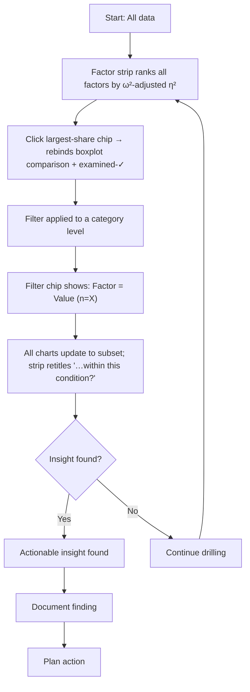

# Drill-Down Analysis Workflow

<!-- journey-phase: scout -->

VariScout's signature interaction pattern—progressive stratification using filter chips to isolate variation sources.

<div class="process-map">
  <div class="process-step">
    <div class="process-step__box process-step__box--input">
      <div class="process-step__title">Paste Data</div>
      <div class="process-step__detail">Ctrl+V in paste area</div>
    </div>
    <div class="process-step__clicks">2 actions</div>
  </div>
  <div class="process-arrow"></div>
  <div class="process-step">
    <div class="process-step__box process-step__box--navigate">
      <div class="process-step__title">Analyze</div>
      <div class="process-step__detail">Click "Analyze Data"</div>
    </div>
    <div class="process-step__clicks">1 click</div>
  </div>
  <div class="process-arrow"></div>
  <div class="process-step">
    <div class="process-step__box process-step__box--navigate">
      <div class="process-step__title">Map Columns</div>
      <div class="process-step__detail">Outcome + 2 factors + "Start"</div>
    </div>
    <div class="process-step__clicks">4 clicks</div>
  </div>
  <div class="process-arrow"></div>
  <div class="process-step">
    <div class="process-step__box process-step__box--read">
      <div class="process-step__title">Read Factor Strip</div>
      <div class="process-step__detail">ω²-adjusted η² below I-Chart</div>
    </div>
    <div class="process-step__clicks">0 clicks</div>
  </div>
  <div class="process-arrow"></div>
  <div class="process-step">
    <div class="process-step__box process-step__box--analyze">
      <div class="process-step__title">Click Top Chip</div>
      <div class="process-step__detail">Rebinds boxplot comparison</div>
    </div>
    <div class="process-step__clicks">1 click</div>
  </div>
  <div class="process-arrow"></div>
  <div class="process-step">
    <div class="process-step__box process-step__box--read">
      <div class="process-step__title">Read Filtered</div>
      <div class="process-step__detail">Variation explained? Cpk improved?</div>
    </div>
    <div class="process-step__clicks">0 clicks</div>
  </div>
  <div class="process-summary">
    <div class="process-summary__total">8 actions</div>
    <div class="process-summary__time">~5 min</div>
  </div>
</div>

_See [all process maps](process-maps.md) for PWA and Azure variants._

## Overview

Drill-down analysis lets you progressively filter data to isolate specific variation sources. The **factor strip** (ω²-adjusted η² ranking, ER-2 2026-06-11) is the default guidance surface — it ranks every candidate factor by cardinality-penalised share of variation directly beneath the I-Chart hero. Click a factor chip to rebind the Variation Sources boxplot comparison; the chip goes examined-✓. For deeper factor-combination analysis, the underlying ANOVA detail is available from the model drawer (ER-3).

> **Note on Factor Intelligence:** the η² ranking previously surfaced inside the `FactorIntelligencePanel` (Stats sidebar). That η² ranking re-homes to the Explore factor strip (ER-2, 2026-06-11); the PI-panel `FactorIntelligencePanel` retires in ER-7.

## The condition loop (ER-4, 2026-06-11)

On the redesigned Explore surface a chart click is **no longer a direct filter commit** — the gesture proposes, the pill commits:

1. **Gesture** — brush a y-band on the I-Chart, or click a boxplot category. The gesture sets an Esc-clearable **transient highlight** (cross-chart: the I-Chart lights member points; the boxplot dims non-highlighted categories) and shows the **condition pill** with the honest split — n in the band and the in-vs-out means.
2. **Commit is explicit** — the pill is the only condition minter. **✚ Capture** records a Finding stamped with the condition + its `scopeId`; **view as condition →** applies the condition.
3. **The scope bar** appears under the chrome: `⌖ Viewing condition: <label> · n of N rows · × back to all data · Take it to Analyze →`.
4. **Per-chart tiers (D6)** — the I-Chart **highlights** (the full series stays plotted, condition members emphasized; control limits and stats remain full-series — statistical honesty), comparison charts (boxplot / Pareto / histogram) **filter** to the condition rows, and the probability plot **re-checks its regime** within the condition.
5. **Take it to Analyze →** mints (or reuses, idempotently) a `ProblemStatementScope` — range predicates carry as `between`/`≥` leaves, not just category levels — and lands on the Wall with the scope active. **×** restores all-data everywhere.

Esc cascade: the first press clears the transient highlight, the second clears the brush selection.

> **Conditions vs filter chips:** an applied condition does **not** write filter chips — it renders in the scope bar and leaves the filter state untouched (filters remain the carrier for state set outside the condition loop: focused views, mobile, saved-state restore). This is what keeps the plotted I-Chart series and its stats reading from the same population.

## Membership analysis + the composition view (ER-5a, 2026-06-11)

When a condition is applied, the factor strip switches questions — from "What explains the variation?" (the ω²-adjusted η² magnitude ranking) to **"What distinguishes these rows?"**:

- **The membership ranking** scores each factor by how well it separates in-condition rows from the rest: **bias-corrected Cramér's V** on the factor × membership contingency table, computed over the **full** population — never within-subset η² (D7). The value is a separation score in [0, 1], deliberately NOT labeled a "% of variation" (it isn't one). Continuous factors quartile-bin first, marked `(binned)`; Y-derived columns are excluded from ranking against their own outcome (D11, `derivedFrom` provenance).
- **Chips carry the most over-represented level** with its lift — e.g. `Cavity — Cav1 ×2.8` (share inside the condition ÷ share outside; levels appearing only inside the condition show the "only in condition" label). A level needs n ≥ 3 inside the condition to qualify.
- **Selecting a membership chip swaps the comparison slot to the composition view**: paired share-in vs share-out bars per level with lift annotations, plus a **count ⇄ lift toggle** (the freed Pareto's condition half, D12 — count = how many condition rows per level; lift = how over-represented). The toggle is condition-scoped; no global mode switcher exists.
- **⊕ on a level adds it to the condition** — a compound AND condition through the same pill/scope-bar machinery (`applyCondition` over the accumulated leaves); the scope bar, I-Chart membership tier, and all filter-tier charts re-apply.
- **Inflection-binning segments commit as conditions** ("view as condition →" in the Azure binding editor; the PWA does not mount that editor) — once the segment condition applies, the membership strip is the natural "what distinguishes these rows?" follow-up (§10).

## The Drill-Down Pattern


```mermaid
flowchart TD
    A[Start: All data] --> B["Factor strip ranks all factors by ω²-adjusted η²"]
    B --> C["Click largest-share chip → rebinds boxplot comparison + examined-✓"]
    C --> D[Filter applied to a category level]
    D --> E["Filter chip shows: Factor = Value (n=X)"]
    E --> F[All charts update to subset; strip retitles '…within this condition?']
    F --> G{Insight found?}
    G -->|"Yes"| H[Actionable insight found]
    G -->|"No"| I[Continue drilling]
    I --> B
    H --> J[Document finding]
    J --> K[Plan action]
```

## Filter Chips

### What They Show

When you apply a filter, a chip appears showing:

```
[Shift = Night (n=45)] [Operator = B (n=12)] [Machine = 3 (n=8)]
```

| Component   | Meaning                             |
| ----------- | ----------------------------------- |
| Factor name | The column being filtered           |
| Value       | The selected level                  |
| n=X         | Sample count in the filtered subset |

The sample count keeps the analyst aware of data sufficiency — when n drops too low, statistics become unreliable.

### Single-Select vs Multi-Select

**Single-Select (Default)** — Click a value to filter to just that level:

```
Shift = Night (n=45)
```

**Multi-Select** — Hold Ctrl/Cmd and click multiple values:

```
Shift = Night, Evening (n=72)
```

Useful for comparing similar groups or establishing baselines.

## The Drill-Down Process

### Step 1: Start with Full Data

The **factor strip** renders automatically beneath the I-Chart hero and ranks all candidate factors by ω²-adjusted η² (cardinality-penalised). The ★ chip is the largest significant contributor. Click a chip to rebind the Variation Sources boxplot comparison to that factor — no scrolling or carousel navigation required. The model drawer (ER-3) exposes factor-combination rankings (R²adj) for analysts who want to check whether a pair of factors together explains more than either alone.

**Strip v2 (ER-6):** Once the model drawer completes the two-pass best-subsets run, the strip upgrades transparently: chips switch to in-model semipartial ΔR² (jointly-fitted contribution), and a ⚡ interaction chip appears when the Pass-2 screening finds a significant factor-factor interaction. The chip face states the geometric conclusion adapted to the pattern (ordinal: "magnitude varies"; disordinal: "relationship reverses"). Clicking the chip binds the boxplot to factor A and applies a transient highlight on the focal level of factor B (the categorical level with the largest |interaction coefficient|), showing factor A's distribution with the focal subset lit against the rest. For continuous×continuous interactions no discrete focal level exists and only factor A is bound. Interaction patterns are classified as **ordinal** or **disordinal** — never "moderator"/"primary".

### Step 2: Click to highlight, commit via the pill

Click on the bar (or box) for the level you want to investigate:

- Click the **highest-spread** level to isolate the biggest variation source (compare StdDev values)
- Click an **outlier** level to focus on the problem area
- Click a **good** level to understand what works

> **ER-4 click semantics:** on the main Explore dashboard the click sets a transient highlight and offers the condition pill — committing is explicit via the pill's "view as condition →" (see [§The condition loop](#the-condition-loop-er-4-2026-06-11)). The legacy direct click-to-filter is preserved only where the pill chrome is absent: focused views, mobile, and embedded charts.

### Step 3: Observe Changes

After committing the condition (or, on legacy surfaces, applying the filter):

- The scope bar shows `⌖ Viewing condition: Factor = Value · n of N rows` (legacy surfaces: a filter chip with `Factor = Value (n=X)`)
- Comparison charts update to the condition rows; the I-Chart keeps the full series with members emphasized (D6)
- Boxplot recalculates η² for remaining factors
- Capability shows filtered Cpk

### Step 4: Continue or Stop

**Continue drilling if:**

- Next factor has meaningful η² (> 10%)
- Enough data remains for analysis (n > 20)
- Boxplot shows clear category differences

**Stop drilling when:**

- Remaining variation is common cause (no factor has meaningful η²)
- Data too sparse for reliable statistics
- Actionable insight found

### Step 5: Document Path

Record your filter path for:

- Reproducing the analysis
- Explaining to others
- Tracking improvements

```
Filter path: Shift=Night → Operator=B → Machine=3
Finding: Machine 3 has StdDev 3x higher than other machines on night shift
Action: Investigate Machine 3 maintenance schedule
```

## Example: Coffee Case Study

### Starting Point

Full dataset: Fill weight variation

| Factor   | η²  | Interpretation      |
| -------- | --- | ------------------- |
| Batch    | 45% | Biggest contributor |
| Operator | 18% | Moderate            |
| Time     | 12% | Some effect         |

### Drill-Down Sequence

**Filter 1: Batch = 3**

```
[Batch = 3 (n=50)]
```

Remaining factors:

| Factor   | η²  |
| -------- | --- |
| Operator | 32% |
| Time     | 8%  |

Batch 3 was different — now Operator is more prominent.

**Filter 2: Operator = New**

```
[Batch = 3 (n=50)] [Operator = New (n=15)]
```

Remaining factors:

| Factor | η²  |
| ------ | --- |
| Time   | 15% |

**Result**

- New operator on Batch 3 explains most variation
- Training opportunity identified
- Time effect (15%) is shift-related — secondary factor

## When to Use Multi-Select

### Comparing Groups

Select multiple "good" values to establish baseline:

```
[Operator = A, C, D (n=35)]  ← Combined good operators
```

Then compare against the excluded "problem" level.

### Excluding Outliers

Select "normal" values to see process without anomalies:

```
[Shift = Day, Evening (n=72)]  ← Excluding Night shift
```

### Investigating Interactions

Select combinations to test interaction effects:

```
[Shift = Night] [Operator = New]
```

vs

```
[Shift = Day] [Operator = New]
```

Does new operator perform differently by shift?

## Best Practices

### Do

- Start with the factor strip (ω²-adjusted η² ranking) for guidance — it ranks all candidates on the default surface
- Click a chip to rebind the comparison and examine the boxplot for category-level spread
- Compare StdDev values to find high-spread categories
- Check Cpk at each level
- Verify sample size remains adequate (watch n=X on chips)
- Document your filter path

### Don't

- Don't drill too deep (sparse data)
- Don't ignore factors with moderate η²
- Don't forget to check stability at each level
- Don't over-interpret small samples

## Reading Chart Updates

### Boxplot After Filtering

- Shows remaining factors for filtered subset
- η² values recalculated
- May reveal hidden factors

### I-Chart After Filtering

- Shows only filtered time series
- Control limits recalculated
- May reveal pattern previously masked

### Capability After Filtering

- Shows Cpk for filtered subset
- Compare to overall Cpk
- Helps quantify factor impact

### Pareto After Filtering

- Shows defect types for filtered subset
- May reveal concentrated failure modes
- Connects variation to specific problems

## Navigating Back

### Remove Single Filter

Click the X on any filter chip to remove it.

### Clear All Filters

Click "Clear all" to return to full dataset.

### Breadcrumb Navigation

Use breadcrumbs to jump to any point in drill path:

```
All Data > Shift: Night > Operator: B
```

Click "Shift: Night" to remove Operator filter but keep Shift.

## Related Documentation

- [Four Lenses Workflow](four-lenses-workflow.md)
- [Progressive Filtering](../navigation/progressive-filtering.md)
- [Boxplot Feature](../analysis/boxplot.md)
