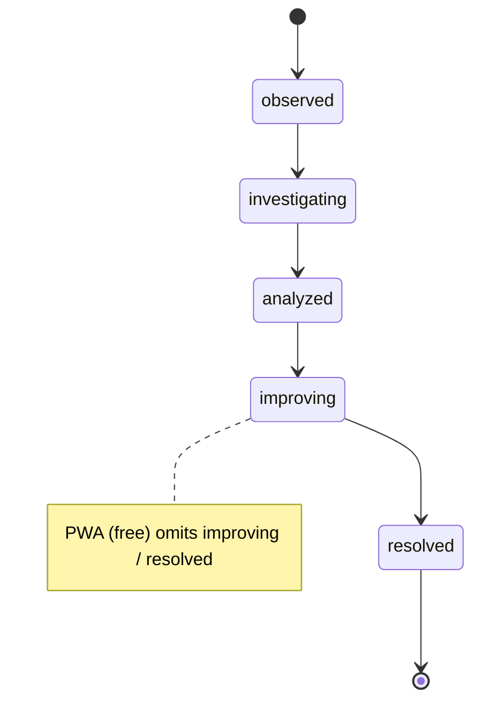

# Findings & Hypotheses — the evidence domain

The evidence layer beneath the [investigation spine](investigation-surface.md): **Findings** are the unit of evidence, **Hypotheses** are the mechanism claims that findings support or refute, and **CausalLinks** wire them into a DAG. Domain code: `packages/core/src/findings/`.

## Finding

A persisted observation. Lifecycle (analyst-driven, **not** auto-derived):

- **`FindingSource`** — discriminated union over chart origin (`boxplot` | `pareto` | `ichart` | `probability` | `coscout`), each carrying its anchor + a **mandatory `timeLens`** (restores the temporal context on replay). Exhaustive switch (missing variant = `never`).
- **`evidenceType`** (`data` | `gemba` | `expert`) — _where the observation came from_; required, defaults to `data`. Used by the Survey rules to triangulate across evidence kinds.
- **`validationStatus`** (`supports` | `contradicts` | `inconclusive`) — _how the finding relates to its hypothesis_. `supports` counts as evidence; `inconclusive` routes to **not-tested** (never silently supports); `contradicts` + `refutes:true` short-circuits the hypothesis to refuted.
- **`FindingProjection`** — baseline + projected stats (mean/sigma/cpk/yield) with deltas + `modelContext` (R²adj, gap closure) for What-If.
- **`FindingOutcome`** — post-action effectiveness (`yes`/`no`/`partial`, Cpk before/after) to close the loop.

## Condition & scope linkage (ER-4, 2026-06-11)

The condition is the WHERE that travels between Explore and Analyze:

- **`ConditionLeaf`** (`findings/hypothesisCondition.ts`) is the predicate grammar — leaf ops `eq`/`neq`/`in`/`gt`/`gte`/`lt`/`lte`/`between`. ER-4 added the Explore-side bridges: `rowMatchesConditionLeaves(row, leaves)` (flat-AND row evaluation), `buildBandLeaf` (I-Chart y-brush → `between`/`gte`), `buildGroupLeaf` (category click → `eq`), and `conditionLeavesToScopeState` / `buildConditionLeavesFromScopeState` (the scope-store round-trip).
- **`Finding.scopeId`** (optional FK, added in CS-0) is now **written**: capturing under an active condition mints-or-matches a `ProblemStatementScope` (`syncScopeFromCondition` — `predicateSetKey`-idempotent, soft-deleted scopes excluded) and stamps the finding. PSS's zero-live-caller state (the PR-CS-0 finding) ended with ER-4.
- The minting gesture is the **condition pill** — one pattern on both apps; the chart click itself is an Esc-clearable transient highlight, never a silent commit. Surface behavior (scope bar, D6 per-chart tiers): [drill-down-workflow.md §The condition loop](drill-down-workflow.md#the-condition-loop-er-4-2026-06-11).

## Hypothesis

A disconfirmable mechanism claim. Status is **derived, never set** (`deriveHypothesisStatus(h, findings)`, `packages/core/src/survey/wall.ts`):

| Status                               | Rule (in priority order)                                                         |
| ------------------------------------ | -------------------------------------------------------------------------------- |
| **refuted**                          | any linked finding has `refutes: true` — wins immediately                        |
| **proposed**                         | no linked findings                                                               |
| **evidenced**                        | ≥1 finding but `< 2` distinct evidence types                                     |
| **needs-disconfirmation**            | ≥2 evidence types, no survived disconfirmation attempt yet                       |
| **confirmed** _(label: "Supported")_ | ≥2 evidence types **AND** ≥1 `DisconfirmationAttempt` with `verdict: 'survived'` |

`DisconfirmationAttempt` verdicts are engine-graded (`survived`/`refuted`/`pending`) with the low-power floor (a thin null → `pending`, never a false refute). See [investigation-surface.md §Confirmation gate](investigation-surface.md).

## CausalLink

Typed factor→factor (or finding→hypothesis) edge forming the investigation DAG: `evidenceType`, `refutes`, optional `hypothesisId`, contribution (`etaSquared`). `wouldCreateCycle()` rejects edges that would cycle the DAG.

## ImprovementIdea

Nested on `Hypothesis.ideas` (re-homed from the retired Question entity, ADR-085 F2). Each carries a **direction** (`prevent` | `detect` | `simplify` | `eliminate`), `timeframe` (`just-do`/`days`/`weeks`/`months`), `cost`, and a 3×3 **risk** (`computeRiskLevel(axis1, axis2)` over two of {process, safety, environmental, quality, regulatory, brand}). `aiGenerated` + `voteCount` support the HMW brainstorm.

## ActionItem

Two caller shapes share one type: legacy (`assignee` + `dueDate`) and Quick Action (`stepId` + `parentImprovementProjectId`/`parentImprovementIdeaId` + `assignedTo`/`dueAt`). `status: open | in-progress | done`; removal is soft (`deletedAt`). Reducer: `reduceActionItems` (`ACTION_ITEM_*`). `HYPOTHESIS_ACTION_*` action kinds are **reserved** (hypothesis-level action items are F5-deferred no-ops today).

## Persistence

All domain entities round-trip in the `DocumentSnapshot` / `.vrs` **except `disconfirmationAttempts`**, which is **in-session only** (F5-deferred — no reload survival yet; the `HYPOTHESIS_RECORD_DISCONFIRMATION` apply-reducer is a no-op). Drift detection (`WindowContext`) flags when a finding's creation-time stats diverge from current data.

## Not yet built (do not document as live)

Durable disconfirmation persistence (F5); hypothesis-level `ActionItem`s (`HYPOTHESIS_ACTION_*` reserved); the auto-link re-ingest cascade (post-IM-4).

## See also

- [investigation-surface.md](investigation-surface.md) — the spine these entities serve. · [analyze-wall.md](analyze-wall.md) — the Wall surface.
- [collaboration.md](collaboration.md) — comments, @mentions, attachments + the team layer on these entities.
- [ADR-085](../../07-decisions/adr-085-drop-question-problem-statement-scope.md) — the entity-model decision (ideas re-homed onto Hypothesis).
