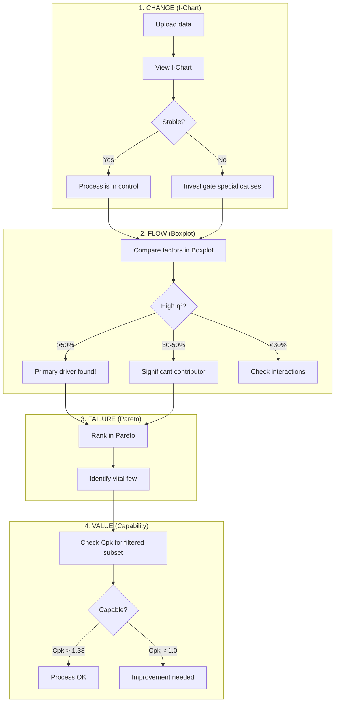

# Four Pillars Analysis Workflow

The core VariScout methodology: **CHANGE → FLOW → FAILURE → VALUE**

## Overview

The Four Pillars represent a systematic progression through variation analysis:

1. **CHANGE** (I-Chart) - Is the process stable over time?
2. **FLOW** (Boxplot) - Which factors drive variation?
3. **FAILURE** (Pareto) - Where do problems concentrate?
4. **VALUE** (Capability) - Do we meet specifications?

Each pillar answers a specific question, and together they form a complete investigation.

## The Analysis Flow



## Pillar 1: CHANGE (I-Chart)

**Question:** Is the process stable over time?

### What to Look For

| Pattern                           | Indicates       | Next Step                  |
| --------------------------------- | --------------- | -------------------------- |
| Points within limits              | Stable process  | Proceed to Boxplot         |
| Point outside UCL/LCL             | Special cause   | Investigate that point     |
| 9+ consecutive points on one side | Process shift   | Find when/why it shifted   |
| Trending up/down                  | Drift           | Check for degradation      |
| Cycling pattern                   | Periodic factor | Look for time-based causes |

### Actions

- **Stable:** Process variation is common cause only. Proceed to understand what factors explain that variation.
- **Unstable:** Special causes present. These must be investigated—they often point directly to assignable causes.

!!! tip "Start Here"
Always check stability first. Analyzing an unstable process as if it were stable leads to wrong conclusions.

## Pillar 2: FLOW (Boxplot)

**Question:** Which factors explain the variation?

### Reading η² (Eta-Squared)

The η² value shows what percentage of total variation is explained by a factor:

| η² Value | Interpretation | Action                    |
| -------- | -------------- | ------------------------- |
| > 50%    | Primary driver | Focus improvement here    |
| 30-50%   | Significant    | Worth investigating       |
| 10-30%   | Moderate       | May contribute to problem |
| < 10%    | Minimal        | Likely not the issue      |

### The Drill-Down

1. **Identify highest η² factor** - Click on it
2. **Filter applied** - All charts update to show that subset
3. **Check remaining variation** - Look at next factor in hierarchy
4. **Repeat** - Until you've isolated enough variation

### Example

```
Shift explains 45% → Filter to "Night Shift"
  └─ Operator explains 32% → Filter to "Operator B"
      └─ Machine explains 18% → Filter to "Machine 3"
          └─ 95% of variation now isolated
```

## Pillar 3: FAILURE (Pareto)

**Question:** Where do problems concentrate?

### The 80/20 Rule

Pareto charts rank categories by frequency or impact. Typically:

- 20% of causes create 80% of problems
- Focus on the "vital few" not the "trivial many"

### Reading the Pareto

1. **Bars** show individual category counts/costs
2. **Line** shows cumulative percentage
3. **Look for the knee** - where cumulative line bends

### Using Pareto with Filters

After drilling down in Boxplot:

1. Pareto updates to show filtered data
2. See which defect types dominate in that subset
3. Combine insights: "Operator B on Machine 3 primarily has alignment defects"

## Pillar 4: VALUE (Capability)

**Question:** Do we meet specifications?

### Key Metrics

| Metric | What It Measures                       | Target |
| ------ | -------------------------------------- | ------ |
| Cp     | Potential capability (spread vs specs) | > 1.33 |
| Cpk    | Actual capability (includes centering) | > 1.33 |
| Pp/Ppk | Long-term performance                  | > 1.33 |

### Interpretation

| Cpk       | Status    | Meaning                         |
| --------- | --------- | ------------------------------- |
| > 1.67    | Excellent | Very capable                    |
| 1.33-1.67 | Good      | Capable                         |
| 1.00-1.33 | Marginal  | Barely meeting specs            |
| < 1.00    | Poor      | Not capable—improvements needed |

### After Drilling Down

Check Cpk for the filtered subset:

- **Cpk improved?** That factor was hurting capability
- **Cpk unchanged?** Variation source doesn't affect specs
- **Cpk worse?** Filtered to a problem area

## Putting It Together: Bottleneck Case Study

### Scenario

Bottling line with fill weight variation affecting customer complaints.

### Workflow

**Step 1: CHANGE**

```
I-Chart shows several points outside limits around 10am each day
→ Special cause: Something happens mid-morning
```

**Step 2: FLOW**

```
Boxplot shows Shift explains 52% (η² = 0.52)
Filter to "Day Shift" (where problems occur)
  └─ Fill Head explains 38%
      └─ Filter to "Fill Head 3"
```

**Step 3: FAILURE**

```
Pareto (filtered): 78% of low-weight fills come from Fill Head 3
→ Clear target for investigation
```

**Step 4: VALUE**

```
Capability (filtered to Fill Head 3):
  Cpk = 0.67 (Poor)
Capability (excluding Fill Head 3):
  Cpk = 1.45 (Good)
→ Fix Fill Head 3 to solve the problem
```

### Result

Fill Head 3 had worn seals causing inconsistent fills. After repair:

- Cpk improved from 0.89 (overall) to 1.52
- Customer complaints dropped 85%

## When to Use Each Pillar

| Situation                 | Primary Pillar     |
| ------------------------- | ------------------ |
| "Something changed"       | CHANGE (I-Chart)   |
| "Why is there variation?" | FLOW (Boxplot)     |
| "What types of defects?"  | FAILURE (Pareto)   |
| "Are we meeting specs?"   | VALUE (Capability) |

## Common Mistakes

### Skipping CHANGE

Analyzing an unstable process as if it were stable. Always check I-Chart first.

### Ignoring Low η²

A factor with 15% η² might still be important if:

- It's easy to fix
- It interacts with other factors
- It affects capability more than variation

### Stopping Too Early

Finding one significant factor doesn't mean you've found all of them. Continue drilling until you've isolated actionable causes.

### Over-Filtering

Too many filters leave too little data for reliable statistics. Balance detail with sample size.

## Related Documentation

- [I-Chart Feature](../analysis/i-chart.md)
- [Boxplot Feature](../analysis/boxplot.md)
- [Pareto Feature](../analysis/pareto.md)
- [Capability Feature](../analysis/capability.md)
- [Four Pillars Philosophy](../../01-vision/four-pillars/index.md)
- [Drill-Down Workflow](drill-down-workflow.md)
