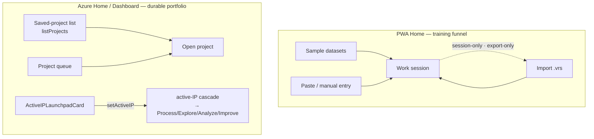

# Home — the entry surface

Home is where a session starts. It is **project-level entry, not the active-IP origin** — selecting the active Improvement Project happens downstream on the Dashboard/Improve surface (see below). The Home surface **diverges sharply by app**: PWA is a training funnel, Azure is a durable project portfolio.

## PWA Home — training funnel

`HomeScreen` (`apps/pwa/src/components/HomeScreen.tsx`) shows **sample datasets**, a **paste-from-Excel** primary action, a manual-entry link, and a **`.vrs` import** button. It is **session-only** — there is no saved-document list; `.vrs` export is the only durable path (R6d export-only). The `PendingInvitesBanner` renders at the top, keyed to the hardcoded single-user `'analyst@local'`.

## Azure Home / Dashboard — durable portfolio

The Azure Editor's `dashboard` view renders `ProjectDashboard` (the saved-project list, `listProjects` from storage) + the project queue + an **`ActiveIPLaunchpadCard`**. Documents are durable (IndexedDB + Blob); access is roster-gated ([save-and-load.md §Access](../data/save-and-load.md)).

## The active-IP cascade does **not** originate on Home

Selecting the active Improvement Project happens on the **Dashboard / Improve** surface, not Home (`Editor.tsx` calls `setActiveIP` from the `ActiveIPLaunchpadCard`, the Projects tab, and new-IP creation — never from a Home control). `useActiveIPContext(hub, { userId })` wraps `useActiveIPStore` (persisted to `localStorage` key `variscout:activeIP:{hubId}:{userId}`); it **auto-selects** when exactly one IP exists in scope and the user hasn't explicitly cleared it. Home is the project-level entry; the cascade is owned downstream. Full rules: [ia-nav-model.md §Active-IP cascade](../../02-journeys/ia-nav-model.md).

## Pending invites

`PendingInvitesBanner` (`packages/ui/src/components/Home/`) lists pending `Invitation`s with Accept/Decline. It is **transient** — rehydrated on mount (`rehydrateInvites`), expand/collapse is local state, and there is **no cross-tab real-time sync** (cross-device persistence is F5-deferred). Accept/decline mutates `useProjectMembershipStore` (localStorage). See [collaboration.md](collaboration.md).

## Azure vs PWA

|                                         | Azure (€120) | PWA (free)                      |
| --------------------------------------- | ------------ | ------------------------------- |
| Saved-document list                     | ✓ (durable)  | — (session-only)                |
| Sample datasets / training funnel       | —            | ✓                               |
| `.vrs` import / export                  | ✓            | ✓ (export-only durability)      |
| `ActiveIPLaunchpadCard` / project queue | ✓            | —                               |
| `PendingInvitesBanner`                  | ✓            | ✓ (single-user `analyst@local`) |

## Not yet built (do not document as live)

Home does **not** own active-IP selection; `PendingInvitesBanner` has no cross-tab real-time sync (F5 rehydrate only); Azure active-IP persists to `localStorage`, **not** cloud; the PWA has no saved-document list (R6d export-only).

## See also

- [project-dashboard.md](project-dashboard.md) — the Azure project portfolio + active-IP launchpad.
- [collaboration.md](collaboration.md) — invitations + roster. · [save-and-load.md](../data/save-and-load.md) — durability + access.
- [ia-nav-model.md](../../02-journeys/ia-nav-model.md) — the 7-tab nav + active-IP cascade.
