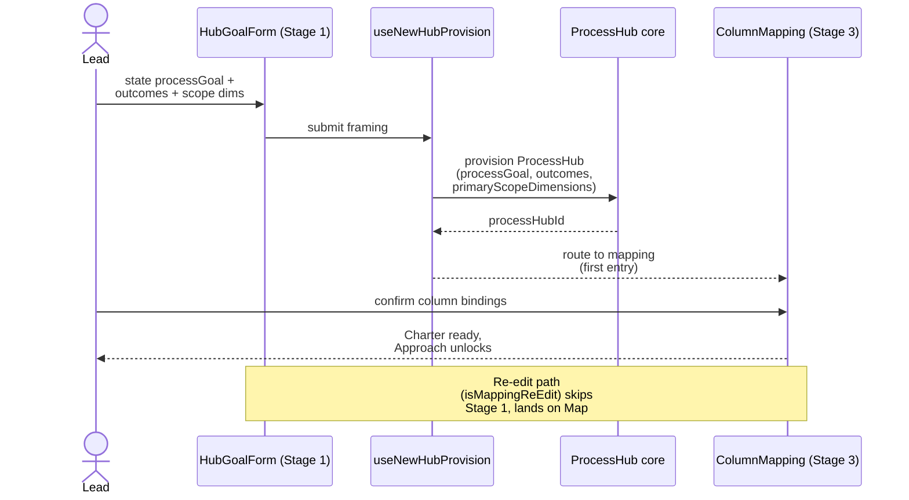

> **L3 feature stub** — created 2026-05-18 as part of M0 SDD migration inventory (Option A). Body to be expanded in M3 audit or on next feature edit.

# Process Hub Creation

## Problem

A new investigation needs a ProcessHub bound before column mapping confirms — otherwise the user states a goal, maps columns, and discovers the hub identity, outcomes, and primary scope dimensions were never persisted; the wedge V1 Charter stage must produce a real hub before Approach can attach measurement plans.

## Capability claim

`HubCreationFlow` (`apps/azure/src/features/hubCreation/HubCreationFlow.tsx`) routes Mode-B framing from Stage 1 (`HubGoalForm`) through provisioning (`useNewHubProvision`) into Stage 3 (`ColumnMapping`) on first entry (`isMappingReEdit === false` and no `processHubId`), skipping to ColumnMapping on re-edit; the `ProcessHub` shape (`processGoal`, `outcomes: OutcomeSpec[]`, `primaryScopeDimensions`) is defined in `@variscout/core/processHub` with primitives under `packages/core/src/processHub/`.

## Intent diagram

Mode-B framing: Stage 1 captures intent, `useNewHubProvision` persists a real `ProcessHub` before Stage 3, and re-entry skips back to ColumnMapping when `isMappingReEdit === true`.

## Acceptance signals

TBD — testable conditions to be added on next edit. See related tests at `apps/azure/src/features/hubCreation/__tests__/` and `packages/core/src/processHub/__tests__/` for current verification.

## Out of scope / non-goals

TBD.

## Links

- **Code**: `apps/azure/src/features/hubCreation/HubCreationFlow.tsx`, `apps/azure/src/features/hubCreation/useNewHubProvision.ts`, `apps/azure/src/features/hubCreation/useStageFiveOpener.ts`, `packages/core/src/processHub/`, `packages/core/src/processHub.ts`
- **Tests**: `apps/azure/src/features/hubCreation/__tests__/`, `packages/core/src/processHub/__tests__/`
- **Related**: `docs/07-decisions/adr-082-wedge-architecture.md`, `docs/superpowers/specs/2026-05-16-wedge-architecture-design.md`, `docs/03-features/data/data-input.md`
