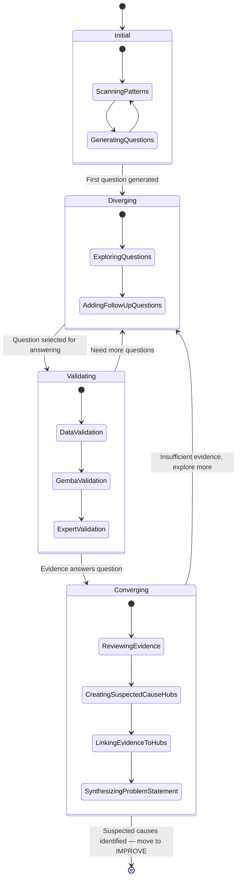
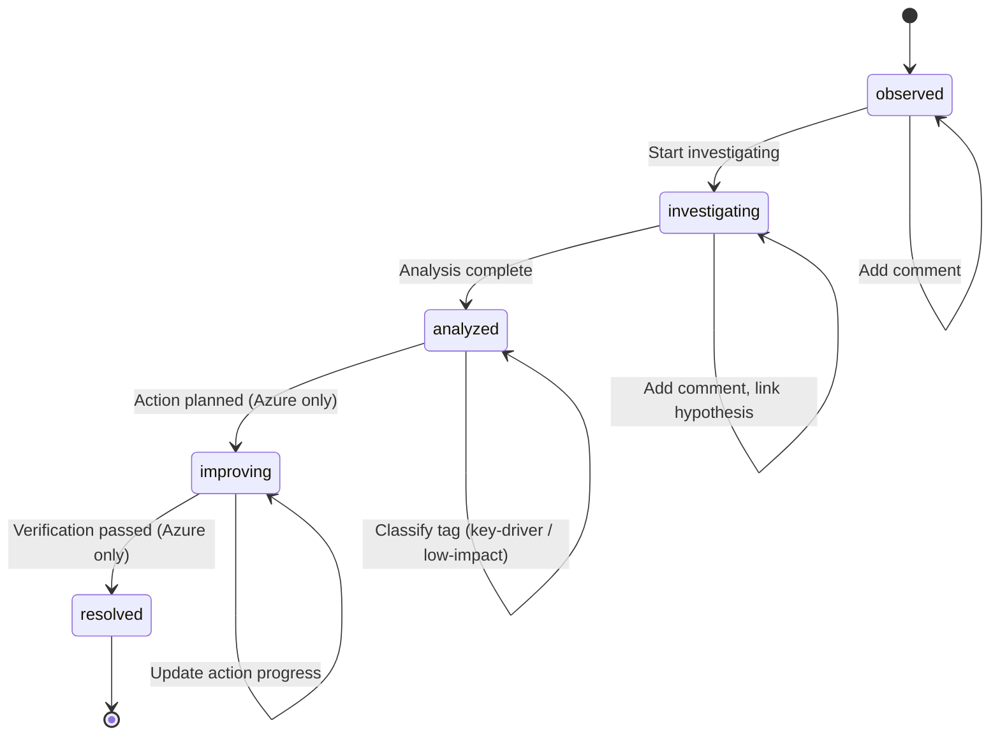
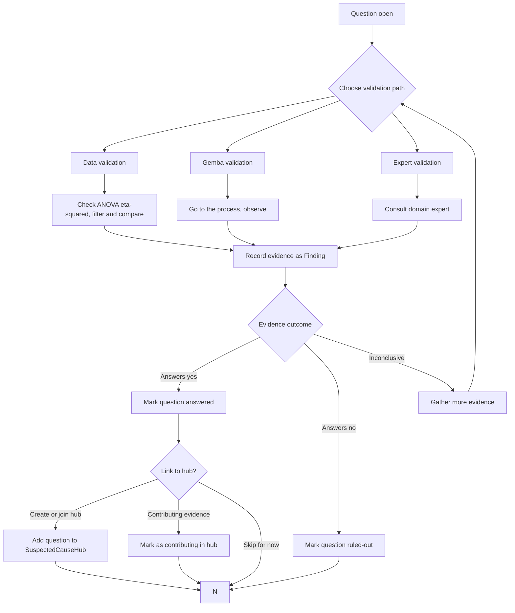
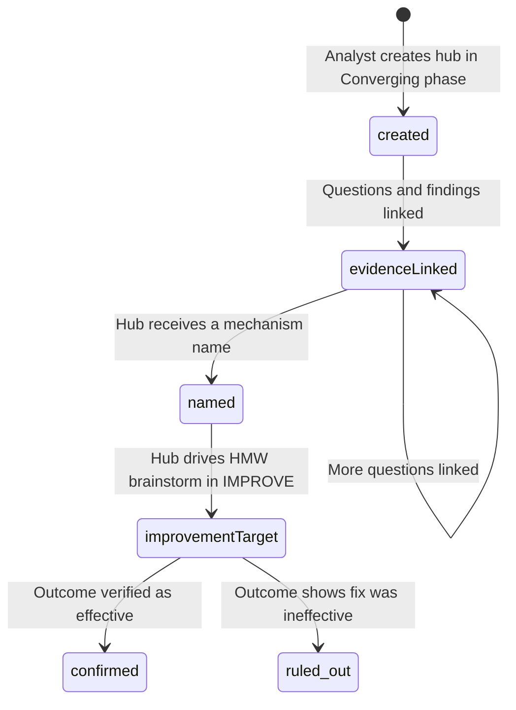

# Investigation Lifecycle Map

> State machine view of the investigation diamond. For the narrative walkthrough, see [Analysis Journey Map § INVESTIGATE](analysis-journey-map.md#phase-3-investigate). For tree UI interaction, see [Question-Driven Investigation](question-driven-investigation.md).

State diagrams for investigation diamond phases, Finding status transitions, and question answering — showing how CoScout adapts its behavior at each stage.

## Overview

The investigation diamond maps the INVESTIGATE phase lifecycle as a 4-phase pattern: Initial → Diverging → Validating → Converging. Each phase changes CoScout's behavior, UI presentation, and suggested questions. After the diamond closes (multiple suspected causes identified), the IMPROVE phase follows with PDCA (Plan-Do-Check-Act).

The framework connects three moving parts:

1. **Investigation diamond phases** — the analyst's cognitive stage in the investigation
2. **Finding statuses** — the lifecycle of individual observations
3. **Question answering** — the evidence-gathering sub-flow within Diverging/Validating

## Investigation Diamond State Diagram

## Phase Behavior Table

Each investigation diamond phase triggers distinct CoScout behavior and UI changes.

| Phase          | Trigger In                   | CoScout Behavior                                                                    | UI Changes                                                                 | Suggested Questions                                                     |
| -------------- | ---------------------------- | ----------------------------------------------------------------------------------- | -------------------------------------------------------------------------- | ----------------------------------------------------------------------- |
| **Initial**    | Data loaded, scanning charts | Scan patterns + generate questions (Factor Intelligence ranking)                    | Dashboard with Four Lenses, question checklist                             | "Which factors should we check first?"                                  |
| **Diverging**  | First question generated     | Encourage exploring open questions, suggest follow-ups                              | Investigation panel opens, question checklist with status dots             | "Does [factor] explain variation? (R²adj = X%)"                         |
| **Validating** | Question selected            | Help interpret evidence for/against (eta-squared, R²adj)                            | Validation checklist, ANOVA highlights                                     | "eta-squared for [factor] is X% — does this answer the question?"       |
| **Converging** | Evidence collected           | Synthesize multiple suspected causes into problem statement via SuspectedCause hubs | Finding cards show answer status, suspected causes section with hub badges | "Evidence points to [mechanism] as suspected cause — ready to improve?" |

> **Note:** For CoScout behavior during IMPROVE (suggesting corrective actions, monitoring Cpk), see [Analysis Journey Map § Phase 4](analysis-journey-map.md#phase-4-improve).

## Finding Status Lifecycle

Individual findings move through a status lifecycle that maps onto the broader investigation. The first three statuses (observed → investigating → analyzed) correspond to the INVESTIGATE phase (diamond). The last two (improving → resolved) correspond to the IMPROVE phase (PDCA). PWA supports the first three statuses; Azure supports all five.

## Finding Status Properties

| Status          | Badge Color | Meaning                               | Available In |
| --------------- | ----------- | ------------------------------------- | ------------ |
| `observed`      | Amber       | Pattern spotted, not yet investigated | PWA, Azure   |
| `investigating` | Blue        | Actively drilling into this finding   | PWA, Azure   |
| `analyzed`      | Purple      | Analysis completed, classified        | PWA, Azure   |
| `improving`     | Teal        | Action planned, in progress           | Azure only   |
| `resolved`      | Green       | Verification passed, closed           | Azure only   |

## Question Answering Sub-flow

Within the Validating phase, each question goes through an evidence-gathering loop with three validation paths. Questions have statuses: `open` (not yet checked), `answered` (finding linked with evidence), `auto-answered` (Factor Intelligence determined the answer), and `ruled-out` (explicitly ruled out).

**Auto-validation thresholds** (based on ANOVA eta-squared):

| eta-squared | Strength | Interpretation                          |
| ----------- | -------- | --------------------------------------- |
| > 0.14      | Strong   | Factor likely driving variation         |
| 0.06 - 0.14 | Moderate | Factor contributes, investigate further |
| < 0.06      | Weak     | Factor unlikely to be root cause        |

**Auto-answered questions:** Factor Intelligence auto-answers questions where R²adj < 5% as "ruled out" — these are negative learnings captured without analyst effort. Factors with R²adj > 5% generate follow-up questions (Layer 2-3).

## SuspectedCause Hub Lifecycle

SuspectedCause hubs have their own lifecycle distinct from the question tree and finding status:

| Hub State           | Meaning                                                               |
| ------------------- | --------------------------------------------------------------------- |
| `created`           | Named entity exists, no questions linked yet                          |
| `evidenceLinked`    | One or more answered questions linked to the hub                      |
| `named`             | Hub has a mechanism name (e.g., "Worn nozzle tip")                    |
| `improvementTarget` | Hub has an associated HMW brainstorm and improvement ideas in IMPROVE |
| `confirmed`         | Outcome shows the fix was effective — hub mechanism was real          |
| `ruled_out`         | Outcome shows the fix was not effective — re-enter INVESTIGATE        |

Confirmation only happens at `resolved` status when outcome is "Effective." Hubs in `improvementTarget` state should be treated as theories, not facts.

## Hooks and Components

Each investigation concept maps to a specific hook or component in the codebase.

| Concept                       | Hook / Component                          | Package            |
| ----------------------------- | ----------------------------------------- | ------------------ |
| Finding CRUD                  | `useFindings`                             | `@variscout/hooks` |
| Question/Hypothesis CRUD      | `useHypotheses`                           | `@variscout/hooks` |
| Investigation phase detection | `detectInvestigationPhase()`              | `@variscout/core`  |
| CoScout phase context         | `getCoScoutPhase()`                       | `@variscout/core`  |
| Finding cards                 | `FindingCard`                             | `@variscout/ui`    |
| Board view                    | `FindingBoardView`                        | `@variscout/ui`    |
| What-If simulator             | `WhatIfSimulator`                         | `@variscout/ui`    |
| SuspectedCause hub CRUD       | `useSuspectedCauses` in `useHypotheses`   | `@variscout/hooks` |
| Idea→What-If projection       | `WhatIfPageBase` (projectionContext)      | `@variscout/ui`    |
| Simulation change callback    | `onSimulationChange` in `WhatIfSimulator` | `@variscout/ui`    |

## Related Documentation

- [Investigation to Action Workflow](investigation-to-action.md) — end-to-end analyst workflow from data load to projection
- [Decision Trees](decision-trees.md) — branching logic for analysis decisions
- [Drill-Down Workflow](drill-down-workflow.md) — factor drill-down navigation
- [Four Lenses Workflow](four-lenses-workflow.md) — the four analytical perspectives (Change, Failure, Flow, Value)
