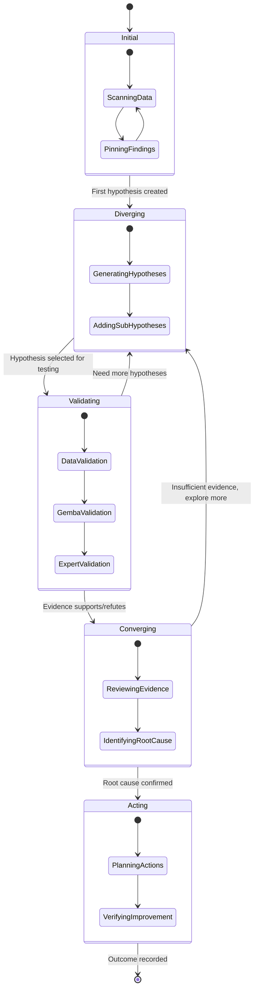
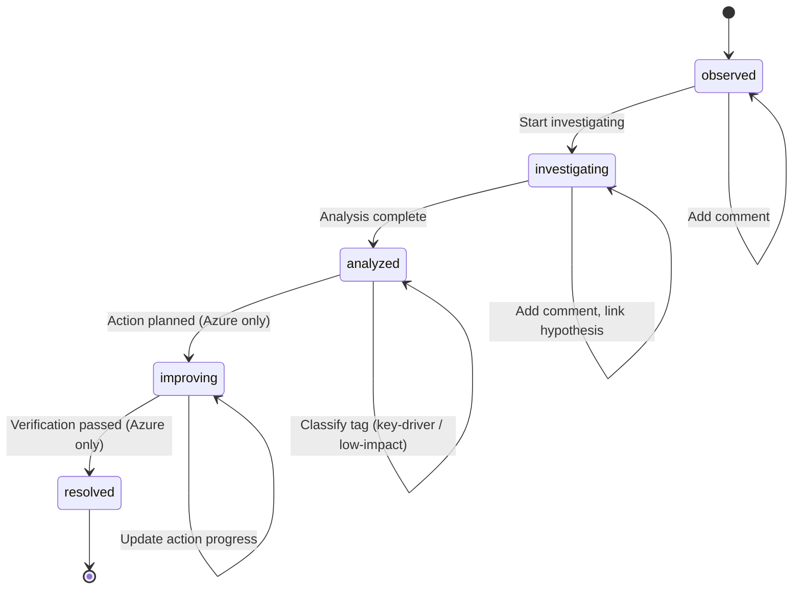
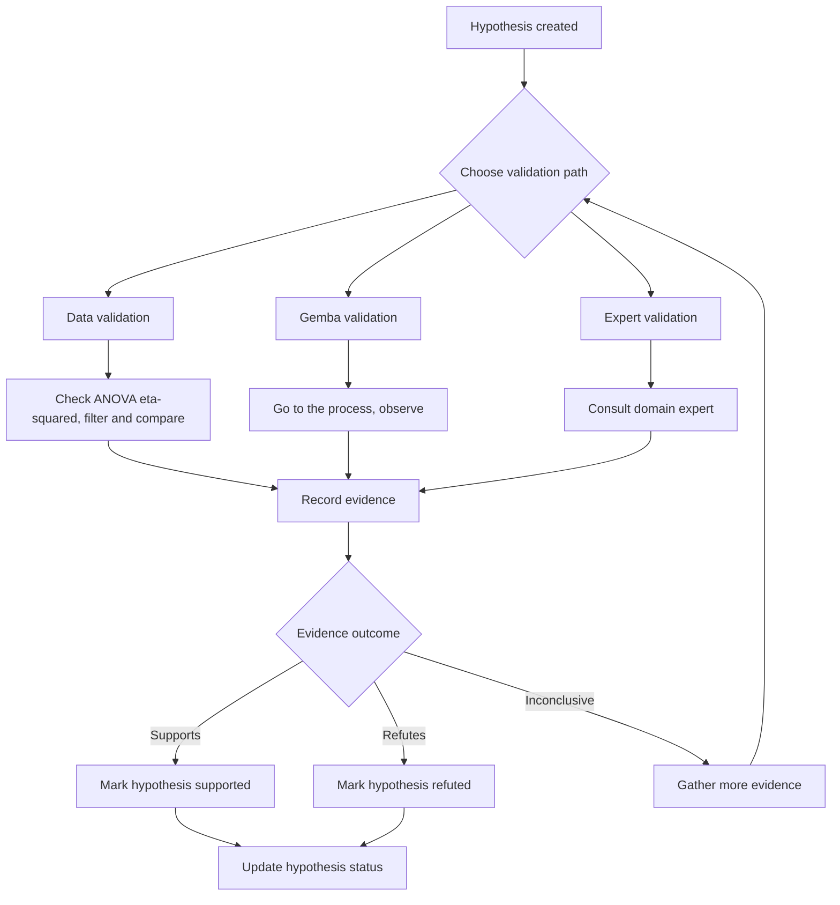

# Investigation Lifecycle Map

State diagrams for IDEOI investigation phases, Finding status transitions, and hypothesis validation — showing how CoScout adapts its behavior at each stage.

## Overview

The IDEOI framework (Initial, Diverging, Evaluating, Organizing, Implementing) maps the investigation lifecycle from first data scan through verified improvement. Each phase changes CoScout's behavior, UI presentation, and suggested questions.

The framework connects three moving parts:

1. **IDEOI phases** — the analyst's cognitive stage in the investigation
2. **Finding statuses** — the lifecycle of individual observations
3. **Hypothesis validation** — the evidence-gathering sub-flow within Diverging/Validating

## IDEOI State Diagram

## Phase Behavior Table

Each IDEOI phase triggers distinct CoScout behavior and UI changes.

| Phase          | Trigger In                   | CoScout Behavior                         | UI Changes                             | Suggested Questions                             |
| -------------- | ---------------------------- | ---------------------------------------- | -------------------------------------- | ----------------------------------------------- |
| **Initial**    | Data loaded, scanning charts | Suggests patterns in data                | Dashboard with Four Lenses             | "What patterns do you see in the I-Chart?"      |
| **Diverging**  | First finding pinned         | Suggests possible hypotheses             | Findings panel opens, hypothesis form  | "Could [factor] be driving this?"               |
| **Validating** | Hypothesis selected          | Provides data evidence for/against       | Validation checklist, ANOVA highlights | "eta-squared for [factor] is X% — significant?" |
| **Converging** | Evidence collected           | Summarizes evidence, suggests root cause | Finding cards show validation status   | "Evidence points to [factor] as root cause"     |
| **Acting**     | Root cause confirmed         | Suggests corrective actions              | What-If simulator, action items        | "What if you reduced [factor] variation by X%?" |

## Finding Status Lifecycle

Individual findings move through a status lifecycle that maps onto the broader IDEOI phases. PWA supports the first three statuses; Azure supports all five.

## Finding Status Properties

| Status          | Badge Color | Meaning                               | Available In |
| --------------- | ----------- | ------------------------------------- | ------------ |
| `observed`      | Amber       | Pattern spotted, not yet investigated | PWA, Azure   |
| `investigating` | Blue        | Actively drilling into this finding   | PWA, Azure   |
| `analyzed`      | Purple      | Analysis completed, classified        | PWA, Azure   |
| `improving`     | Teal        | Action planned, in progress           | Azure only   |
| `resolved`      | Green       | Verification passed, closed           | Azure only   |

## Hypothesis Validation Sub-flow

Within the Validating phase, each hypothesis goes through an evidence-gathering loop with three validation paths.

**Auto-validation thresholds** (based on ANOVA eta-squared):

| eta-squared | Strength | Interpretation                          |
| ----------- | -------- | --------------------------------------- |
| > 0.14      | Strong   | Factor likely driving variation         |
| 0.06 - 0.14 | Moderate | Factor contributes, investigate further |
| < 0.06      | Weak     | Factor unlikely to be root cause        |

## Hooks and Components

Each IDEOI concept maps to a specific hook or component in the codebase.

| Concept               | Hook / Component             | Package            |
| --------------------- | ---------------------------- | ------------------ |
| Finding CRUD          | `useFindings`                | `@variscout/hooks` |
| Hypothesis CRUD       | `useHypotheses`              | `@variscout/hooks` |
| IDEOI phase detection | `detectInvestigationPhase()` | `@variscout/core`  |
| CoScout phase context | `getCoScoutPhase()`          | `@variscout/core`  |
| Finding cards         | `FindingCard`                | `@variscout/ui`    |
| Board view            | `FindingBoardView`           | `@variscout/ui`    |
| What-If simulator     | `WhatIfSimulator`            | `@variscout/ui`    |

## Related Documentation

- [Investigation to Action Workflow](investigation-to-action.md) — end-to-end analyst workflow from data load to projection
- [Decision Trees](decision-trees.md) — branching logic for analysis decisions
- [Drill-Down Workflow](drill-down-workflow.md) — factor drill-down navigation
- [Four Lenses Workflow](four-lenses-workflow.md) — the four analytical perspectives (Change, Failure, Flow, Value)
