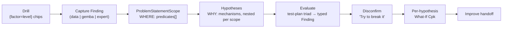

# Investigation Surface — the Analyze-tab spine

> Delivered update 2026-06-08 — the Analyze tab now defaults to the canvas-first Wall + Causes surface. Evidence Map remains an advanced/report graph projection; ADR-066 is amended accordingly.

The Analyze tab is one graph — `y = f(x)`: an **outcome (Y)** sharpened by a **scope (the WHERE)** and explained by **hypotheses (the WHY)**. There is no "Question" entity (retired, [ADR-085](../../07-decisions/adr-085-drop-question-problem-statement-scope.md)); the spine is **scope-first drill → evidence → mechanisms**. The Wall is the default operational projection of this graph; the Evidence Map remains an advanced/report projection. See [analyze-wall.md](analyze-wall.md) for the shipped surface.

## Spine

1. **Drill** — the analyst filters the outcome by `{factor=level}` chips (e.g. `Machine = B ∩ Shift = night`).
2. **Capture a Finding** — an observation with its capture context (filter state + stats) and an `evidenceType` (`data | gemba | expert`).
3. **The drill becomes a `ProblemStatementScope`** — the compound WHERE is persisted as a first-class scope (`predicates: ConditionLeaf[]`, AND-joined). Re-drilling the same predicate set is idempotent (`predicateSetKey`, type-tagged so numeric `1 ≠ string '1'`).
4. **Hypotheses nest under the scope** — each is a named mechanism (the WHY) with its own disconfirmable `condition` (a `HOLDS` claim), never re-asserting the scope.
5. **Evaluate** — the test-plan triad runs the right test per factor → a typed `supports` / `inconclusive` Finding (§Evaluate).
6. **Disconfirm** — "Try to break it" runs the same engine under a wrongness prediction (§Confirmation gate).
7. **What-If** — per-hypothesis projected Cpk if the condition were fixed (never summed across hypotheses).
8. **Improve handoff** — a Supported hypothesis carries its factor + expected What-If gain to the Improve tab.

## Entities (the one graph)

| Entity                    | Is                              | Key fields                                                                                                                               | Code                                            |
| ------------------------- | ------------------------------- | ---------------------------------------------------------------------------------------------------------------------------------------- | ----------------------------------------------- |
| **Finding**               | a persisted observation         | `evidenceType` (data/gemba/expert), `validationStatus` (supports/contradicts/inconclusive), `context` (filters + stats), `findingSource` | `packages/core/src/findings/types.ts` `Finding` |
| **ProblemStatementScope** | the **WHERE**, first-class      | `predicates: ConditionLeaf[]`, `hypothesisIds[]`, optional `gateNode`, optional `whatIfProjection`                                       | `types.ts` `ProblemStatementScope`              |
| **Hypothesis**            | the **WHY** (a mechanism claim) | `condition` (HOLDS claim), `status`, `disconfirmationAttempts[]`                                                                         | `types.ts` `Hypothesis`                         |
| **CausalLink**            | a typed factor→factor edge      | `evidenceType`, `refutes`, optional `hypothesisId`                                                                                       | `types.ts` `CausalLink`                         |

`ConditionLeaf` = `{ column, op: eq|neq|lt|lte|gt|gte|between|in, value }` (`packages/core/src/findings/hypothesisCondition.ts`). A scope's predicates are a flat `ConditionLeaf[]` AND; a hypothesis's `condition` is a nested `And|Or|Not` tree.

## WHERE ≠ WHY

The scope's `predicates` are the analyst-drilled **WHERE**. A hypothesis's `condition` is the cause's own **WHY** — a disconfirmable claim, never a copy of the scope. Scopes own `hypothesisIds`; causes do not own scopes. A cause's **relevant factors are derived, not stored** (`deriveHypothesisFactors` = the condition's columns ∪ linked findings' columns ∪ naming `CausalLink`s) — there is no `Hypothesis.factorIds[]`, so the ranking re-computes on every drill instead of freezing.

## Contribution is level-native

Contribution is reported in each level's **native share** routed by process level (Outcome `Y` / Flow `X` / Local `x`): η² for a factor's variance, Cpk-per-group, Pareto count-%, regression slope, VA%, bottleneck-seconds. There is **no bespoke cross-level "SS-share" number** and **no multiplied-η² chain** ([ADR-088](../../07-decisions/adr-088-level-native-contribution.md)). The one cross-level number is the **What-If "if-fixed" projection** (`computeScopeWhatIfProjection`) — a _simulation_ of impact, not a variance decomposition. Never imply causal certainty or say "driver" — say **contribution**, "accounts for the spread" (P5).

## Evaluate — the test-plan triad

Each hypothesis card carries a **derived test-plan triad**: _relevant factors_ (derived, above) × _auto-suggested tool by data type_ (categorical → 2-sample/ANOVA; continuous → regression) × _data-readiness_ (have it / gap). One-tap **Evaluate** runs the test and attaches a **typed Finding**:

- `p < .05` (evidence threshold) + significant → **`supports`**.
- `p ≥ .05` → **`inconclusive`** (routes to _not-tested_ — never silently "supports"; preserves the Supported gate).

This is distinct from the **vital-few screening** threshold `p < .15` used by the model-builder band — a deliberate **two-α split** (screening vs evidence). Engine: `packages/core/src/findings/hypothesisTestPlan.ts` (`buildHypothesisTestPlan`, `suggestToolForFactor`, `evaluateHypothesisFactor`).

## Confirmation gate — evidence + a survived challenge

A hypothesis reaches **Supported** only with **≥2 evidence types** (data + gemba/expert) **AND** a **survived disconfirmation attempt** — evidence count alone is never enough (`deriveHypothesisStatus`, `packages/core/src/survey/wall.ts`). Status lifecycle: `proposed → evidenced → confirmed | refuted | needs-disconfirmation` (the user-facing label for `confirmed` is **"Supported"**).

**Disconfirmation ("Try to break it")** runs the same evaluate engine under a wrongness prediction; the **engine grades the verdict** (the analyst never self-grades):

- significant → **`survived`** (the cause withstood the challenge).
- not-significant **with adequate power** (≥20 rows regression / ≥10 per group) → **`refuted`**.
- not-significant **below the power floor** → **`pending`** ("too few rows") — _absence of evidence is not evidence of absence_, so a thin null never false-refutes.

`evaluateDisconfirmation` in `hypothesisTestPlan.ts`. Use **"Supported / Counts-against"** in copy (loud for counter-evidence), never "confirmed/contradicts" prose.

## Measurement Plan = a DCP

Outstanding evidence is captured as a **Measurement Plan** (a Data Collection Plan) bound to one hypothesis: `{ outcome, primaryFactor, neededFactors[], sampleSize, method, owner, status, scope, processLocation, opDef?, msaNote? }`. `opDef`/`msaNote` are optional notes, never gates; there is no `msaRequired` boolean and no randomized-order field. Full field reference: [measurement-plan-dcp.md](measurement-plan-dcp.md).

## Terminology

**Supported / Counts-against** (status), **contributing factors**, **contribution** (not causal certainty / not "driver"), **scope** (the WHERE), **hypothesis / suspected cause** (the WHY; a _role_, not a grouping entity), **survived / refuted / pending** (disconfirmation verdicts), **vital-few** (model-builder screening). The four CHANGE/FLOW/FAILURE/VALUE "lenses" are pedagogy — there is no mode or lens picker ([ADR-089](../../07-decisions/adr-089-retire-mode-lens-user-axis.md)); the four charts are always-on. Values⇄Capability is the one specs-gated view (Cp/Cpk only).

## Not yet built (do not document as live)

Child-scope recursion (V1 scopes are flat), the auto-link re-load cascade (re-ingest → auto-mint Findings → re-evaluate; post-IM-4), live presence/cursors, factor-family LOD + edge bundling, and numeric range handoff into chart filters. The ACH (argument/counter-argument) matrix was **dropped**, not deferred (one rival at a time by design).

## See also

- [analyze-wall.md](analyze-wall.md) — the Wall surface (bipartite factor↔hypothesis canvas, bands, Focus lens) that renders this graph.
- [measurement-plan-dcp.md](measurement-plan-dcp.md) — the DCP field reference.
- [ADR-085](../../07-decisions/adr-085-drop-question-problem-statement-scope.md) (drop Question / scope first-class) · [ADR-086](../../07-decisions/adr-086-unified-investigation-canvas.md) (unified canvas) · [ADR-088](../../07-decisions/adr-088-level-native-contribution.md) (level-native contribution) · [ADR-089](../../07-decisions/adr-089-retire-mode-lens-user-axis.md) (retire mode/lens).
