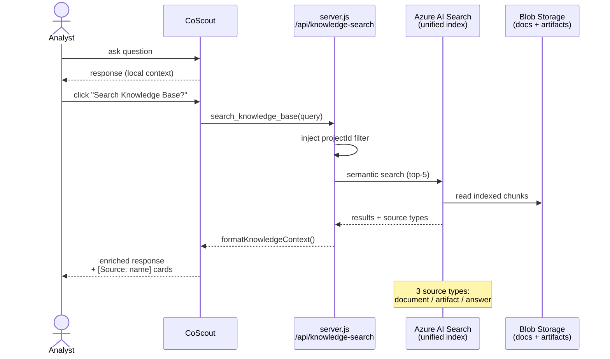

# Knowledge Base Search

Search your team's documents and investigation artifacts from CoScout to accelerate investigations with institutional knowledge — SOPs, fault trees, past findings, and more.

---

## Problem

Improvement specialists spend disproportionate time rediscovering what their team already learned. A new investigation lands on a familiar process, but the prior findings, SOPs, fault trees, and resolved-finding outcomes live in scattered SharePoint folders, personal notes, and old project files that don't surface during analysis. Manual cross-referencing across dozens of past investigations doesn't scale, and the most valuable signal — _"we saw nozzle wear cause this drift two quarters ago, here's what worked"_ — is the easiest to lose. Without retrieval, every investigation starts from zero and the team's accumulated learning never compounds.

## Capability claim

VariScout integrates a **CoScout-mediated semantic search** over a unified knowledge index (Knowledge Catalyst, [ADR-060](../../07-decisions/adr-060-coscout-intelligence-architecture.md)). When the analyst asks a question, CoScout can call `search_knowledge_base` against an Azure AI Search index that contains three source types (admin-uploaded documents, auto-indexed investigation artifacts, contributed answers), all scoped to the active project via a server-computed `projectId` filter. Results return as source-attributed cards and feed into the CoScout response via `formatKnowledgeContext()`, with `[Source: name]` citations. Beta in V1 Azure (€120/month, Phase 2+), opt-in via Admin > Knowledge Base.

## Intent diagram

CoScout calls `search_knowledge_base` only when the analyst explicitly opts in (the "Search Knowledge Base?" button after a response); the server enforces the `projectId` scope filter before the index hit, so cross-project leakage is structurally impossible.

---

## Overview

The Knowledge Base feature allows CoScout to search a unified knowledge index for relevant documents and investigation artifacts when answering questions. This brings both institutional documents and the team's accumulated investigation knowledge into every conversation.

**Plan requirement**: Azure App (€120/month, Phase 2+)
**Status**: Beta (opt-in via Admin > Knowledge Base)
**Architecture**: [ADR-060](../../07-decisions/adr-060-coscout-intelligence-architecture.md)

---

## How It Works

1. **Automatic indexing** — findings, questions, and improvement ideas are automatically indexed as investigation artifacts as your investigation progresses
2. **Document upload** — admins can upload SOPs, procedures, and reference documents via the Knowledge Base admin UI
3. **On-demand search** — when you ask CoScout a question, a "Search Knowledge Base?" button appears after the response. Click it to search your team's knowledge index
4. **Source-attributed results** — results appear as cards with title, snippet preview, source type (document / investigation artifact / answer), and a direct link
5. **Enriched responses** — CoScout cites sources naturally with `[Source: name]` badges, combining your analysis data with institutional knowledge

---

## Search Scope

CoScout searches the Azure AI Search unified knowledge index (Knowledge Catalyst), scoped to the active project via a `projectId` filter computed server-side (`server.js → /api/knowledge-search`). This ensures results are relevant to the current investigation context.

> Results include both project-specific investigation artifacts and shared organizational documents (SOPs, procedures) uploaded by admins.

---

## Data Sources

### Knowledge Catalyst Unified Knowledge Index (ADR-060)

The knowledge index is backed by Blob Storage and organized into three source types:

| Source Type                 | Content                                                                    | How It Gets There                        |
| --------------------------- | -------------------------------------------------------------------------- | ---------------------------------------- |
| **Documents**               | SOPs, work instructions, procedures, fault trees, 8D reports               | Admin uploads via Knowledge Base UI      |
| **Investigation artifacts** | Findings, questions, improvement ideas from active and past investigations | Auto-indexed as investigation progresses |
| **Answers**                 | Team member contributions and recorded answers                             | Contributed via CoScout conversation     |

**Search flow**: CoScout calls `search_knowledge_base` tool → `server.js` computes `projectId` filter → queries Azure AI Search → returns top-5 results with source type attribution → formatted via `formatKnowledgeContext()` into CoScout prompt.

**No M365 Copilot license required**: Azure AI Search connects to Blob Storage directly — no Remote SharePoint knowledge source needed.

---

## Acceptance signals

Testable conditions that demonstrate the capability is wired end-to-end:

- **Index populated**: a project with ≥1 admin-uploaded document and ≥1 resolved finding shows non-empty results in the Admin > Knowledge Base "Test Search Connectivity" step.
- **Project scoping holds**: a query that has obvious matches in another project's data returns 0 hits when run from a different project; `projectId` filter is enforced server-side, not client-side.
- **Source attribution**: every result card surfaces title + snippet + source type (`document` / `artifact` / `answer`); CoScout responses embed `[Source: name]` citations in prose.
- **Top-5 contract**: search returns at most 5 results, ranked by Azure AI Search relevance score.
- **Graceful empty-state**: an empty index (or empty result set) returns silently with no error toast; CoScout falls back to local-context response without showing the "Search Knowledge Base?" button.
- **Offline degradation**: with no network, `isKnowledgeBaseAvailable` returns false and the button is hidden — CoScout still responds with local context only.
- **404 silent**: a misconfigured or missing index returns empty results (not an error blocking the conversation).

---

## Offline Behavior

The Knowledge Base search degrades gracefully:

- **No network**: Search button is hidden, CoScout responds with local context only
- **No search endpoint**: Feature is disabled (`isKnowledgeBaseAvailable` returns false)
- **Search errors**: Logged as warnings, empty results returned — never blocks the conversation
- **No Knowledge Base (404)**: Silently returns empty results

---

## Out of scope / non-goals

V1 deferrals — explicitly _not_ part of the Beta capability:

- **Full-text indexing of arbitrary file formats** — beyond what Azure AI Search natively handles for Blob Storage (PDF, DOCX, TXT, MD). Image-only PDFs and scanned documents are out until OCR is wired.
- **Multi-tenant KB sharing** — each Azure tenant owns its index; there is no cross-tenant or marketplace KB layer in V1.
- **KB versioning / revision history** — documents are replaced, not versioned. Re-uploading an updated SOP overwrites the indexed copy.
- **Real-time re-indexing** — Azure AI Search runs on its own indexing cadence; newly uploaded documents may take minutes to appear in results.
- **Inline KB-result editing** — analysts cannot edit indexed documents from search results; edits must go through the original source (SharePoint, source SOP, etc.).
- **Per-result feedback / re-ranking** — no thumbs-up / thumbs-down learning loop in V1. Result quality depends on Azure AI Search's default relevance scoring.

---

## Admin Setup

1. Navigate to **Admin > Knowledge Base** (BookOpen icon in header)
2. Verify all status checks are green:
   - Azure App active (Phase 2+ feature)
   - Search endpoint configured (via ARM template — Azure AI Search service)
   - Beta feature enabled
3. Upload organizational documents (SOPs, procedures, reference docs) via the document upload UI — Azure AI Search indexes from Blob Storage automatically; no Remote SharePoint knowledge source needed
4. Click **Test Search Connectivity** to verify the Azure AI Search index
5. Toggle the beta feature on/off as needed

---

## Links

- **Code**: `packages/core/src/ai/knowledgeAdapter.ts` (source-type taxonomy + abstract search interface), `packages/core/src/ai/searchProject.ts` (project-scoped search), `packages/core/src/ai/actionTools.ts` (`search_knowledge_base` tool wiring), `apps/azure/server.js` (`/api/knowledge-search` endpoint with `projectId` filter injection)
- **Architecture**: [ADR-060: CoScout Intelligence Architecture](../../07-decisions/adr-060-coscout-intelligence-architecture.md) (current knowledge architecture)
- **Superseded**: [ADR-022: Knowledge Layer Architecture](../../archive/adrs/adr-022-knowledge-layer-architecture.md) (original); [ADR-026: SharePoint-First Knowledge Base](../../archive/adrs/adr-026-knowledge-base-sharepoint-first.md) (superseded by ADR-060)
- **Infrastructure**: [ARM Template — AI Services](../../08-products/azure/arm-template.md#4-ai-services-all-plans)
- **Related features**: [AI Architecture](../../05-technical/architecture/ai-architecture.md), [CoScout](../ai/coscout.md)
