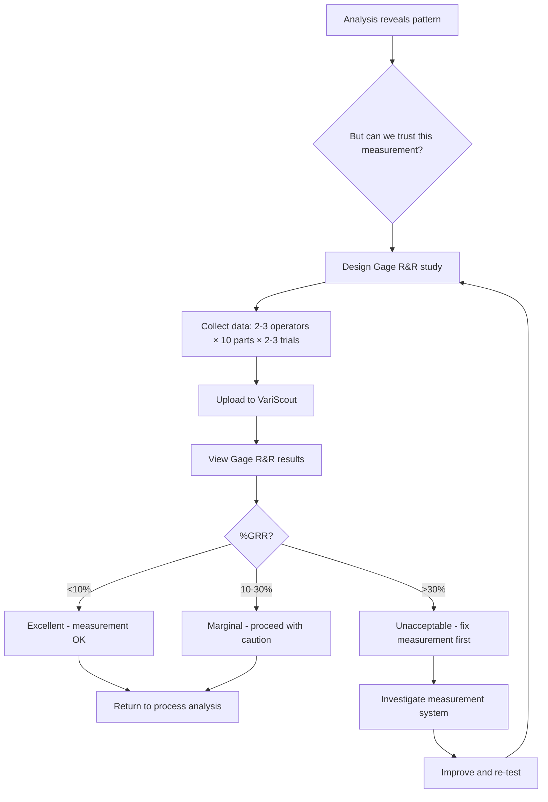
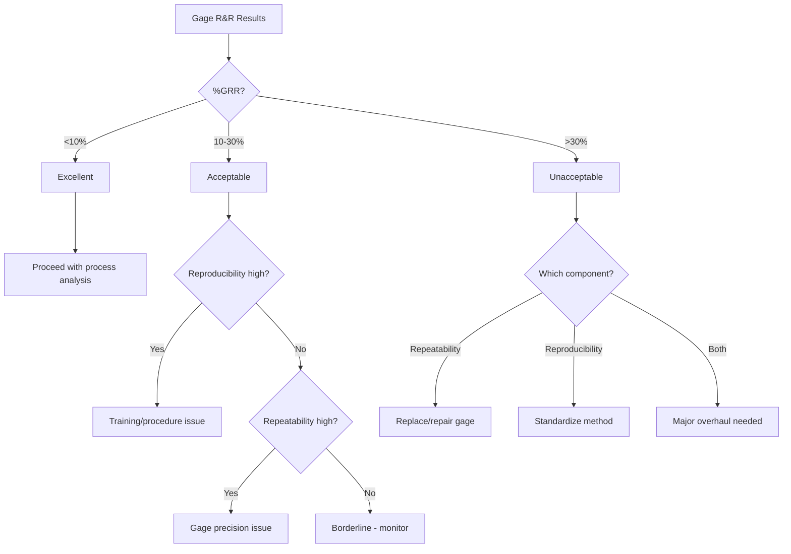

# MSA/Gage R&R Workflow

Validate your measurement system before drawing conclusions from your data.

## Overview

Measurement System Analysis (MSA) answers a critical question: **Can we trust the numbers?**

Before concluding that a process has problems, verify that the measurement system isn't creating the variation you're seeing.

## When to Run MSA



### Triggers for MSA

| Situation                             | Why MSA Matters                      |
| ------------------------------------- | ------------------------------------ |
| Found unexpected operator effect      | Is it real or measurement variation? |
| Cpk doesn't match customer complaints | Measurement may be biased            |
| New gage introduced                   | Verify it works as expected          |
| Process improvement "didn't work"     | Maybe measurement changed            |
| High variation, unknown cause         | Could be measurement system          |
| Calibration or maintenance done       | Verify measurement still good        |

## Study Design

### Components

A proper Gage R&R study requires:

| Component | Typical | Range | Purpose                |
| --------- | ------- | ----- | ---------------------- |
| Operators | 3       | 2-4   | Test reproducibility   |
| Parts     | 10      | 10-30 | Sample variation range |
| Trials    | 3       | 2-4   | Test repeatability     |

### Total Measurements

```
Operators × Parts × Trials = Total
    3     ×  10   ×   3   = 90 measurements
```

### Part Selection

Select parts that span the expected range:

- Include parts near LSL
- Include parts near USL
- Include parts in the middle
- Avoid all "perfect" parts

!!! warning "Common Mistake"
Using parts with no variation makes %GRR look artificially high. Parts should represent typical production spread.

## Data Collection

### Setup

1. Number parts 1-10 (concealed from operators)
2. Randomize measurement order
3. Have each operator measure each part multiple times
4. Record results in standard format

### Data Format

| Operator | Part | Trial | Value |
| -------- | ---- | ----- | ----- |
| A        | 1    | 1     | 10.02 |
| A        | 1    | 2     | 10.04 |
| A        | 1    | 3     | 10.01 |
| A        | 2    | 1     | 9.95  |
| ...      | ...  | ...   | ...   |
| C        | 10   | 3     | 10.18 |

### Blind Measurement

Operators should not know:

- Which part they're measuring (randomize)
- What others measured (prevent bias)
- Expected values (prevent adjustment)

## Interpreting Results

### %GRR (Gage R&R)

The key metric: What percentage of observed variation comes from measurement?

| %GRR   | Assessment   | Action                |
| ------ | ------------ | --------------------- |
| < 10%  | Excellent    | Measurement system OK |
| 10-30% | Acceptable   | May need improvement  |
| > 30%  | Unacceptable | Fix measurement first |

### Components of %GRR

```
%GRR = Repeatability + Reproducibility
         ↓                ↓
    Same operator    Different operators
    Same part        Same part
    Different trials Different trials
```

### Repeatability

**Same operator, same part, different trials**

High repeatability variation means:

- Gage lacks precision
- Inconsistent technique
- Environmental fluctuation

### Reproducibility

**Different operators, same part**

High reproducibility variation means:

- Operators use different techniques
- Training needed
- Procedure unclear

### Number of Distinct Categories (ndc)

How many groups can the measurement system distinguish?

| ndc | Interpretation           |
| --- | ------------------------ |
| < 2 | Cannot distinguish parts |
| 2-4 | Marginal discrimination  |
| ≥ 5 | Adequate discrimination  |

## VariScout Gage R&R Output

### Variance Components

| Source          | Variance   | %Contribution |
| --------------- | ---------- | ------------- |
| Part            | 0.0234     | 76.2%         |
| Repeatability   | 0.0052     | 16.9%         |
| Reproducibility | 0.0021     | 6.9%          |
| **Total GRR**   | **0.0073** | **23.8%**     |

### By Operator Chart

Shows each operator's measurements overlaid:

- Similar spread = good reproducibility
- Offset between operators = calibration/technique issue
- One operator wider = training needed

### By Part Chart

Shows variation within each part:

- Large variation = poor repeatability
- Consistent variation = good repeatability
- One part differs = part may be borderline

## Workflow Example

### Scenario

Fill weight analysis shows Operator B consistently high. Is this real or measurement bias?

### Step 1: Design Study

- 3 operators (A, B, C)
- 10 parts (selected from recent production)
- 3 trials each

### Step 2: Collect Data

```
Part #3, Trial #2, Operator B: [Record weight]
Part #7, Trial #1, Operator A: [Record weight]
... randomized sequence
```

### Step 3: Upload to VariScout

Switch to Gage R&R analysis mode, upload data.

### Step 4: Review Results

```
%GRR = 24.5% (Acceptable with caution)

Repeatability: 15.2%
Reproducibility: 9.3%
  - Operator B: +0.3g bias
```

### Step 5: Interpret

Operator B reads consistently 0.3g high. This explains the "operator effect" in the process data.

### Step 6: Action

- Retrain Operator B on measurement technique
- OR adjust Operator B's gage
- Re-run Gage R&R to verify fix

### Step 7: Return to Process Analysis

After fixing measurement, re-analyze process data. The "operator effect" may disappear.

## Decision Tree



## Common Issues and Solutions

### High Repeatability

| Cause                  | Solution                       |
| ---------------------- | ------------------------------ |
| Worn gage              | Replace or repair              |
| Low resolution         | Use higher precision gage      |
| Environmental noise    | Control temperature, vibration |
| Inconsistent technique | Improve fixturing              |

### High Reproducibility

| Cause                | Solution              |
| -------------------- | --------------------- |
| Different techniques | Standardize procedure |
| Training gaps        | Train operators       |
| Unclear procedure    | Document step-by-step |
| Calibration drift    | Regular calibration   |

### Both High

| Cause                           | Solution                       |
| ------------------------------- | ------------------------------ |
| Wrong gage for application      | Select appropriate gage        |
| Fundamental measurement problem | Re-evaluate measurement method |

## Best Practices

### Do

- Run MSA before major decisions
- Use parts that span the process range
- Randomize measurement order
- Keep operators blind to part identity
- Document measurement procedure

### Don't

- Don't use all "perfect" parts
- Don't let operators see each other's results
- Don't skip trials (complete the design)
- Don't assume "good gage = good measurement"
- Don't ignore marginal results

## Related Documentation

- [Gage R&R Feature](../analysis/gage-rr.md)
- [Four Pillars Workflow](four-pillars-workflow.md)
- [Data Validation](../data/validation.md)
