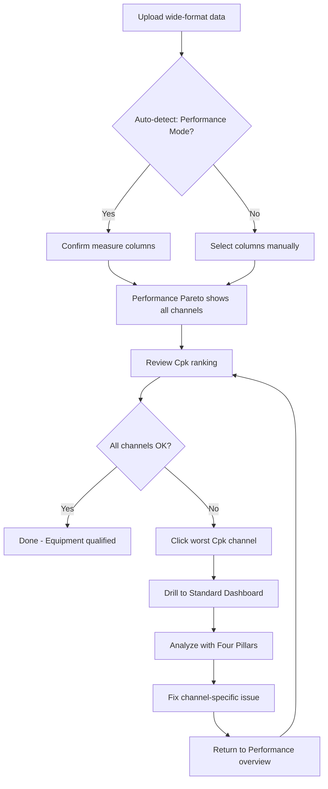

# Performance Mode Workflow

Multi-channel analysis for production equipment with multiple measurement points.

## Overview

Performance Mode is designed for analyzing equipment with multiple parallel measurement channels:

- **Fill heads** on a bottling line
- **Cavities** in injection molding
- **Nozzles** in dispensing equipment
- **Zones** in ovens or furnaces
- **Spindles** on multi-spindle machines

Instead of analyzing one measurement at a time, Performance Mode shows all channels together for comparison.

## When to Use Performance Mode

| Scenario                                   | Use Performance Mode? |
| ------------------------------------------ | --------------------- |
| 8 fill heads, need to find worst performer | Yes                   |
| Single measurement, multiple factors       | No (Standard)         |
| Comparing cavity-to-cavity variation       | Yes                   |
| Tracking one metric over time              | No (Standard)         |
| Equipment qualification                    | Yes                   |

## The Performance Mode Flow



## Data Format

### Wide Format (Performance Mode)

Each row is one sample, columns are channels:

| Sample | Head_1 | Head_2 | Head_3 | Head_4 |
| ------ | ------ | ------ | ------ | ------ |
| 1      | 100.2  | 99.8   | 101.5  | 100.1  |
| 2      | 99.9   | 100.1  | 102.1  | 99.7   |
| 3      | 100.3  | 99.6   | 101.8  | 100.4  |

### Long Format (Standard Mode)

Each row is one measurement:

| Sample | Head | Value |
| ------ | ---- | ----- |
| 1      | 1    | 100.2 |
| 1      | 2    | 99.8  |
| 1      | 3    | 101.5 |

Performance Mode expects **wide format**.

## Performance Charts

### Performance Pareto

Ranks all channels by Cpk (worst first):

```
Head_3  ████████████████  Cpk: 0.67 (Poor)
Head_1  ██████████████████████  Cpk: 1.12 (Marginal)
Head_4  ████████████████████████  Cpk: 1.35 (Good)
Head_2  █████████████████████████  Cpk: 1.48 (Good)
```

**What to look for:**

- Clear worst performer (fix this first)
- Cluster of poor performers (systematic issue?)
- Gap between good and bad (isolated problem)

### Performance I-Chart (Scatter)

Shows Cpk over time or sample sequence:

- Each point is a channel at a time period
- Color indicates health status
- Helps identify when a channel degraded

### Performance Boxplot

Distribution comparison across channels:

- Shows spread and centering
- Highlights outlier channels
- Limited to 5 channels at once (select worst)

### Performance Capability

Single-channel histogram after drilling down:

- Full capability analysis for selected channel
- Compare to specs
- Detailed distribution view

## Cpk vs Cp Toggle

| Metric | Shows                                  | Use When                            |
| ------ | -------------------------------------- | ----------------------------------- |
| Cpk    | Actual capability (includes centering) | Production monitoring               |
| Cp     | Potential capability (spread only)     | Identifying centering opportunities |

**Toggle in Performance Mode:**

- Default: Cpk (overall assessment)
- Switch to Cp: See if centering could help

!!! tip "Interpreting the Difference"
If Cp >> Cpk, the process can meet specs if centered. If Cp ≈ Cpk, the process is centered but variation is the issue.

## Health Classification

Performance Mode uses color-coded health status:

| Status    | Cpk Range | Color  | Action          |
| --------- | --------- | ------ | --------------- |
| Excellent | ≥ 1.67    | Green  | None needed     |
| Good      | 1.33–1.67 | Blue   | Monitor         |
| Marginal  | 1.00–1.33 | Yellow | Investigate     |
| Poor      | < 1.00    | Red    | Fix immediately |

## Workflow Example: Bottling Line

### Setup

8-head bottling line, fill weight specification: 500 ± 5g

### Step 1: Upload Data

Wide format with Head_1 through Head_8 columns.

VariScout auto-detects: "Performance Mode detected. Confirm measure columns?"

### Step 2: Review Performance Pareto

```
Head_3  Cpk: 0.67  [Poor]     ← Focus here
Head_7  Cpk: 0.89  [Poor]
Head_1  Cpk: 1.15  [Marginal]
Head_5  Cpk: 1.28  [Marginal]
Head_2  Cpk: 1.42  [Good]
Head_4  Cpk: 1.51  [Good]
Head_6  Cpk: 1.58  [Good]
Head_8  Cpk: 1.72  [Excellent]
```

### Step 3: Drill into Head_3

Click Head_3 bar → Transitions to Standard Dashboard

Now viewing only Head_3 data with full Four Pillars analysis.

### Step 4: Analyze with Four Pillars

**I-Chart:** Shows instability around 10am each day

**Boxplot:** Time of day explains 42% (η² = 0.42)

**Finding:** Head_3 heats up mid-morning, causing underfill

### Step 5: Return to Performance View

After identifying root cause, click "Back to Performance"

Plan: Add cooling to Head_3 or adjust fill timing

### Step 6: Verify Fix

After implementing fix, re-run Performance analysis:

```
Head_3  Cpk: 1.38  [Good]  ← Improved!
```

## Navigating Between Views

### Performance → Standard

- Click any channel in Performance charts
- Selected channel becomes the focus
- Standard Dashboard shows that channel's data
- Filter chip shows: `Channel: Head_3`

### Standard → Performance

- Click "Back to Performance" button
- Returns to multi-channel overview
- Any non-channel filters preserved

### Combining Filters

You can apply filters in Standard view, then return to Performance:

```
Performance → Head_3 → Filter Shift=Day → Back to Performance
```

Now Performance view shows all channels, but only Day shift data.

## Channel Limits

| Tier         | Max Channels |
| ------------ | ------------ |
| Demo         | 3            |
| Starter      | 10           |
| Professional | 50           |
| Enterprise   | Unlimited    |

## Common Patterns

### One Bad Channel

```
Head_3 is Poor, others are Good/Excellent
```

**Interpretation:** Isolated equipment issue

**Action:** Focus on that specific channel (wear, calibration, damage)

### All Channels Similar

```
All channels: Cpk 1.0-1.2 (Marginal)
```

**Interpretation:** Systematic issue affecting all channels

**Action:** Look at common causes (material, settings, environment)

### Degradation Over Time

```
Early samples: All Good
Recent samples: Several Poor
```

**Interpretation:** Process drift or wear

**Action:** Check maintenance records, calibration schedule

### Position-Based Pattern

```
Head_1, Head_2: Poor
Head_7, Head_8: Good
```

**Interpretation:** Position on machine matters

**Action:** Check mechanical alignment, temperature gradients

## Best Practices

### Do

- Review all channels before drilling down
- Check if poor performers cluster (position, time)
- Compare Cp vs Cpk to understand centering
- Document findings per channel
- Re-verify after fixes

### Don't

- Don't ignore marginally poor channels
- Don't assume all channels are independent
- Don't forget to check for time-based patterns
- Don't skip back to Performance view after fixing

## Related Documentation

- [Performance Mode Feature](../analysis/performance-mode.md)
- [Four Pillars Workflow](four-pillars-workflow.md)
- [Capability Analysis](../analysis/capability.md)
- [Oven Zones Case Study](../../04-cases/oven-zones/index.md)
