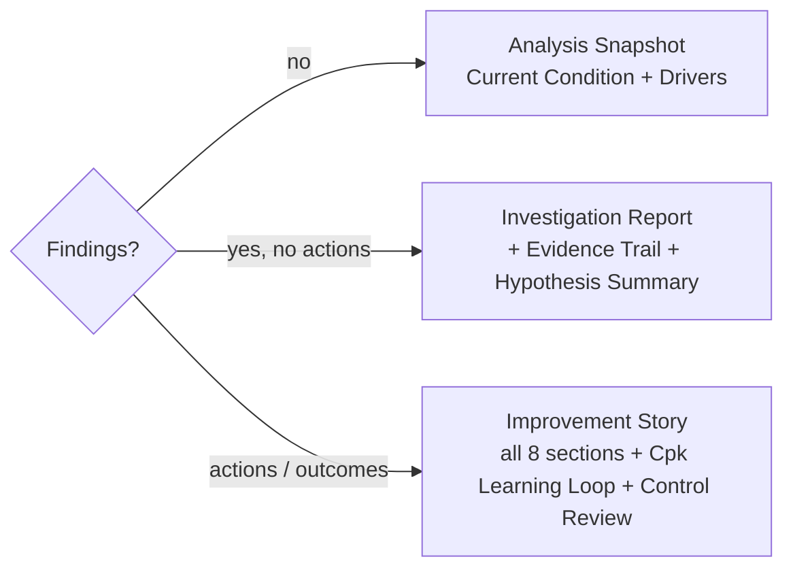

# Report — the compilation surface

> **Last material edit 2026-06-11** — Report is now the source surface for local-first Analysis Packs per [ADR-092](../../07-decisions/adr-092-local-first-variscout-product-model.md) + [ADR-093](../../07-decisions/adr-093-v1-simplification-cuts.md). Current shipped print/PDF and `.vrs` exports remain; HTML Analysis Packs are the product direction, and the artifact layer becomes paid-only (build-time gate on the free deployment) when the channel model lands.

The terminal, **read-mostly** surface: Findings, Hypotheses, Actions, and Control evidence compile into a narrative report the analyst can share. Under the Workspace model, Report always renders the single-project/workspace report because every Workspace is backed by one active Project. Informal Projects get one soft formalization hint; the retired Hub portfolio fallback is gone.

In the local-first model, Report is also the source for **Analysis Packs**: self-contained evidence artifacts that replace manual PowerPoint/PDF reporting for the common Minitab + Excel + PowerPoint workflow.

## Three report types (auto-detected)

`deriveReportType(findings)` (`packages/hooks/src/useReportSections.ts`) picks the type from the presence of actions/outcomes:

Sections are tagged by **workspace origin** and colour-coded: Analysis (green), Findings (amber), Improvement (purple). The legacy `hub-portfolio` section id was deleted by RPT-1; hypothesis summaries render _within_ `evidence-trail`, not as a separate id. `ReportImprovementSummary` maps `Hypothesis.status` (the `confirmed` status renders as **"Supported"**).

Section status markers are derived from content. Empty or placeholder-only sections do not render as completed; the Report shows an explicit empty-state line instead of a decorative checkmark.

## Single-project overview report

The Overview audience mode renders the seven QC-story-shaped sections from `deriveIPReportNarrative()`:

1. Executive summary
2. Where we started
3. What we aimed for
4. What we found + what we did
5. Did it work?
6. What we standardized + learned
7. What's next

Control integration is explicit:

- **Where we started** includes the frozen `ControlRecord.baseline` anchor when present: measure, baseline window, n, mean, sigma, and Cpk when specs exist.
- **Did it work?** reads the `ControlReview` re-check sequence and latest before/now comparison. It does not use tick counts or auto-verdict copy.
- **What we standardized + learned** reads the simplified handoff surface and system name.
- Cause rows use the latest analyst re-check verdict as verification context.
- **What we found + what we did** includes evidenced suspected-cause rows and the explicit unattached-finding destination: "Findings not yet attached to a suspected cause." If no findings, actions, or suspected causes exist yet, the section says so directly.

PO-5 governs Report composition through analyst-owned hypothesis status and evidence links. RPT-1 governs the container: Report is always the single-project report, with the old portfolio fallback removed. ER-11 adds the missing destination for findings captured before they are attached to a suspected cause; it does not change PO-5's status rules for cause rows.

## Audience toggle

Defaults to **Technical** (full I-Chart params, ANOVA, Cpk, limits); toggles to **Summary** (high-level narrative, simplified charts) for non-technical stakeholders. `ReportViewBase` (`packages/ui/src/components/ReportView/`).

## Distributions, not aggregates (ADR-073 — invariant)

Capability is shown as **per-step boxplot distributions side-by-side, never an aggregated number**. There is deliberately **no** `aggregateCpk()` / `meanCapabilityAcrossHubs()` / portfolio-roll-up function — capability indices across heterogeneous units are incommensurable, and the _absence_ is enforced by an architecture test (`packages/core/src/__tests__/architecture.noCrossInvestigationAggregation.test.ts`). See [ADR-073](../../07-decisions/adr-073-no-statistical-rollup-across-heterogeneous-units.md).

## Export

- **Analysis Pack (product direction)** — self-contained HTML export generated from Report/workspace state. Variants: Executive, Technical, Reproducible, Redacted. See [export.md](../data/export.md).
- **Print / PDF (both apps)** via the browser print dialog (`handlePrintReport` → `window.print()` + an `@media print` stylesheet — no PDF library; expands all sections, switches to a light theme). Print/PDF is the lightweight derived form of the Report, not the long-term highest-quality share artifact. _(ADR-031 predates the PWA Report view and is stale on its "Azure-only" claim — both apps print.)_
- **`.vrs` snapshot (both apps)** — the report's `DocumentSnapshot` envelope; on PWA this is the only _durable_ workspace path (R6d export-only). Reproducible Analysis Packs may include or link this snapshot.
- **AI narrative** — optional provider-boundary capability. Azure CoScout can draft narrative today; future local LLM/MCP agents may draft or critique through controlled bundles. Deterministic report data remains authoritative.

## Access

> **Roles scheduled for deletion (ADR-093 D1).** The Lead/Member/Sponsor role model below is shipped code scheduled for deletion; "Sponsor" survives as a pack _audience_ (the executive Analysis Pack), not a role with access.

The **Sponsor** is read-only on the Report (the role's primary surface); Lead/Member edit upstream. Sign-off is optional + out-of-band in V1.

## Azure vs PWA

|                         | Company-approved / Azure | PWA (free)                |
| ----------------------- | ------------------------ | ------------------------- |
| Report tab              | ✓                        | ✓ (read-mostly)           |
| Print / PDF             | ✓ (print)                | ✓ (print)                 |
| `.vrs` snapshot export  | ✓                        | ✓                         |
| Analysis Pack direction | ✓                        | ✓                         |
| AI narrative            | Optional customer AI     | — / future local provider |

## Not yet built (do not document as live)

No cross-hub / cross-investigation statistical aggregation (ADR-073 — by design, not a gap); no Hub portfolio report fallback; in-product sign-off workflow is out-of-band in V1; no shipped HTML Analysis Pack generator yet.

## See also

- [export.md](../data/export.md) — export channels and Analysis Packs. · [save-and-load.md](../data/save-and-load.md) — the `.vrs` snapshot.
- [ADR-037](../../07-decisions/adr-037-reporting-workspaces.md) (report types) · [ADR-073](../../07-decisions/adr-073-no-statistical-rollup-across-heterogeneous-units.md) (distributions-not-aggregates) · [ADR-031](../../07-decisions/adr-031-report-export.md) (export) · [ADR-092](../../07-decisions/adr-092-local-first-variscout-product-model.md) (local-first product model).
