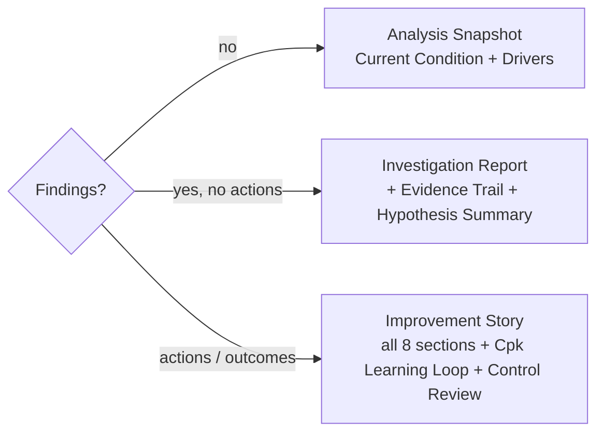

# Report — the compilation surface

The terminal, **read-mostly** surface: Findings, Hypotheses, Actions, and Control status compile into a narrative report the Sponsor reviews and the team shares. The report **type auto-detects** from how far the investigation has progressed.

## Three report types (auto-detected)

`deriveReportType(findings)` (`packages/hooks/src/useReportSections.ts`) picks the type from the presence of actions/outcomes:

Sections are tagged by **workspace origin** and colour-coded: Analysis (green), Findings (amber), Improvement (purple). The 8 ordered sections: `current-condition`, `drivers`, `evidence-trail`, `hypothesis-summary`, `improvement-plan`, `actions-taken`, `verification`, + optional `hub-portfolio`. `ReportImprovementSummary` maps `Hypothesis.status` (the `confirmed` status renders as **"Supported"**).

## Audience toggle

Defaults to **Technical** (full I-Chart params, ANOVA, Cpk, limits); toggles to **Summary** (high-level narrative, simplified charts) for non-technical stakeholders. `ReportViewBase` (`packages/ui/src/components/ReportView/`).

## Distributions, not aggregates (ADR-073 — invariant)

Capability is shown as **per-step boxplot distributions side-by-side, never an aggregated number**. There is deliberately **no** `aggregateCpk()` / `meanCapabilityAcrossHubs()` / portfolio-roll-up function — capability indices across heterogeneous units are incommensurable, and the _absence_ is enforced by an architecture test (`packages/core/src/__tests__/architecture.noCrossInvestigationAggregation.test.ts`). See [ADR-073](../../07-decisions/adr-073-no-statistical-rollup-across-heterogeneous-units.md).

## Export

- **Azure: PDF** via the browser print dialog (`window.print()` + an `@media print` stylesheet — no PDF library, zero bundle cost; expands all sections, switches to a light theme). Optional AI narrative (CoScout) in the findings/evidence sections, labelled "AI-generated" (Azure only; PWA has no AI, P8).
- **PWA: export-only** — `.vrs` (a VariScout Report Snapshot, the `DocumentSnapshot` envelope). No print/PDF (ADR-031, Azure-only). Read-mostly sections render; durability is the `.vrs`.

## Access

The **Sponsor** is read-only on the Report (the role's primary surface); Lead/Member edit upstream. Sign-off is optional + out-of-band in V1.

## Azure vs PWA

|                        | Azure (€120) | PWA (free)      |
| ---------------------- | ------------ | --------------- |
| Report tab             | ✓            | ✓ (read-mostly) |
| PDF export             | ✓ (print)    | —               |
| `.vrs` snapshot export | ✓            | ✓               |
| AI narrative           | ✓            | —               |

## Not yet built (do not document as live)

No cross-hub / cross-investigation statistical aggregation (ADR-073 — by design, not a gap); in-product sign-off workflow is out-of-band in V1.

## See also

- [export.md](../data/export.md) — the export channels. · [save-and-load.md](../data/save-and-load.md) — the `.vrs` snapshot.
- [ADR-037](../../07-decisions/adr-037-reporting-workspaces.md) (report types) · [ADR-073](../../07-decisions/adr-073-no-statistical-rollup-across-heterogeneous-units.md) (distributions-not-aggregates) · [ADR-031](../../07-decisions/adr-031-report-export.md) (export).
