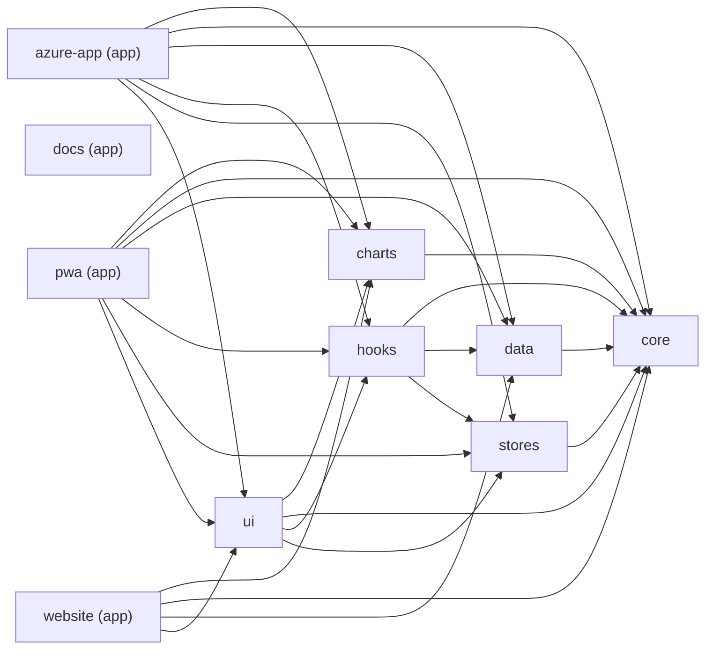

> AUTO-GENERATED by `pnpm docs:gen-arch` — do not edit by hand. Regenerate after changing `package.json#dependencies`, `tsconfig.json#paths`, `package.json#exports`, or `apps/*/src/index.css` `@source` directives.

# Architecture (auto-generated)

Generated: 2026-05-26. Source: `scripts/docs/gen-arch.mjs`.

---

## Workspace Dependency Graph

Internal workspace dependencies only (edges within the `@variscout/*` namespace). External npm dependencies omitted for clarity.

---

## Sub-Path Export Map

Sub-path exports declared in `package.json#exports` and corresponding TypeScript path aliases in `tsconfig.json#compilerOptions.paths`. These must be updated together — adding one without the other silently breaks imports. See `.claude/INVARIANTS.md` §Sub-path exports.

| Package | `package.json` exports | `tsconfig.json` paths |
|---------|------------------------|----------------------|
| `@variscout/charts` | `.`, `./Boxplot`, `./CapabilityHistogram`, `./ChartSourceBar`, `./IChart`, `./ParetoChart`, `./ProbabilityPlot` | _(none)_ |
| `@variscout/core` | `.`, `./actions`, `./ai`, `./canvas`, `./capability`, `./defect`, `./evidenceMap`, `./evidenceSources`, `./export`, `./findings`, `./frame`, `./glossary`, `./i18n`, `./identity`, `./improvementProject`, `./matchSummary`, `./measurementPlan`, `./navigation`, `./pareto`, `./parser`, `./performance`, `./persistence`, `./processHub`, `./processMoments`, `./projectMembership`, `./projectMetadata`, `./responsive`, `./signalCards`, `./stats`, `./strategy`, `./survey`, `./tier`, `./time`, `./types`, `./ui-types`, `./variation`, `./yamazumi` | `@variscout/core/measurementPlan`, `@variscout/core/projectMembership` |
| `@variscout/data` | `.`, `./computed`, `./samples` | _(none)_ |
| `@variscout/hooks` | `.` | _(none)_ |
| `@variscout/stores` | `.` | _(none)_ |
| `@variscout/ui` | `.`, `./ipDetail`, `./styles/components.css`, `./styles/report-print.css`, `./styles/theme.css` | _(none)_ |
| `@variscout/azure-app` | _(none)_ | `@/*`, `@variscout/charts`, `@variscout/charts/*`, `@variscout/core`, `@variscout/core/*`, `@variscout/data`, `@variscout/data/*`, `@variscout/hooks`, `@variscout/hooks/*`, `@variscout/ui`, `@variscout/ui/*`, `@variscout/ui/ipDetail` |
| `@variscout/pwa` | _(none)_ | `@variscout/charts`, `@variscout/charts/*`, `@variscout/core`, `@variscout/core/*`, `@variscout/data`, `@variscout/data/*`, `@variscout/hooks`, `@variscout/hooks/*`, `@variscout/ui`, `@variscout/ui/*`, `@variscout/ui/ipDetail` |

---

## Tailwind v4 @source Coverage

Each app must declare `@source` directives for every shared package whose class names it uses. Missing a directive silently breaks Tailwind v4 responsive utilities. See `.claude/INVARIANTS.md` §`@source` directive.

| App | `@source` directives in `src/index.css` |
|-----|------------------------------------------|
| `@variscout/azure-app` | `../../../packages/ui/src/**/*.tsx` `../../../packages/charts/src/**/*.tsx` `../../../packages/hooks/src/**/*.ts` |
| `@variscout/docs` | _(no src/index.css — not a Tailwind app)_ |
| `@variscout/pwa` | `../../../packages/ui/src/**/*.tsx` `../../../packages/charts/src/**/*.tsx` `../../../packages/hooks/src/**/*.ts` |
| `@variscout/website` | _(no src/index.css — not a Tailwind app)_ |
