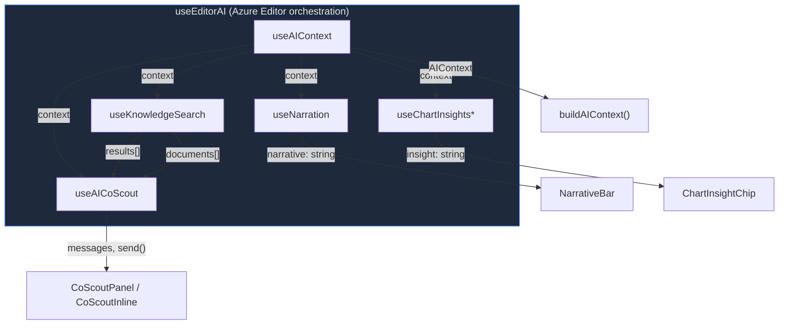

# AI Data Flow & Interaction Design

Cross-cutting reference for how AI features compose across hooks, services, and UI components.

---

## 1. Information Flow

```mermaid
flowchart LR
    subgraph State["Analysis State"]
        DC[DataContext]
        F[Findings]
        H[Hypotheses]
        PC[ProcessContext]
    end

    subgraph Orchestration["useEditorAI"]
        AC[useAIContext]
        NR[useNarration]
        CI[useChartInsights]
        CS[useAICoScout]
        KS[useKnowledgeSearch]
    end

    subgraph Core["@variscout/core"]
        BAC[buildAIContext]
        PT[\"prompts/* modules\"]
        SQ[buildSuggestedQuestions]
    end

    subgraph Service["AI Service Layer"]
        FN[fetchNarration]
        FCI[fetchChartInsight]
        FCR[fetchCoScoutResponse]
        SRF[searchRelatedFindings]
    end

    subgraph UI["UI Components"]
        NB[NarrativeBar]
        CIC[ChartInsightChip]
        CSP[CoScoutPanel]
        ISB[InvestigationSidebar]
    end

    DC --> AC
    F --> AC
    H --> AC
    PC --> AC
    AC --> BAC
    BAC --> PT
    BAC --> SQ

    AC --> NR
    AC --> CI
    AC --> CS
    AC --> KS

    NR --> FN --> NB
    CI --> FCI --> CIC
    CS --> FCR --> CSP
    KS --> SRF --> CSP

    SQ --> ISB
```

**Data flow summary:**

1. `useEditorAI` composes all AI hooks and provides a single return object to the Editor
2. `useAIContext` calls `buildAIContext()` to assemble the structured `AIContext` from analysis state
3. Each hook consumes the context and calls the appropriate AI service function
4. Service responses flow into UI components via hook return values

**Additional service flows** not shown in the diagram above:

- **Streaming:** `fetchCoScoutStreamingResponse()` follows the same data path as `fetchCoScoutResponse()` but delivers tokens incrementally via a chunk callback. `useAICoScout` manages abort control and progressive message assembly.
- **AI Report:** `fetchFindingsReport()` + `buildReportPrompt()` (from `packages/core/src/ai/prompts/reports.ts`) — a distinct flow for generating a structured findings export. Consumes the full `AIContext` plus all findings, producing a formatted report rather than a conversational response.

---

## 2. Three-Mode Comparison

How each AI-powered component behaves across the three modes:

| Component                     | No AI                                                              | AI Enabled                                            | AI + Knowledge Base                                                       |
| ----------------------------- | ------------------------------------------------------------------ | ----------------------------------------------------- | ------------------------------------------------------------------------- |
| **NarrativeBar**              | Hidden                                                             | Summary bar with 1-2 sentence narration               | Same (KB doesn't affect narration)                                        |
| **ChartInsightChip**          | Deterministic insight only                                         | AI-enhanced insight (120 chars)                       | Same (KB doesn't affect chart insights)                                   |
| **CoScoutPanel**              | Hidden                                                             | Conversational assistant grounded in analysis context | + KB search results injected as system context, source badges on messages |
| **Investigation Sidebar**     | Suggested questions (deterministic from `buildSuggestedQuestions`) | + AI-generated questions                              | + KB-aware questions referencing past findings                            |
| **FindingCard "Ask CoScout"** | Hidden                                                             | Opens CoScout with finding focus context              | + Linked hypothesis ideas in question                                     |
| **Per-action "Ask CoScout"**  | Hidden                                                             | Sends action-specific question to CoScout             | Same                                                                      |

---

## 3. AI Hook Composition



\*`useChartInsights` is composed per-chart in chart wrapper components, not inside `useEditorAI`. The `fetchChartInsight` function is passed down as a prop.

### Hook responsibilities

| Hook               | Consumes                                                                                 | Produces                                       | UI Consumer        |
| ------------------ | ---------------------------------------------------------------------------------------- | ---------------------------------------------- | ------------------ |
| `useAIContext`     | stats, filters, findings, hypotheses, processContext, violations, variationContributions | `AIContext` object                             | All other AI hooks |
| `useNarration`     | `AIContext`, `fetchNarration` service fn                                                 | `narrative`, `isLoading`, `error`, `refresh()` | `NarrativeBar`     |
| `useChartInsights` | `AIContext`, `fetchChartInsight` service fn, chart-specific data                         | `insight`, `isAIEnhanced`, `isLoading`         | `ChartInsightChip` |

> **Deterministic-first pipeline:** `useChartInsights` always runs a **deterministic insight first** — `buildIChartInsight()`, `buildBoxplotInsight()`, `buildParetoInsight()`, or `buildCapabilityInsight()` from `packages/core/src/ai/chartInsights.ts`. These pure functions produce a meaningful text insight from stats alone (violations, contribution %, capability status). If AI is available and the user has insights enabled, the hook then fires a debounced `fetchChartInsight()` call to enhance the deterministic text with process context. The deterministic insight is displayed immediately; the AI enhancement replaces it when ready. This means **chart insights work in all modes**, including PWA (no AI) and offline.
> | `useAICoScout` | `AIContext`, `fetchCoScoutResponse`, `onBeforeSend` (KB injection) | `messages[]`, `send()`, `isStreaming`, `abort()` | `CoScoutPanel`, `CoScoutInline` |
> | `useKnowledgeSearch` | `searchFn`, `searchDocumentsFn`, `enabled` flag | `results[]`, `documents[]`, `search()` | Injected into CoScout via `onBeforeSend` |

---

## 4. Context Data Shape

`buildAIContext()` produces an `AIContext` object with these sections:

```
AIContext
├── process              # User-provided process description, problem statement, factor roles
├── stats                # mean, stdDev, samples, cpk, cp, passRate
├── filters[]            # Active drill-down filters with category names
├── violations           # Out-of-control, above USL, below LSL, Nelson rule counts
├── variationContributions[]  # Per-factor η² values with category names
├── drillPath[]          # Ordered factor names from filter stack
├── findings             # { total, byStatus, keyDrivers[] }
├── investigation
│   ├── problemStatement
│   ├── targetMetric, targetValue, currentValue, progressPercent
│   ├── selectedFinding  # Text, hypothesis, projection, actions (with full text)
│   ├── allHypotheses[]  # Text, status, contribution, ideas (with projections)
│   ├── hypothesisTree[] # Root hypotheses with children (factor, level, ideas, validation)
│   ├── phase            # Deterministic: initial | diverging | validating | converging | acting
│   └── categories[]     # Investigation categories for completeness prompting
├── activeChart          # Currently focused chart type (ichart, boxplot, pareto, capability)
├── stagedComparison     # Before/After verification metrics (baseline vs current Cpk, mean, etc.)
├── focusContext         # From "Ask CoScout about this" (chart, category, or finding with ideas)
├── teamContributors     # Teams plan: count + hypothesis areas
├── glossaryFragment     # Methodology terms + concepts for grounding
├── knowledgeResults[]   # Past findings from AI Search (injected via onBeforeSend)
├── knowledgeDocuments[] # SharePoint/SOP documents (injected via onBeforeSend)
└── locale               # Active locale (e.g. 'en', 'fi', 'de') for AI response language
```

---

## 5. Progressive Enhancement

User journey through the three modes:

### Mode 1: AI Not Configured

- All AI UI components are hidden (`aiAvailable = false`)
- Chart insights show deterministic text only (computed in `useChartInsights`)
- Investigation Sidebar shows deterministic suggested questions from `buildSuggestedQuestions()`
- No `fetchNarration`, `fetchCoScoutResponse` functions are passed to hooks

### Mode 2: AI Enabled (toggle on)

- `isAIAvailable()` returns true — AI service endpoint is configured
- Per-component toggles in `AIPreferences`: `narration`, `insights`, `coscout`
- NarrativeBar appears with loading shimmer → AI summary
- ChartInsightChip enhances deterministic insight with process context
- CoScout panel becomes available (via NarrativeBar "Ask" button or FindingCard)
- Provider label shown in CoScout header (T3 transparency)

### Mode 3: AI + Knowledge Base

- `isKnowledgeBaseAvailable()` returns true — AI Search index exists
- `onBeforeSend` hook in `useAICoScout` triggers **two parallel KB searches** before each message:
  - `searchRelatedFindings()` — queries the findings index in AI Search for past resolved findings with similar context
  - `searchDocuments()` — Foundry IQ agentic retrieval for SharePoint documents, SOPs, and work instructions
  - Results are merged and injected as `knowledgeResults[]` + `knowledgeDocuments[]` in the CoScout system prompt
- Source badges (`[Source: findings]`, `[Source: SharePoint]`) appear in responses
- Investigation Sidebar may surface KB-aware suggested questions

#### Knowledge Accumulation

The Knowledge Base is populated by a feedback loop from resolved findings. `indexFindingsToSearch()` (from `apps/azure/src/services/indexService.ts`) performs debounced (5-second) fire-and-forget indexing of findings to the AI Search index whenever findings are updated. Only findings with sufficient context (status, hypothesis, outcome) are indexed. This is the write path that populates Mode 3 — resolved investigations from one user become searchable knowledge for the next.

---

## 6. Mode Transition UX

| Event                    | What Happens                                                                           |
| ------------------------ | -------------------------------------------------------------------------------------- |
| **AI toggle on**         | NarrativeBar fades in, chips start enhancing, CoScout becomes available                |
| **AI toggle off**        | NarrativeBar hidden, chips revert to deterministic, CoScout hidden                     |
| **Endpoint removed**     | `isAIAvailable()` → false, same as toggle off; no error states                         |
| **Offline**              | AI service calls fail gracefully → error classification → retry for transient errors   |
| **KB toggle**            | `isKnowledgeBaseAvailable()` changes, `onBeforeSend` hook activates/deactivates        |
| **Per-component toggle** | Individual `AIPreferences` flags control narration/insights/coscout independently (T7) |
| **Rate limited**         | CoScout shows retryable error badge; narration falls back to cached value              |

---

## 7. Investigation Workflow x AI Touch Points

How AI context changes across IDEOI investigation phases:

| Phase          | AI Context Injected                                                       | Suggested Questions                                                    | CoScout Instructions                                                |
| -------------- | ------------------------------------------------------------------------- | ---------------------------------------------------------------------- | ------------------------------------------------------------------- |
| **Initial**    | Problem statement, basic stats                                            | "What patterns do you see?", "Which chart should I examine first?"     | Help identify which chart to examine first                          |
| **Diverging**  | Hypothesis tree (roots + children with factor/level/ideas), categories    | "Have you explored [uncovered category]?", "What about [factor]?"      | Encourage exploring across factor categories, cast wide net         |
| **Validating** | η² contributions, validation status, validation tasks                     | "What does this η² mean for [factor]?", "Should I drill deeper?"       | Help interpret contribution %, prioritize untested hypotheses       |
| **Converging** | Supported hypotheses with improvement ideas (text, selected, projections) | "What improvement ideas for [hypothesis]?", "Compare effort vs impact" | Help brainstorm ideas, evaluate existing ones, compare alternatives |
| **Acting**     | Action items (full text + status), projections, outcomes                  | "How should I approach [action]?", "Is Cpk improving?"                 | Check Capability chart, monitor effectiveness                       |

> **Note:** `buildSuggestedQuestions()` (from `packages/core/src/ai/suggestedQuestions.ts`) is a **pure function** — no AI call is involved. It selects phase-appropriate questions based on the current `AIContext` state (investigation phase, uncovered categories, hypothesis count, action status). These questions appear in the Investigation Sidebar and work in all modes, including when AI is not configured.

---

## See Also

- [AI Architecture](ai-architecture.md) — High-level AI integration strategy and service layer
- [AI Context Engineering](ai-context-engineering.md) — Prompt design and context assembly patterns
- [AIX Design System](aix-design-system.md) — Governance, terminology, confidence calibration
- [Component Patterns](component-patterns.md) — Hook architecture including AI hook layer
- [ADR-019: AI Integration](../../07-decisions/adr-019-ai-integration.md) — Decision record
- [AI Context Pipeline Reference](ai-context-reference.md) — Module map, function signatures, caching strategy
