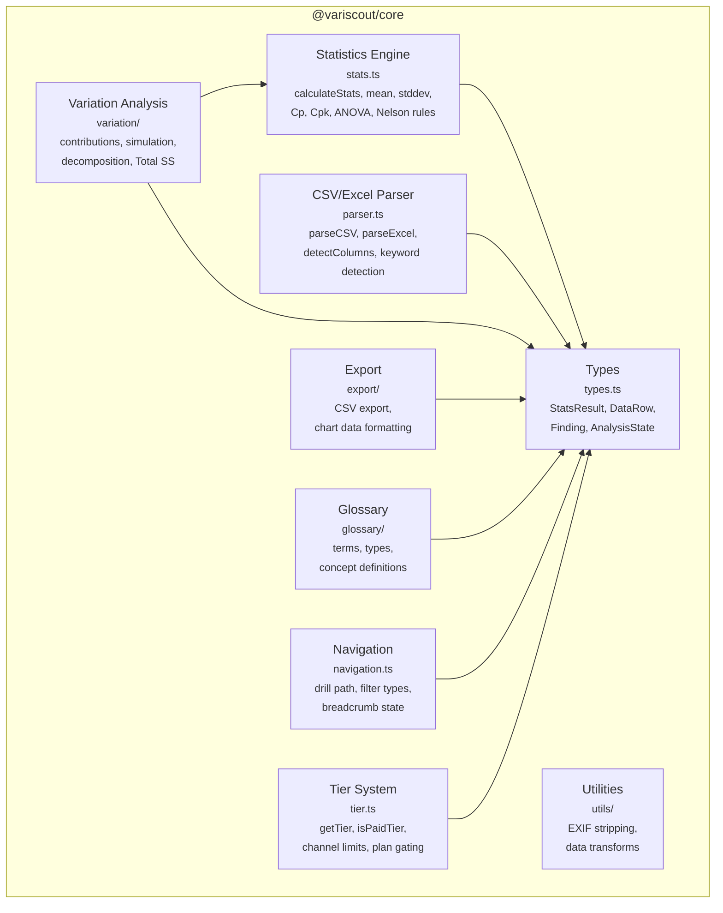
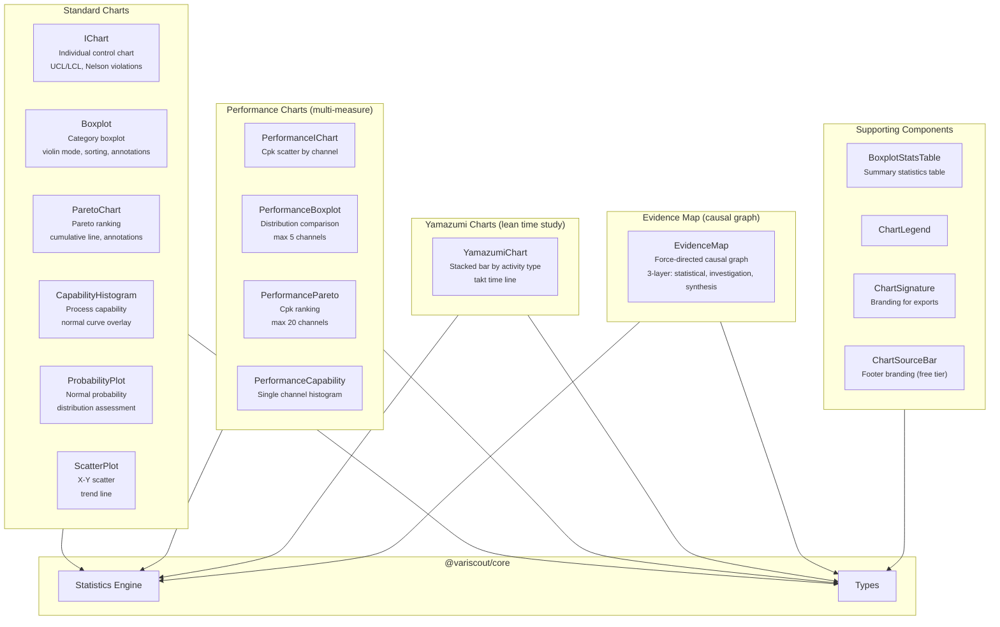
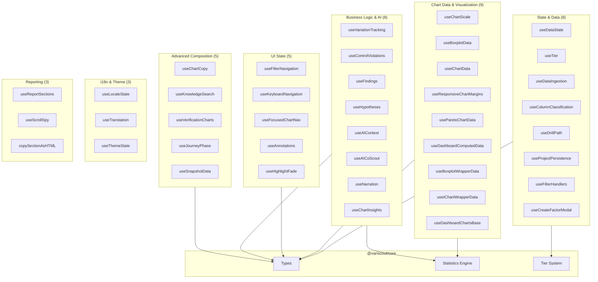
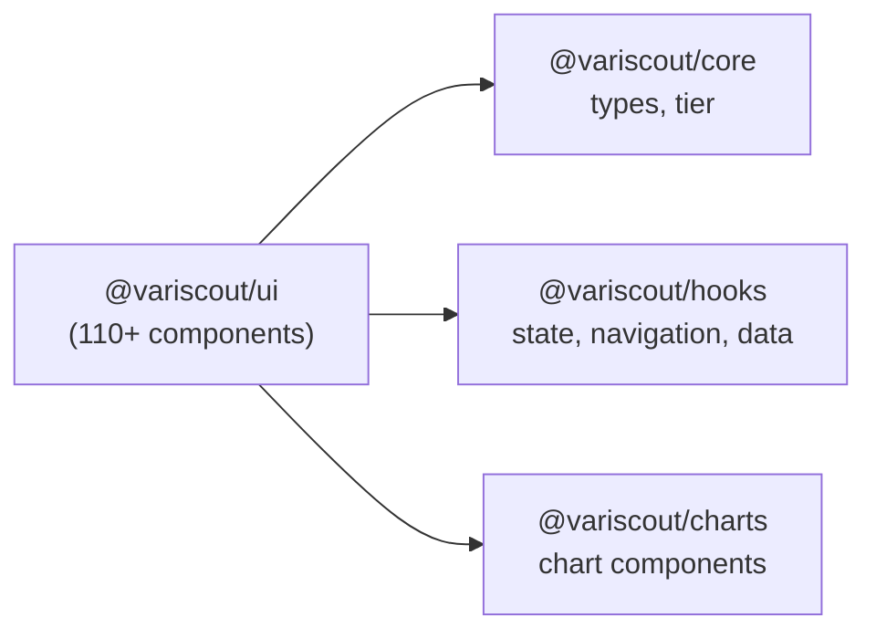
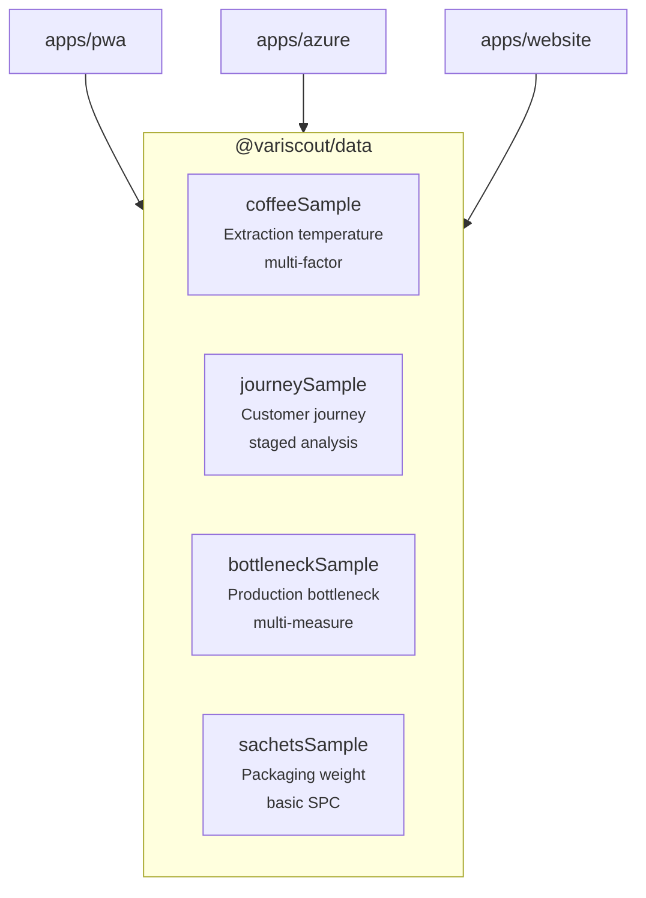
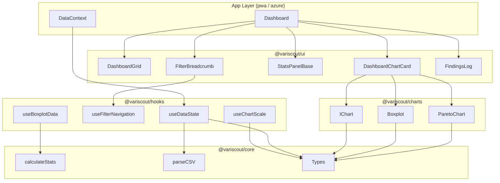

# Component Map

<!-- journey-phase: [all] -->

L3 component decomposition for each VariScout package. These are architecture component diagrams maintained alongside the codebase.

## Package Overview

All packages and their internal module counts at a glance.

```mermaid
flowchart LR
    subgraph core["@variscout/core (13 modules)"]
        direction TB
        c1["Statistics Engine"]
        c2["CSV/Excel Parser"]
        c3["Tier System"]
        c4["Navigation"]
        c5["Types"]
        c6["Variation Analysis"]
        c7["Glossary"]
        c8["Export"]
        c9["Utilities"]
        c10["AI Context"]
        c11["Findings"]
        c12["i18n"]
        c13["Performance"]
    end

    subgraph charts["@variscout/charts (18 components)"]
        direction TB
        ch1["10 Standard Charts"]
        ch2["4 Performance Charts (+ Base)"]
    end

    subgraph hooks["@variscout/hooks (127 hooks)"]
        direction TB
        h1["8 State & Data"]
        h2["9 Chart Data & Visualization"]
        h3["5 UI State"]
        h4["8 Business Logic & AI"]
        h5["5 Advanced Composition"]
        h6["3 i18n & Theme"]
        h7["3 Reporting & Export"]
    end

    subgraph ui["@variscout/ui (92 components)"]
        direction TB
        u1["10 Input"]
        u2["4 Data Display"]
        u3["8 Analysis"]
        u4["6 Chart Wrappers"]
        u5["4 Navigation"]
        u6["13 Findings"]
        u7["2 Simulation"]
        u8["5 Dashboard"]
        u9["11 AI & CoScout"]
        u11["6 Report View"]
        u12["6 Investigation"]
        u13["3 Utilities"]
    end

    subgraph data["@variscout/data (4 datasets)"]
        direction TB
        d1["coffee"]
        d2["journey"]
        d3["bottleneck"]
        d4["sachets"]
    end

    charts --> core
    hooks --> core
    ui --> core
    ui --> hooks
    ui --> charts
```

---

## @variscout/core

Pure TypeScript — zero React dependencies. The foundation layer that all other packages depend on.

**Key dependency rule:** `types.ts` is the shared foundation. Statistics and variation analysis are the most complex modules; everything else is relatively independent.

---

## @variscout/charts

React + Visx chart components. Every chart exports both a responsive wrapper (uses `withParentSize`) and a `*Base` variant for explicit sizing.

---

## @variscout/hooks

Shared React hooks organized by concern. Depends on `@variscout/core` for types, statistics utilities, and tier logic.

---

## @variscout/ui

110+ shared UI components across 14 categories. Uses the `colorScheme` pattern with `defaultScheme` semantic tokens. Depends on core, hooks, and charts.

```mermaid
flowchart TB
    subgraph input["Input (10)"]
        columnmapping["ColumnMapping"]
        createfactor["CreateFactorModal"]
        measuresel["MeasureColumnSelector"]
        chartype["CharacteristicTypeSelector"]
        manualentry["ManualEntryBase"]
        manualsetup["ManualEntrySetupBase"]
        slider["Slider"]
        speceditor["SpecEditor"]
        specspopover["SpecsPopover"]
        pastescreen["PasteScreenBase"]
    end

    subgraph datadisplay["Data Display (4)"]
        dataquality["DataQualityBanner"]
        datatable["DataTableBase"]
        perfdetected["PerformanceDetectedModal"]
        mobilesheet["MobileCategorySheet"]
    end

    subgraph analysis["Analysis (6)"]
        anova["AnovaResults"]
        statspanel["StatsPanelBase"]
        yaxispopover["YAxisPopover"]
        axiseditor["AxisEditor"]
        factorsel["FactorSelector"]
        boxplottoggle["BoxplotDisplayToggle"]
    end

    subgraph chartwrappers["Chart Wrappers (6)"]
        annotationlayer["ChartAnnotationLayer"]
        annotationmenu["AnnotationContextMenu"]
        chartcard["ChartCard"]
        downloadmenu["ChartDownloadMenu"]
        edittitle["EditableChartTitle"]
        focusedview["FocusedChartViewBase"]
    end

    subgraph navcomps["Navigation (4)"]
        breadcrumb["FilterBreadcrumb"]
        chipdropdown["FilterChipDropdown"]
        contextbar["FilterContextBar"]
        selectionpanel["SelectionPanel"]
    end

    subgraph findings["Findings (13)"]
        findingslog["FindingsLog"]
        findingcard["FindingCard"]
        findingeditor["FindingEditor"]
        findingstatus["FindingStatusBadge"]
        findingcomments["FindingComments"]
        findingboard["FindingBoardView"]
        findingspanel["FindingsPanelBase"]
        findingswindow["FindingsWindow"]
        findingsexport["FindingsExportMenu"]
        hypothesistree["HypothesisTreeView"]
        hypothesisnode["HypothesisNode"]
        findingdetail["FindingDetailPanel"]
        briefheader["BriefHeader"]
    end

    subgraph simulation["Simulation (2)"]
        whatif["WhatIfSimulator"]
        whatifpage["WhatIfPageBase"]
    end

    subgraph dashboard["Dashboard (5)"]
        dashgrid["DashboardGrid"]
        dashcard["DashboardChartCard"]
        focusedcard["FocusedChartCard"]
        focusedoverlay["FocusedViewOverlay"]
        settingspanel["SettingsPanelBase"]
    end

    subgraph aicoscout["AI & CoScout (11)"]
        narrativebar["NarrativeBar"]
        chartinsightchip["ChartInsightChip"]
        coscoutinline["CoScoutInline"]
        coscoutmessages["CoScoutMessages"]
        coscoutpanel["CoScoutPanelBase"]
        processdesc["ProcessDescriptionField"]
        aionboarding["AIOnboardingTooltip"]
        previewbadge["PreviewBadge"]
        ichartwrapbase["IChartWrapperBase"]
        boxplotwrapbase["BoxplotWrapperBase"]
        paretowrapbase["ParetoChartWrapperBase"]
    end


    subgraph report["Report View (6)"]
        reportview["ReportViewBase"]
        reportsection["ReportSection"]
        reportstep["ReportStepMarker"]
        reportkpi["ReportKPIGrid"]
        reportchart["ReportChartSnapshot"]
        verifevidence["VerificationEvidenceBase"]
    end

    subgraph investigation["Investigation (6)"]
        investsidebar["InvestigationSidebar"]
        stagedcomp["StagedComparisonCard"]
        investphase["InvestigationPhaseBadge"]
        presentview["PresentationViewBase"]
        investprompt2["InvestigationPrompt"]
        dashlayout["DashboardLayoutBase"]
    end

    subgraph utilities["Utilities (3)"]
        helptooltip["HelpTooltip"]
        upgradeprompt["UpgradePrompt"]
        errorboundary["ErrorBoundary"]
    end
```

### UI dependency flow

The UI package composes all three lower-level packages:

---

## @variscout/data

Pre-computed sample datasets. No internal package dependencies — pure TypeScript data files consumed by apps and website.

---

## Cross-Package Component Flow

How components compose across package boundaries during a typical analysis session:

---

## Yamazumi Dashboard Slot Composition

When Yamazumi (lean time study) mode is active, the standard 4-slot dashboard layout is replaced:

| Slot | Standard Mode | Yamazumi Mode                                                | Hook / Component           |
| ---- | ------------- | ------------------------------------------------------------ | -------------------------- |
| 1    | I-Chart       | I-Chart (switchable metric via `YamazumiIChartMetricToggle`) | `useYamazumiIChartData`    |
| 2    | Boxplot       | YamazumiChart (stacked bars by activity type)                | `useYamazumiChartData`     |
| 3    | Pareto        | Pareto (5 switchable modes via `YamazumiParetoModeDropdown`) | `useYamazumiParetoData`    |
| 4    | Stats Panel   | Yamazumi Summary (`YamazumiSummaryBar`)                      | Core `computeYamazumiData` |

Detection is automatic via `detectYamazumiFormat()` in `@variscout/core` during paste or file upload. The detection modal (`YamazumiDetectedModal`) confirms the mapping before entering Yamazumi mode.

---

## Diagram Health

Run `pnpm docs:check` to verify that component counts and type values in these diagrams match the current codebase. The script checks package export counts and ensures all enum values (FindingStatus, InvestigationPhase, etc.) appear in the relevant diagrams.

## See Also

- [system-map.md](system-map.md) -- L1 Context + L2 Container diagrams
- [shared-packages.md](shared-packages.md) -- Detailed package APIs and export inventories
- [component-patterns.md](component-patterns.md) -- React component conventions and hook patterns
- [data-flow.md](data-flow.md) -- End-to-end data pipeline
- [data-pipeline-map.md](data-pipeline-map.md) -- Step-by-step data transformation pipeline
