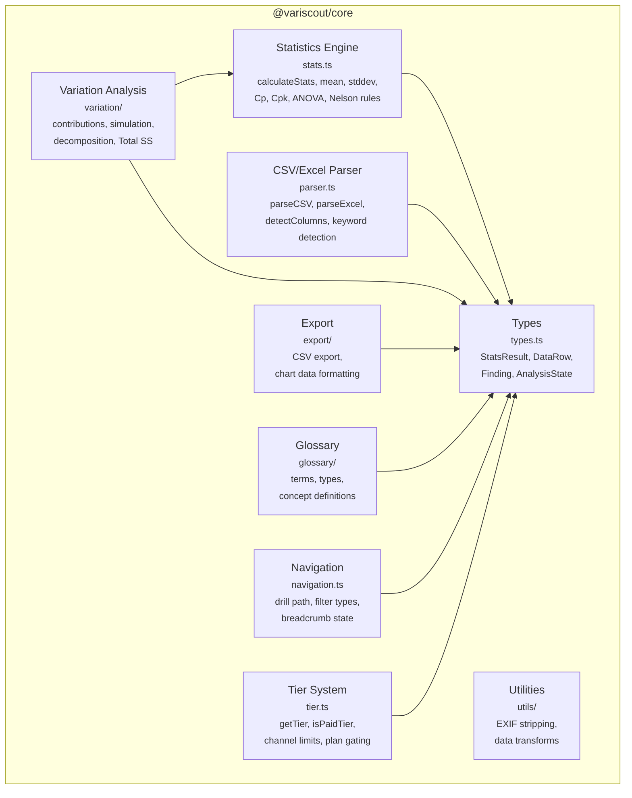
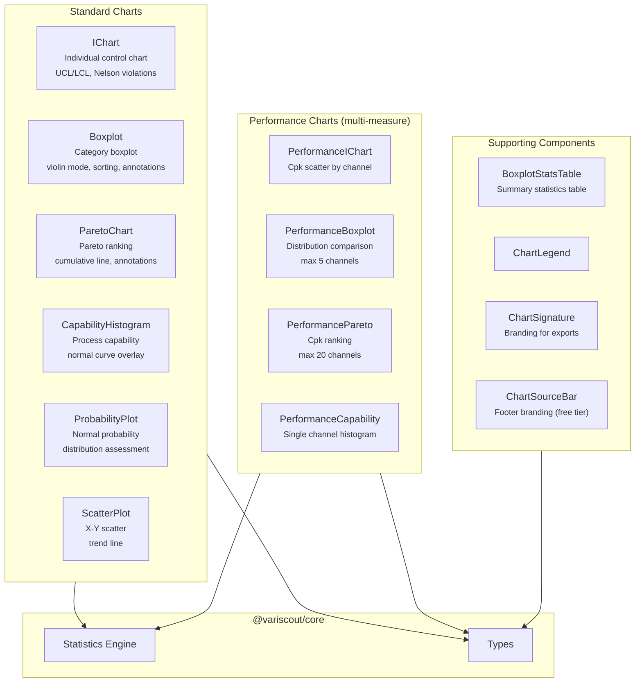
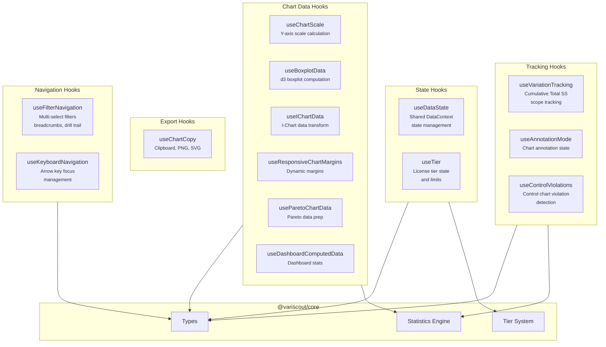
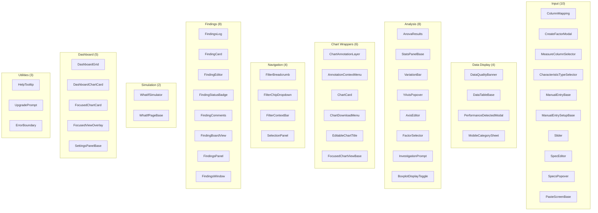
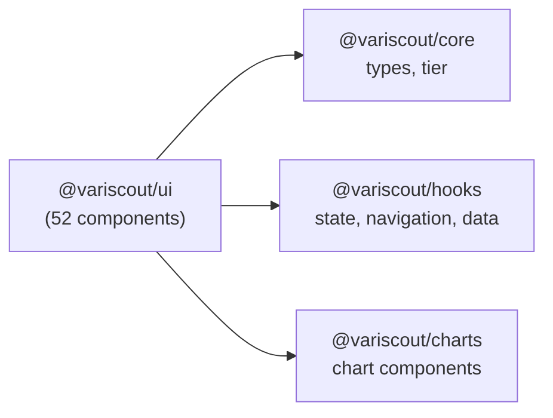
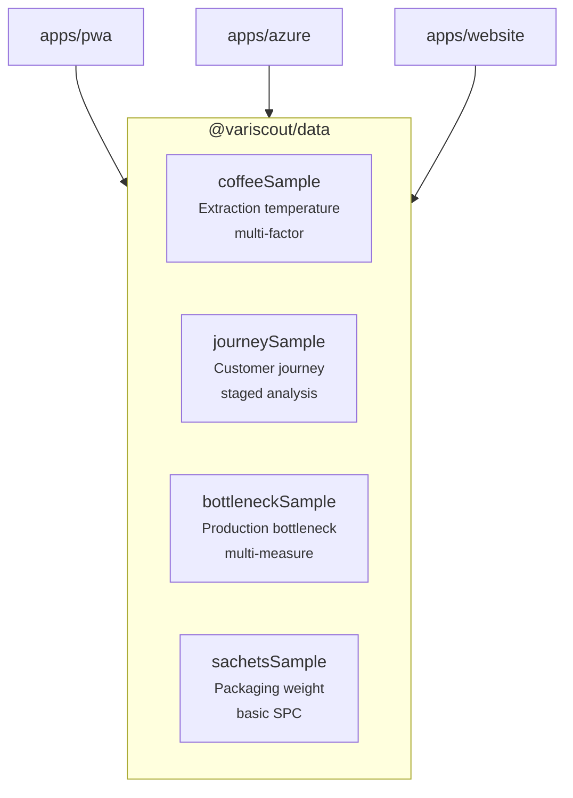
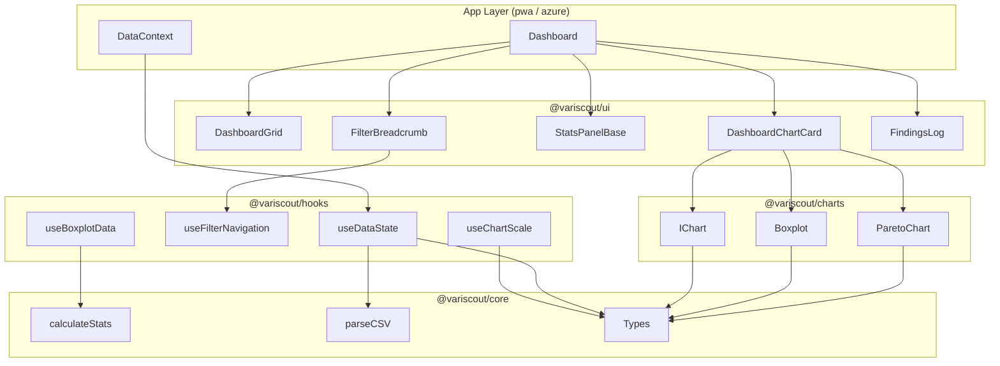

# Component Map

<!-- journey-phase: [all] -->

L3 component decomposition for each VariScout package. These diagrams are manually maintained Mermaid translations of the canonical architecture model in [`docs/architecture/likec4/`](../../architecture/likec4/).

## Package Overview

All packages and their internal module counts at a glance.

```mermaid
flowchart LR
    subgraph core["@variscout/core (9 modules)"]
        direction TB
        c1["Statistics Engine"]
        c2["CSV/Excel Parser"]
        c3["Tier System"]
        c4["Navigation"]
        c5["Types"]
        c6["Variation Analysis"]
        c7["Glossary"]
        c8["Export"]
        c9["Utilities"]
    end

    subgraph charts["@variscout/charts (14 components)"]
        direction TB
        ch1["6 Standard Charts"]
        ch2["4 Performance Charts"]
        ch3["4 Supporting"]
    end

    subgraph hooks["@variscout/hooks (13 hooks)"]
        direction TB
        h1["2 State"]
        h2["2 Navigation"]
        h3["6 Chart Data"]
        h4["1 Export"]
        h5["3 Tracking"]
    end

    subgraph ui["@variscout/ui (52 components)"]
        direction TB
        u1["10 Input"]
        u2["4 Data Display"]
        u3["8 Analysis"]
        u4["6 Chart Wrappers"]
        u5["4 Navigation"]
        u6["8 Findings"]
        u7["2 Simulation"]
        u8["5 Dashboard"]
        u9["3 Utilities"]
    end

    subgraph data["@variscout/data (4 datasets)"]
        direction TB
        d1["coffee"]
        d2["journey"]
        d3["bottleneck"]
        d4["sachets"]
    end

    charts --> core
    hooks --> core
    ui --> core
    ui --> hooks
    ui --> charts
```



---

## @variscout/core

Pure TypeScript — zero React dependencies. The foundation layer that all other packages depend on.



**Key dependency rule:** `types.ts` is the shared foundation. Statistics and variation analysis are the most complex modules; everything else is relatively independent.

---

## @variscout/charts

React + Visx chart components. Every chart exports both a responsive wrapper (uses `withParentSize`) and a `*Base` variant for explicit sizing.



---

## @variscout/hooks

Shared React hooks organized by concern. Depends on `@variscout/core` for types, statistics utilities, and tier logic.



---

## @variscout/ui

52 shared UI components across 9 categories. Uses the `colorScheme` pattern with `defaultScheme` semantic tokens. Depends on core, hooks, and charts.



### UI dependency flow

The UI package composes all three lower-level packages:



---

## @variscout/data

Pre-computed sample datasets. No internal package dependencies — pure TypeScript data files consumed by apps and website.



---

## Cross-Package Component Flow

How components compose across package boundaries during a typical analysis session:



---

## Source of Truth

The canonical architecture model is defined in **LikeC4**:

```
docs/architecture/likec4/
├── model.c4    — L1 context + L2 containers + relationships
├── core.c4     — L3 @variscout/core components
├── charts.c4   — L3 @variscout/charts components
├── hooks.c4    — L3 @variscout/hooks components
├── ui.c4       — L3 @variscout/ui components
└── views.c4    — View definitions (L1-L3)
```

To render or export:

- **Interactive browser:** `pnpm docs:c4:serve`
- **Export to Mermaid:** `pnpm docs:c4`

The Mermaid diagrams in this file are manually maintained translations. When the LikeC4 model changes, update these diagrams to match.

## See Also

- [system-map.md](system-map.md) -- L1 Context + L2 Container diagrams
- [shared-packages.md](shared-packages.md) -- Detailed package APIs and export inventories
- [component-patterns.md](component-patterns.md) -- React component conventions and hook patterns
- [data-flow.md](data-flow.md) -- End-to-end data pipeline
- [data-pipeline-map.md](data-pipeline-map.md) -- Step-by-step data transformation pipeline
