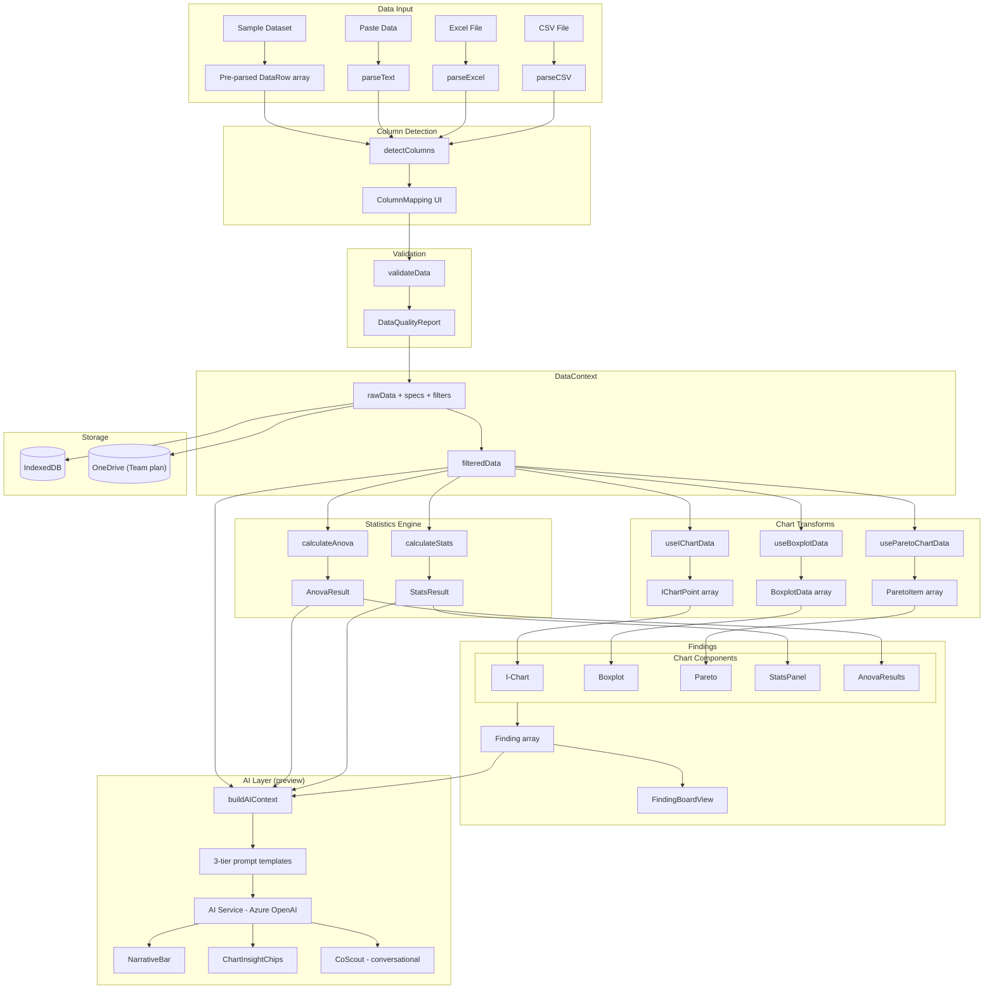
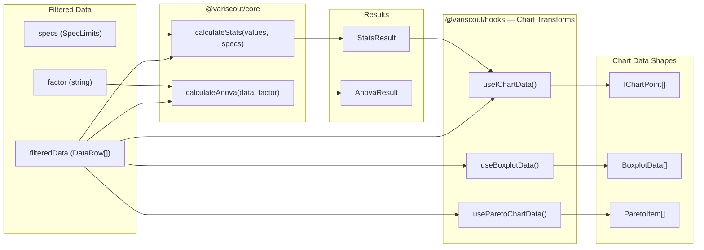
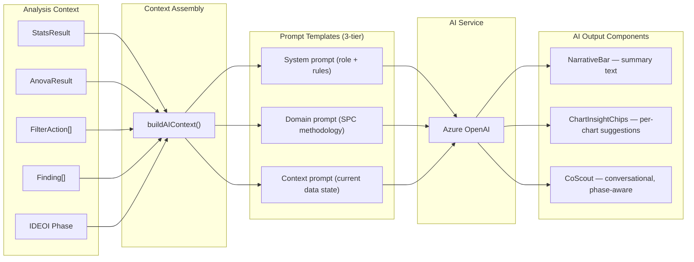
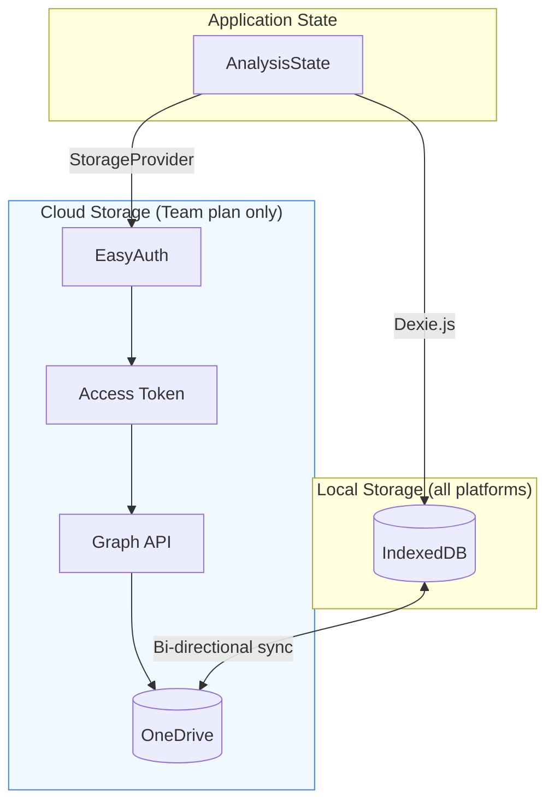
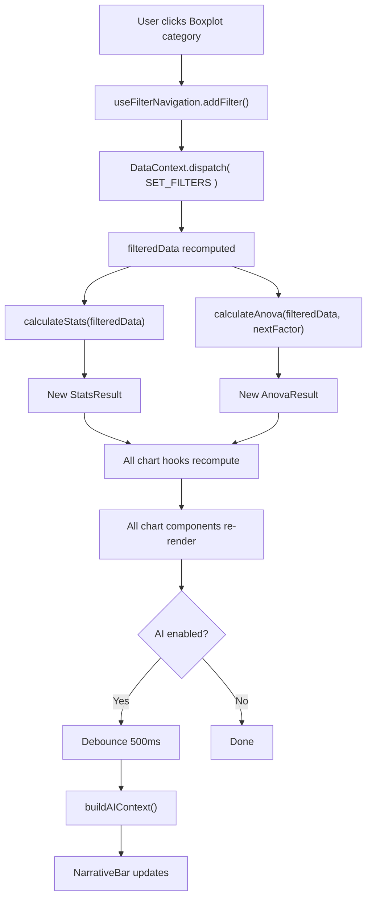
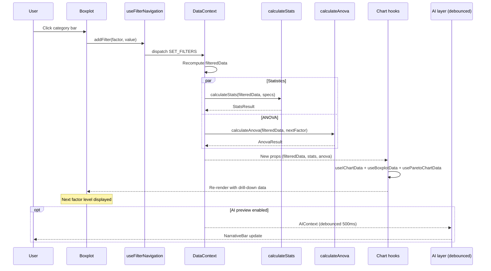

# Data Pipeline Map

End-to-end data flow from CSV upload through statistics, charts, and AI — with TypeScript interfaces at every boundary. Extends [data-flow.md](data-flow.md) with the full pipeline view including AI integration.

---

## 1. Full Pipeline Overview



---

## 2. TypeScript Interfaces at Boundaries

Each boundary between pipeline stages has a well-defined TypeScript interface. The shapes below are abbreviated from the actual source.

### Input Boundary

```typescript
// packages/core/src/types.ts
type DataCellValue = string | number | boolean | null | undefined;

interface DataRow {
  [columnName: string]: DataCellValue;
}
```

All parsers (`parseCSV`, `parseText`, `parseExcel`) return `DataRow[]`.

### Column Detection Boundary

```typescript
// packages/core/src/parser/types.ts
interface DetectedColumns {
  outcome: string | null;
  factors: string[];
  timeColumn: string | null;
  confidence: 'high' | 'medium' | 'low';
  columnAnalysis: ColumnAnalysis[];
}
```

### Validation Boundary

```typescript
// packages/core/src/parser/types.ts
interface DataQualityReport {
  totalRows: number;
  validRows: number;
  excludedRows: ExcludedRow[];
  columnIssues: ColumnIssue[];
}

interface ExclusionReason {
  type: 'missing' | 'non_numeric' | 'empty';
  column: string;
  value?: string;
}
```

### Stats Boundary

```typescript
// packages/core/src/types.ts
interface StatsResult {
  mean: number;
  median: number;
  stdDev: number; // Sample std dev (sigma_overall)
  sigmaWithin: number; // Within-subgroup std dev (MR-bar / d2)
  mrBar: number; // Mean moving range
  ucl: number; // Upper Control Limit (mean + 3 * sigmaWithin)
  lcl: number; // Lower Control Limit (mean - 3 * sigmaWithin)
  cp?: number; // Process Capability (requires USL + LSL)
  cpk?: number; // Process Capability accounting for centering
  outOfSpecPercentage: number;
}
```

### ANOVA Boundary

```typescript
// packages/core/src/types.ts
interface AnovaResult {
  groups: AnovaGroup[];
  ssb: number; // Sum of squares between groups
  ssw: number; // Sum of squares within groups
  dfBetween: number; // Degrees of freedom (k-1)
  dfWithin: number; // Degrees of freedom (N-k)
  msb: number; // Mean square between
  msw: number; // Mean square within
  fStatistic: number; // F = MSB / MSW
  pValue: number;
  isSignificant: boolean; // p < 0.05
  etaSquared: number; // Effect size (SSB / SST)
  insight: string; // Plain-language interpretation
}
```

### Filter Boundary

```typescript
// packages/core/src/navigation.ts
interface FilterAction {
  id: string;
  type: FilterType; // 'filter' | 'highlight'
  source: FilterSource; // Which chart initiated
  factor?: string; // Column being filtered
  values: (string | number)[];
  rowIndex?: number; // I-Chart row highlight
  timestamp: number;
}
```

### Finding Boundary

```typescript
// packages/core/src/findings.ts
type FindingStatus = 'observed' | 'investigating' | 'analyzed';
type FindingTag = 'key-driver' | 'low-impact';

type FindingSource =
  | { chart: 'boxplot' | 'pareto'; category: string }
  | { chart: 'ichart'; anchorX: number; anchorY: number };

interface FindingContext {
  activeFilters: Record<string, (string | number)[]>;
  cumulativeScope: number | null;
  stats?: { mean: number; median?: number; cpk?: number; samples: number };
}

interface Finding {
  id: string;
  text: string;
  createdAt: number;
  context: FindingContext;
  status: FindingStatus;
  tag?: FindingTag;
  comments: FindingComment[];
  statusChangedAt: number;
  source?: FindingSource;
  assignee?: FindingAssignee;
}
```

### Persistence Boundary

```typescript
// packages/hooks/src/types.ts
interface AnalysisState {
  version: string;
  rawData: DataRow[];
  outcome: string | null;
  factors: string[];
  specs: SpecLimits;
  measureSpecs?: Record<string, SpecLimits>;
  filters: Record<string, (string | number)[]>;
  axisSettings: { min?: number; max?: number; scaleMode?: ScaleMode };
  columnAliases?: Record<string, string>;
  valueLabels?: Record<string, Record<string, string>>;
  displayOptions?: DisplayOptions;
  cpkTarget?: number;
  stageColumn?: string | null;
  stageOrderMode?: StageOrderMode;
  isPerformanceMode?: boolean;
  measureColumns?: string[];
  selectedMeasure?: string | null;
  measureLabel?: string | null;
  chartTitles?: Record<string, string>;
  filterStack?: FilterAction[];
  viewState?: ViewState;
  findings?: Finding[];
}
```

---

## 3. Stats Pipeline Swim Lane



---

## 4. AI Pipeline Swim Lane

> **Note**: AI features are shipped behind a preview gate. The pipeline components (NarrativeBar, ChartInsightChips, CoScout) are defined in the knowledge layer but not yet wired to live AI services in the main codebase. See the [investigation lifecycle map](../../03-features/workflows/investigation-lifecycle-map.md) for IDEOI phase definitions and CoScout behavior per phase.



### IDEOI Phase Mapping

The AI layer adapts behavior based on the current investigation phase:

| IDEOI Phase      | Trigger              | CoScout Behavior                            |
| ---------------- | -------------------- | ------------------------------------------- |
| **Initial**      | Data loaded          | Suggests patterns in data                   |
| **Diverging**    | First finding pinned | Suggests possible hypotheses                |
| **Evaluating**   | Hypothesis linked    | Challenges assumptions, suggests validation |
| **Organizing**   | Finding analyzed     | Summarizes root causes, suggests actions    |
| **Implementing** | Actions defined      | Tracks progress, projects improvement       |

---

## 5. Persistence Pipeline



`AnalysisState` is the single serializable shape that captures the full state of an analysis session. Key fields for persistence:

| Field               | Purpose                                |
| ------------------- | -------------------------------------- |
| `rawData`           | Original uploaded data rows            |
| `specs`             | USL, LSL, target specifications        |
| `filters`           | Active filter selections               |
| `filterStack`       | Ordered `FilterAction[]` drill trail   |
| `findings`          | Investigation findings with status     |
| `viewState`         | Active tab, focused chart, panel state |
| `isPerformanceMode` | Multi-measure mode flag                |
| `measureColumns`    | Selected measure columns               |
| `cpkTarget`         | Capability target (default 1.33)       |

---

## 6. Filter Recalculation Flow

A single filter click triggers a cascade of recalculations through the pipeline:



### What gets recomputed

| Stage        | Function / Hook        | Output                                        |
| ------------ | ---------------------- | --------------------------------------------- |
| Filter       | `useFilterNavigation`  | Updated `FilterAction[]`                      |
| Data         | DataContext reducer    | `filteredData` (subset of `rawData`)          |
| Stats        | `calculateStats()`     | New `StatsResult` (mean, Cpk, control limits) |
| ANOVA        | `calculateAnova()`     | New `AnovaResult` (F, p, eta-squared)         |
| I-Chart      | `useIChartData()`      | New `IChartPoint[]`                           |
| Boxplot      | `useBoxplotData()`     | New `BoxplotData[]`                           |
| Pareto       | `useParetoChartData()` | New `ParetoItem[]`                            |
| Variation    | `useVariationTracking` | Updated scope fraction and cumulative %       |
| AI (preview) | `buildAIContext()`     | Refreshed narrative and insights              |

---

## 7. Filter Drill-Down Sequence Diagram

Complete round-trip from user click to updated UI:



---

## 8. See Also

- [Data Flow](data-flow.md) -- detailed input/validation stages and platform-specific flows
- [System Map](system-map.md) -- package topology and dependency graph
- [Component Patterns](component-patterns.md) -- hook integration details and DataContext structure
- [Investigation Lifecycle Map](../../03-features/workflows/investigation-lifecycle-map.md) -- IDEOI phases and CoScout behavior
- [Investigation to Action](../../03-features/workflows/investigation-to-action.md) -- findings workflow specification
