# Zustand Store Interactions

The Azure app uses five Zustand feature stores (ADR-041), co-located in `apps/azure/src/features/*/` following Feature-Sliced Design. This document maps all cross-store dependencies and the orchestration hooks that coordinate them.

## Architecture Overview

Stores are **leaf-level state containers** that hold UI-specific read state. They do not import or call each other directly. All cross-store coordination flows through **orchestration hooks** (React hooks that compose shared hooks from `@variscout/hooks` and sync derived state into stores) or through **the Editor page** (which reads from multiple stores and passes data between them via props).

```
DataContext (React Context)
    |
    v
Orchestration Hooks (useEffect sync)
    |
    +---> panelsStore
    +---> findingsStore
    +---> investigationStore
    +---> improvementStore
    +---> aiStore
    |
    v
Components (selector reads)
```

## Store Dependency Graph

```mermaid
graph TD
    subgraph "Stores (no direct cross-reads)"
        PS[panelsStore<br/><i>UI visibility, layout</i>]
        FS[findingsStore<br/><i>findings UI state</i>]
        IS[investigationStore<br/><i>hypothesis UI state</i>]
        IMS[improvementStore<br/><i>improvement workspace</i>]
        AS[aiStore<br/><i>CoScout, narration</i>]
    end

    subgraph "Orchestration Hooks"
        FO[useFindingsOrchestration]
        IO[useInvestigationOrchestration]
        IMO[useImprovementOrchestration]
        AO[useAIOrchestration]
        TH[useToolHandlers]
        PSE[usePanelsSideEffects]
    end

    subgraph "Page Layer"
        ED[Editor.tsx]
        PD[ProjectDashboard.tsx]
        EDV[EditorDashboardView.tsx]
    end

    %% EditorDashboardView passes grouped prop objects to Dashboard:
    %% viewMode (presentation/report), performance (drill-from),
    %% ai (narration, insights, CoScout). Core props remain flat.

    %% Orchestration hook -> store writes (sync)
    FO -->|syncFindings, setHighlightedFindingId| FS
    FO -->|setFindingsOpen| PS
    IO -->|syncHypotheses, syncHypothesesMap, syncIdeaImpacts, setProjectionTarget| IS
    IO -->|setWhatIfOpen| PS
    IMO -->|syncState| IMS
    AO -->|syncNarration, syncCoScoutMessages, syncSuggestedQuestions, syncActionProposals, syncAIContext, syncKnowledgeSearch, ...| AS
    PSE -->|setHighlightPoint| PS

    %% useToolHandlers reads multiple stores
    TH -->|navigate_to: showDashboard, showEditor, setFindingsOpen, setCoScoutOpen, setImprovementOpen, openReport, setPendingChartFocus| PS
    TH -->|navigate_to: setHighlightedFindingId| FS
    TH -->|navigate_to: expandToHypothesis| IS

    %% Editor page reads all stores
    ED -.->|selector reads| PS
    ED -.->|selector reads| FS
    ED -.->|selector reads| IS
    ED -.->|selector reads| IMS
    ED -.->|selector reads| AS

    %% EditorDashboardView reads 4 stores
    EDV -.->|selector reads| PS
    EDV -.->|selector reads| FS
    EDV -.->|selector reads| IS
    EDV -.->|selector reads| IMS

    %% ProjectDashboard reads AI store
    PD -.->|selector reads| AS

    style PS fill:#e0f2fe,stroke:#0284c7
    style FS fill:#fef3c7,stroke:#d97706
    style IS fill:#ede9fe,stroke:#7c3aed
    style IMS fill:#dcfce7,stroke:#16a34a
    style AS fill:#fce7f3,stroke:#db2777
```



## Cross-Store Writes via Orchestration Hooks

These are the only places where code in one feature domain writes to a store owned by another feature domain. All go through orchestration hooks (never store-to-store).

| Source File                        | Writes To            | Action(s) Called                                                                                                                                                                                                                                                    | Purpose                                                                   |
| ---------------------------------- | -------------------- | ------------------------------------------------------------------------------------------------------------------------------------------------------------------------------------------------------------------------------------------------------------------- | ------------------------------------------------------------------------- |
| `useFindingsOrchestration.ts`      | `panelsStore`        | `setFindingsOpen(true)`                                                                                                                                                                                                                                             | Open findings panel when pinning or observing a finding                   |
| `useFindingsOrchestration.ts`      | `findingsStore`      | `syncFindings()`, `setHighlightedFindingId()`                                                                                                                                                                                                                       | Sync CRUD state from `useFindings` hook; highlight newly created findings |
| `useInvestigationOrchestration.ts` | `panelsStore`        | `setWhatIfOpen(true)`, `setWhatIfOpen(false)`                                                                                                                                                                                                                       | Open/close What-If panel for idea projection round-trip                   |
| `useInvestigationOrchestration.ts` | `investigationStore` | `syncHypotheses()`, `syncHypothesesMap()`, `syncIdeaImpacts()`, `setProjectionTarget()`                                                                                                                                                                             | Sync hypothesis CRUD state and computed display data                      |
| `useImprovementOrchestration.ts`   | `improvementStore`   | `syncState()`                                                                                                                                                                                                                                                       | Bulk sync computed improvement workspace data                             |
| `useAIOrchestration.ts`            | `aiStore`            | `syncNarration()`, `syncCoScoutMessages()`, `syncSuggestedQuestions()`, `syncAIContext()`, `setProviderLabel()`, `setKbPermissionWarning()`, `setResolvedChannelFolderUrl()`, `setKnowledgeSearchScope()`, `setKnowledgeSearchTimestamp()`, `syncKnowledgeSearch()` | Sync all AI-derived state from composed hooks                             |
| `teamToolHandlers.ts`              | `panelsStore`        | `showDashboard()`, `showEditor()`, `setFindingsOpen()`, `setCoScoutOpen()` (implied via navigation), `setImprovementOpen()`, `openReport()`, `setPendingChartFocus()`                                                                                               | `navigate_to` tool handler navigates UI panels                            |
| `teamToolHandlers.ts`              | `findingsStore`      | `setHighlightedFindingId()`                                                                                                                                                                                                                                         | `navigate_to` tool highlights target finding                              |
| `teamToolHandlers.ts`              | `investigationStore` | `expandToHypothesis()`                                                                                                                                                                                                                                              | `navigate_to` tool scrolls to target hypothesis                           |
| `usePanelsSideEffects.ts`          | `panelsStore`        | `setHighlightPoint(null)`                                                                                                                                                                                                                                           | Auto-clear chart highlight after 2-second timeout                         |

## Cross-Store Reads via Page/Component Layer

These are selector-based reads where a component subscribes to multiple stores. This is the intended consumption pattern -- components compose state from whichever stores they need.

| Component                 | Reads From           | Fields Read                                                                                                                                                 | Purpose                                               |
| ------------------------- | -------------------- | ----------------------------------------------------------------------------------------------------------------------------------------------------------- | ----------------------------------------------------- |
| `Editor.tsx`              | `panelsStore`        | `activeView`, `isFindingsOpen`, `isCoScoutOpen`, `isWhatIfOpen`, `isImprovementOpen`, `isReportOpen`, `isDataPanelOpen`, `pendingChartFocus`                | Layout decisions, panel visibility                    |
| `Editor.tsx`              | `findingsStore`      | `highlightedFindingId`, `setHighlightedFindingId`                                                                                                           | Finding highlight state for sidebar                   |
| `Editor.tsx`              | `investigationStore` | `projectionTarget`                                                                                                                                          | What-If round-trip: pre-populate projection from idea |
| `Editor.tsx`              | `improvementStore`   | `improvementHypotheses`, `improvementLinkedFindings`, `selectedIdeaIds`, `convertedIdeaIds`                                                                 | Improvement workspace props                           |
| `Editor.tsx`              | `aiStore`            | `pendingDashboardQuestion`                                                                                                                                  | Pre-fill CoScout from project dashboard quick-ask     |
| `EditorDashboardView.tsx` | `panelsStore`        | `isFindingsOpen`, `isCoScoutOpen`, `isReportOpen`, `isPresentationMode`, `isDataPanelOpen`, `isDataTableOpen`, `highlightRowIndex`, `highlightedChartPoint` | Dashboard layout, data panel, overlays                |
| `EditorDashboardView.tsx` | `findingsStore`      | `highlightedFindingId`, `setHighlightedFindingId`                                                                                                           | Finding highlight in dashboard context                |
| `EditorDashboardView.tsx` | `investigationStore` | `hypothesesMap`, `ideaImpacts`                                                                                                                              | Hypothesis display data for finding cards             |
| `EditorDashboardView.tsx` | `improvementStore`   | `projectedCpkMap`, `improvementLinkedFindings`                                                                                                              | Projected Cpk badges on finding cards                 |
| `ProjectDashboard.tsx`    | `aiStore`            | `narration`, `setPendingDashboardQuestion`                                                                                                                  | Show AI summary, queue question for CoScout           |

## Store Isolation Summary

| Store                | Direct Cross-Store Imports | Written By (orchestration)                                                                                            | Read By (components)                    |
| -------------------- | -------------------------- | --------------------------------------------------------------------------------------------------------------------- | --------------------------------------- |
| `panelsStore`        | None                       | `useFindingsOrchestration`, `useInvestigationOrchestration`, `teamToolHandlers`, `usePanelsSideEffects`, `Editor.tsx` | `Editor.tsx`, `EditorDashboardView.tsx` |
| `findingsStore`      | None                       | `useFindingsOrchestration`, `teamToolHandlers`                                                                        | `Editor.tsx`, `EditorDashboardView.tsx` |
| `investigationStore` | None                       | `useInvestigationOrchestration`, `teamToolHandlers`                                                                   | `Editor.tsx`, `EditorDashboardView.tsx` |
| `improvementStore`   | None                       | `useImprovementOrchestration`                                                                                         | `Editor.tsx`, `EditorDashboardView.tsx` |
| `aiStore`            | None                       | `useAIOrchestration`                                                                                                  | `Editor.tsx`, `ProjectDashboard.tsx`    |

## Guidelines

### No Direct Store-to-Store Dependencies

Stores must never import or call `getState()` on another store. This is the current state of the codebase and must be preserved. Direct store-to-store reads would create hidden coupling and make stores difficult to test in isolation.

### No Dependency Cycles

The dependency graph must remain a DAG (directed acyclic graph). Currently, no cycles exist because:

- Stores have zero outbound dependencies on other stores.
- Orchestration hooks write to their own feature store plus `panelsStore` (the shared UI coordinator), but never form circular write chains.

### Use Orchestration Hooks for Cross-Store Coordination

When an action in one domain needs to affect another domain's store, route it through an orchestration hook rather than adding a direct store import. For example, `useFindingsOrchestration` opens the findings panel via `usePanelsStore.getState().setFindingsOpen(true)` rather than having `findingsStore` call `panelsStore` internally.

### panelsStore Is the UI Coordinator

`panelsStore` is the most widely written-to store because it owns panel visibility, which multiple workflows need to control (e.g., opening findings panel after creating a finding, opening What-If for idea projection). This is by design -- it acts as a shared UI coordination layer.

### useToolHandlers Is the Cross-Store Bridge for AI

`useToolHandlers` composes three handler modules: `readToolHandlers` (7 data tools), `actionToolHandlers` (7 proposal tools), and `teamToolHandlers` (`navigate_to` + 3 team-only tools). Only `teamToolHandlers` reads/writes stores (`panelsStore`, `findingsStore`, `investigationStore`) — the other two modules are pure functions with no store access. This is intentional: the `navigate_to` AI tool must be able to navigate to any part of the UI, and the team tools need store access for sharing. The handler module split keeps store coupling isolated to one file.

### Component Reads Are Free

Components subscribing to multiple stores via selectors is the normal Zustand pattern. No restrictions apply -- components should read from whatever stores they need. The key constraint is on **writes**, which must go through orchestration hooks.

### Testing Stores in Isolation

Each store can be tested independently by calling actions and asserting state, without mocking other stores. Cross-store interactions are tested at the orchestration hook level. See `features/panels/__tests__/panelsStore.test.ts` for the reference pattern.

## Cross-Store Coordination Pattern

Orchestration hooks are the designated coordination layer for cross-store interactions. They use direct `getState()` calls, which is the Zustand-recommended pattern for cross-store communication (per maintainer guidance).

```typescript
// useFindingsOrchestration.ts — explicit, traceable cross-store calls
usePanelsStore.getState().setFindingsOpen(true);
useFindingsStore.getState().setHighlightedFindingId(finding.id);
```

**Why direct calls, not an event bus:** An event bus (ADR-046, superseded) was implemented and evaluated. At 5 stores / 9 cross-store interactions, direct calls provide better traceability ("Go to Definition" works, stack traces are clear) without the indirection cost of events. See [ADR-046](../../07-decisions/adr-046-event-driven-architecture.md) for the full evaluation.

**Bridge hooks** (e.g., `usePanelsPersistence`) handle Zustand→Context persistence via Zustand's `.subscribe()` — the community-approved pattern for reactive persistence bridges.

### How to Add a Cross-Store Side Effect

When a domain action in one feature needs to trigger a side effect in another feature's store:

**Step 1:** Identify the orchestration hook that owns the triggering action.

| Action                      | Orchestration Hook              |
| --------------------------- | ------------------------------- |
| Finding created/pinned      | `useFindingsOrchestration`      |
| Hypothesis linked           | `useInvestigationOrchestration` |
| AI tool navigation          | `teamToolHandlers`              |
| Improvement idea projection | `useInvestigationOrchestration` |

**Step 2:** Add the `getState()` call in the orchestration hook:

```typescript
// In useFindingsOrchestration.ts
const handlePinFinding = useCallback(() => {
  const newFinding = findingsState.addFinding(text, context);

  // Cross-store side effect: open findings panel + highlight
  usePanelsStore.getState().setFindingsOpen(true);
  useFindingsStore.getState().setHighlightedFindingId(newFinding.id);

  return newFinding;
}, [findingsState]);
```

**Step 3:** Test the side effect in the orchestration hook's test file (not in the store test).

### Anti-Patterns

| Don't                                       | Do Instead                                        |
| ------------------------------------------- | ------------------------------------------------- |
| `bus.emit('finding:created')`               | Direct `getState()` call in orchestration hook    |
| Call `getState()` from a component          | Call from orchestration hook, pass result as prop |
| `storeA.subscribe(() => storeB.setState())` | Direct `getState()` call (avoids infinite loops)  |
| Import stores in other stores               | Keep stores independent; coordinate via hooks     |
