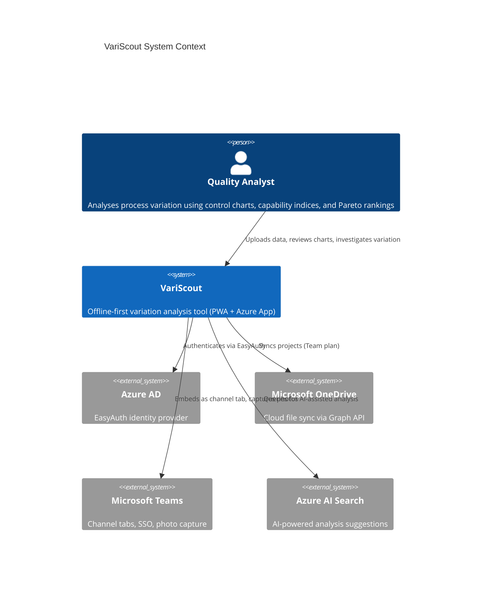
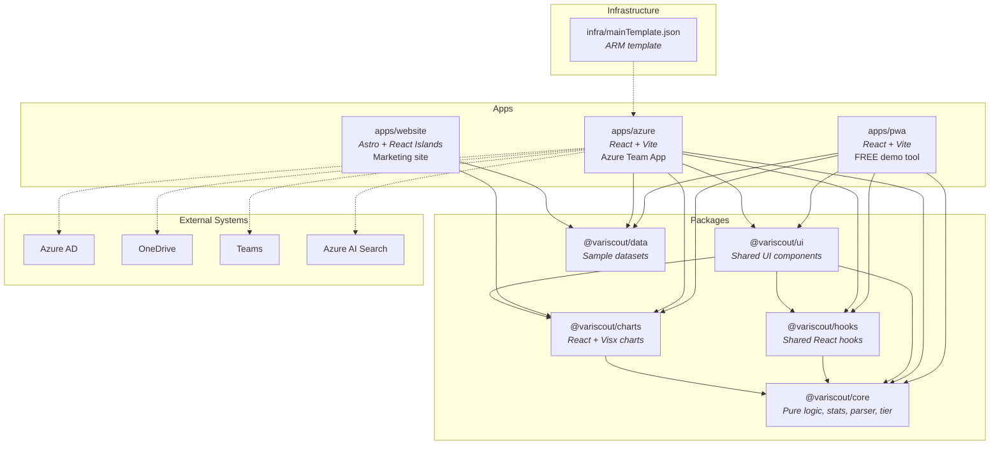

# System Map

Visual entry point for understanding VariScout's architecture. Start here, then drill into component-level docs linked below.

## Context Diagram (C4 L1)

Who uses VariScout and what external systems does it touch?

## Container Diagram (C4 L2)

Monorepo packages, apps, and their dependency relationships.

### Key dependency rules

- **Apps** import from packages; packages never import from apps.
- **`@variscout/core`** has zero React dependencies (pure TypeScript + d3-array, exceljs, papaparse).
- **`@variscout/data`** has no internal package dependencies.
- **`@variscout/ui`** is the highest-level shared package, composing core, hooks, and charts.

## Package Responsibilities

| Package             | Role                                                                | Key exports                                                              | Docs                                           |
| ------------------- | ------------------------------------------------------------------- | ------------------------------------------------------------------------ | ---------------------------------------------- |
| `@variscout/core`   | Statistics engine, CSV/Excel parser, tier system, glossary, types   | `calculateStats`, `parseCSV`, `getTier`, `GlossaryTerm`                  | [shared-packages.md](shared-packages.md)       |
| `@variscout/charts` | Visx chart components (I-Chart, Boxplot, Pareto, Performance suite) | `IChart`, `Boxplot`, `ParetoChart`, `PerformanceIChart`, `useChartTheme` | [component-patterns.md](component-patterns.md) |
| `@variscout/data`   | Pre-computed sample datasets for demo and testing                   | `coffeeSample`, `journeySample`, `bottleneckSample`                      | [shared-packages.md](shared-packages.md)       |
| `@variscout/hooks`  | Shared React hooks for state, navigation, data transforms           | `useDataState`, `useFilterNavigation`, `useChartScale`, `useTier`        | [component-patterns.md](component-patterns.md) |
| `@variscout/ui`     | Shared UI components with colorScheme theming pattern               | `StatsPanelBase`, `FindingsLog`, `DashboardGrid`, `WhatIfSimulator`      | [component-patterns.md](component-patterns.md) |

## App Responsibilities

| App            | Distribution      | Technology              | Key characteristics                                                |
| -------------- | ----------------- | ----------------------- | ------------------------------------------------------------------ |
| `apps/pwa`     | Public URL (free) | React + Vite PWA        | Session-only storage, 3 factors max, 50K rows                      |
| `apps/azure`   | Azure Marketplace | React + Vite + EasyAuth | IndexedDB + OneDrive sync, 6 factors, 100K rows, Teams integration |
| `apps/website` | Public URL        | Astro + React Islands   | Static marketing site with embedded chart demos                    |

## Infrastructure

| Component                                    | Purpose                                                           | Docs                                                       |
| -------------------------------------------- | ----------------------------------------------------------------- | ---------------------------------------------------------- |
| `infra/mainTemplate.json`                    | ARM template for Azure Marketplace Managed Application deployment | [arm-template.md](../../08-products/azure/arm-template.md) |
| `.github/workflows/deploy-azure-staging.yml` | CI/CD pipeline: build + OIDC deploy to staging                    | [deployment.md](../implementation/deployment.md)           |

## See Also

- [component-map.md](component-map.md) -- L3 component views per package (internal modules)
- [data-flow.md](data-flow.md) -- End-to-end data pipeline from ingestion to chart rendering
- [shared-packages.md](shared-packages.md) -- Detailed package APIs and export inventories
- [monorepo.md](monorepo.md) -- Build system, workspace configuration, import rules
- [component-patterns.md](component-patterns.md) -- React component conventions and hook patterns
- [offline-first.md](offline-first.md) -- Storage strategy, sync architecture, conflict resolution
- [data-pipeline-map.md](data-pipeline-map.md) -- Step-by-step data transformation pipeline
