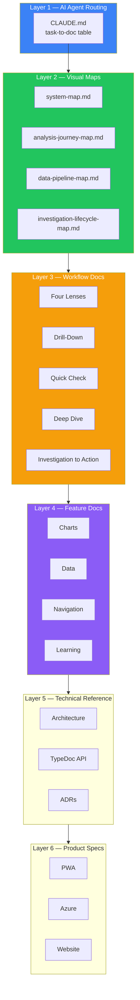
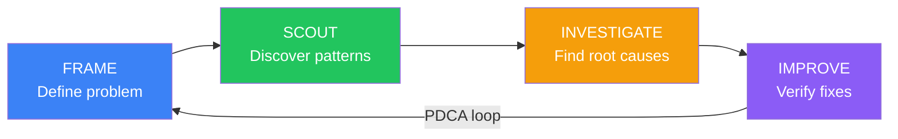
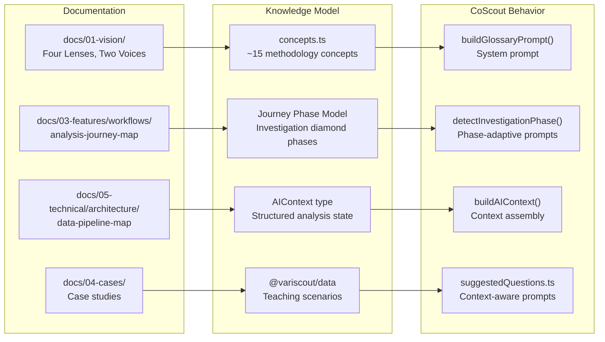
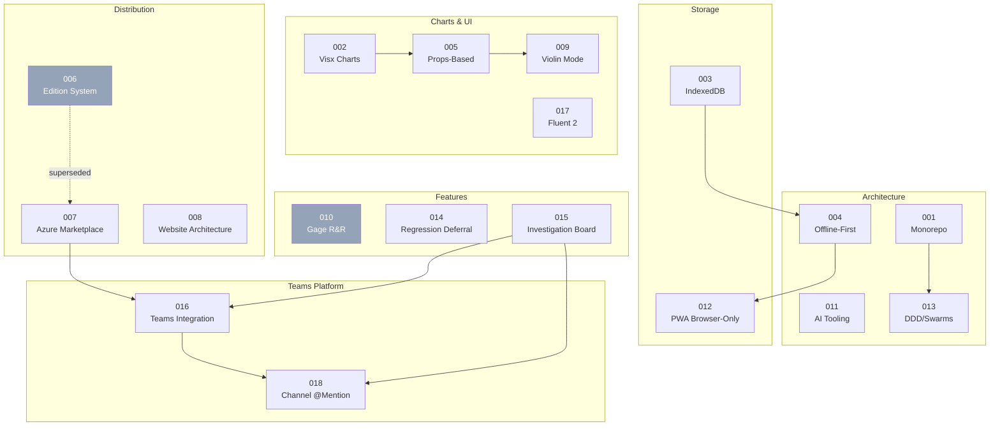

# Documentation Methodology



Six layers, each serving a different reader at a different zoom level. AI agents enter at Layer 1 (CLAUDE.md routing table). Developers enter at Layer 2 (visual maps) or Layer 3 (workflows). Product managers enter at Layer 6 (product specs).

---

## Why Document the Documentation?

VariScout's documentation serves three audiences simultaneously:

1. **AI coding agents** — need structured, cross-linked docs to navigate the codebase. CLAUDE.md's task-to-doc table routes agents to the right file in one hop.
2. **Human developers** — need visual maps and architecture docs to understand the system. Mermaid diagrams provide sub-60-second comprehension.
3. **Quality analysts** — need workflow docs that mirror their real analysis journey. The 4-phase model (Frame → Scout → Investigate → Improve) organizes features around how work actually happens.

With 100+ markdown files across 8 doc sections, a governing methodology prevents drift, duplication, and orphaned docs.

---

## Foundations: Industry Frameworks Applied

VariScout's docs align naturally with three established frameworks. This wasn't retrofitted — the structure emerged from building docs alongside code.

### Diataxis

[Diataxis](https://diataxis.fr/) classifies documentation into four types by purpose. VariScout maps cleanly:

| Diataxis Type                            | VariScout Section                                               | Examples                                           |
| ---------------------------------------- | --------------------------------------------------------------- | -------------------------------------------------- |
| **Tutorials** (learning-oriented)        | `docs/04-cases/` — case studies with teaching briefs            | Coffee extraction, Packaging weight, Hospital Ward |
| **How-to Guides** (task-oriented)        | `docs/03-features/workflows/` — step-by-step analysis protocols | Quick Check, Deep Dive, Drill-Down, Four Lenses    |
| **Reference** (information-oriented)     | `docs/05-technical/`, TypeDoc API docs                          | Architecture, data-flow, api/core/                 |
| **Explanation** (understanding-oriented) | `docs/01-vision/`, `docs/07-decisions/`                         | Philosophy, Four Lenses theory, ADRs               |

The remaining sections fit naturally: `02-journeys/` (personas informing tutorials), `06-design-system/` (reference), `08-products/` (reference per product).

### C4 Model

The [C4 Model](https://c4model.com/) provides four zoom levels for architecture diagrams. VariScout implements three explicitly and one via tooling:

| C4 Level              | VariScout Implementation                              | File                                                                                                   |
| --------------------- | ----------------------------------------------------- | ------------------------------------------------------------------------------------------------------ |
| **L1 System Context** | VariScout + Azure AD, OneDrive, Teams, AI Search      | [system-map.md](architecture/system-map.md) (Mermaid C4Context)                                        |
| **L2 Container**      | 5 packages + 3 apps + infra with dependency arrows    | [system-map.md](architecture/system-map.md) (Mermaid flowchart)                                        |
| **L3 Component**      | Hook dependencies, chart composition, data transforms | [component-patterns.md](architecture/component-patterns.md), [data-flow.md](architecture/data-flow.md) |
| **L4 Code**           | Auto-generated API reference for @variscout/core      | [api/core/](api/core/) (TypeDoc)                                                                       |

### Docs-as-Code

[Docs-as-Code](https://www.writethedocs.org/guide/docs-as-code/) principles treat documentation with the same rigor as source code:

| Principle              | VariScout Practice                                                   |
| ---------------------- | -------------------------------------------------------------------- |
| Markdown source in Git | All 100+ docs in `docs/` directory, same repo as code                |
| Version controlled     | Documentation changes in the same PRs as code changes                |
| Automated builds       | Starlight (`pnpm docs:build`) for static site generation             |
| Generated API docs     | TypeDoc for `@variscout/core` (`pnpm --filter @variscout/core docs`) |
| Review in PRs          | Documentation reviewed alongside code in every PR                    |
| Linting rules          | `.claude/rules/documentation.md` enforces structure                  |

---

## The Journey Spine

VariScout's unique contribution to its documentation model: **every doc is organized around a 4-phase analysis journey**.



Each phase maps to specific UI screens, data shapes, code modules, and CoScout behaviors. The full journey model is documented in [analysis-journey-map.md](../03-features/workflows/analysis-journey-map.md).

### Journey Phase Tags

All workflow and feature docs include a `journey-phase:` tag — either in YAML frontmatter or as an HTML comment:

```markdown
<!-- journey-phase: scout -->
```

Valid phases: `frame`, `scout`, `investigate`, `improve`, `[all]`.

These tags enable AI agents and developers to discover docs by the phase of analysis they support. Combined with CLAUDE.md's task-to-doc routing table, an AI agent can resolve "how does drill-down work?" → `journey-phase: scout` → `drill-down-workflow.md` in one hop.

### Decision Point Map

The journey defines 12 key branching points where the analyst makes a decision. Each has a clear question, evidence source, and branching outcome. See the [Decision Point Map](../03-features/workflows/analysis-journey-map.md#decision-point-map) for the full table.

These decision points serve double duty:

- **For analysts**: they guide the investigation workflow
- **For CoScout**: they define where AI suggestions are most valuable

---

## Documentation Layers

Each layer serves a different reader at a different zoom level:

| Layer                      | Content                                              | Primary Reader                | Entry Point                  |
| -------------------------- | ---------------------------------------------------- | ----------------------------- | ---------------------------- |
| **1. AI Agent Routing**    | CLAUDE.md task-to-doc table                          | AI coding agents              | Task description → file path |
| **2. Visual Maps**         | system-map, journey-map, pipeline-map, lifecycle-map | Developers needing overview   | Mermaid diagrams             |
| **3. Workflow Docs**       | Four Lenses, Drill-Down, Quick Check, Deep Dive      | Quality analysts + developers | Step-by-step protocols       |
| **4. Feature Docs**        | Charts, data input, navigation, learning             | Developers building features  | Component specs              |
| **5. Technical Reference** | Architecture, TypeDoc API, ADRs                      | Developers + architects       | API signatures, decisions    |
| **6. Product Specs**       | PWA, Azure, Website                                  | Product managers + developers | Platform-specific details    |

A developer investigating a bug starts at Layer 1 (CLAUDE.md routes to the right file). A new team member starts at Layer 2 (visual maps for orientation). A quality analyst learning the tool starts at Layer 3 (workflow docs mirror their real work).

---

## Documentation as CoScout's Foundation

The documentation methodology directly powers CoScout, the AI companion. Structured docs become structured AI behavior.

### The Documentation-to-AI Pipeline



### How Each Layer Feeds CoScout

| Doc Layer                                     | CoScout Feature        | Mechanism                                                   |
| --------------------------------------------- | ---------------------- | ----------------------------------------------------------- |
| Vision docs (Four Lenses, Two Voices)         | Methodology grounding  | `concepts.ts` → `buildGlossaryPrompt()` in system prompt    |
| Journey Map (Frame/Scout/Investigate/Improve) | Phase-adaptive prompts | `detectInvestigationPhase()` → `getCoScoutPhase()`          |
| Investigation Lifecycle (diamond phases)      | Hypothesis suggestions | `suggestedQuestions.ts` adapts per investigation phase      |
| Data Pipeline Map (TypeScript interfaces)     | Context assembly       | `buildAIContext()` produces `AIContext` from analysis state |
| Case studies                                  | Teaching examples      | Sample datasets inform suggested questions                  |
| Glossary terms                                | Terminology alignment  | ~41 terms in system prompt via Azure prompt caching         |

### Practical Implications

When documentation is structured around the journey model, CoScout inherits that structure automatically:

- Updating `analysis-journey-map.md` should trigger review of `suggestedQuestions.ts`
- New concepts in `docs/01-vision/` should be added to `concepts.ts`
- New workflow docs tagged with `journey-phase:` become candidates for CoScout prompt context
- The documentation IS the spec for CoScout's behavior

---

## Documentation as Navigation and UX Spec

The journey model serves double duty: it documents the analysis workflow AND specifies the navigation/UX design.

### Journey Phases = Navigation States

```
FRAME    →  HomeScreen / PasteScreen / ColumnMapping
SCOUT    →  Dashboard (Four Lenses tabs, filter chips, drill-down)
INVESTIGATE  →  FindingsPanel + Board view + hypothesis forms
IMPROVE  →  WhatIfSimulator + ActionItems + StagedAnalysis
```

### Tier-Progressive UX

The same 4-phase journey applies to all tiers, with features progressively unlocked:

| Journey Phase   | PWA (Free)                      | Azure Standard                      | Azure Team                                       |
| --------------- | ------------------------------- | ----------------------------------- | ------------------------------------------------ |
| **FRAME**       | Paste only, 3 factors, 50K rows | + File upload, 6 factors, 250K rows | + OneDrive sync                                  |
| **SCOUT**       | Four Lenses + drill-down        | Same + more factors                 | + NarrativeBar, ChartInsightChips                |
| **INVESTIGATE** | 3 statuses, no photos           | Same                                | + 5 statuses, photo evidence, CoScout            |
| **IMPROVE**     | What-If only                    | Same                                | + Action tracking, staged verification, outcomes |

This table is the master spec for:

- Which components render at each phase per tier
- Where `UpgradePrompt` appears (at the feature boundary)
- What CoScout can suggest at each phase
- Which navigation paths exist

### With and Without AI

**Without AI (PWA):**

- The journey is fully manual — the analyst reads charts, makes decisions, pins findings
- Navigation follows the Four Lenses sequence (I-Chart → Boxplot → Pareto → Capability)
- All decision points in the Decision Point Map are human-driven

**With AI (Azure Standard + Team):**

- CoScout adds a second entry path: hypothesis-driven (AI suggests → confirm → jump to Investigate)
- NarrativeBar provides passive guidance at each phase
- ChartInsightChips highlight actionable patterns on charts

**With Teams (Azure Team plan):**

- Channel tabs = shared navigation context (multiple analysts, same journey)
- Photo evidence at Investigate phase (Teams camera API)
- OneDrive sync = persistent journey state across devices

---

## Visual-First Methodology

Rules codified in [`.claude/rules/documentation.md`](../../.claude/rules/documentation.md):

| Rule                             | Purpose                                                                                       |
| -------------------------------- | --------------------------------------------------------------------------------------------- |
| **Mermaid diagram first**        | Every architecture/workflow doc opens with a diagram. Readers grasp structure in <60 seconds. |
| **Data boundary interfaces**     | Architecture docs show TypeScript interface shapes at module boundaries.                      |
| **Mermaid for all new diagrams** | GitHub-native rendering, machine-readable by AI agents.                                       |
| **Journey phase tags**           | All workflow/feature docs tagged with analysis phase for discovery.                           |
| **Cross-linking required**       | New docs added to parent index, CLAUDE.md table, and related See Also sections.               |
| **YAML frontmatter**             | Title, description, journey-phase for docs in the journey map.                                |

---

## Tooling Stack

| Tool               | Purpose                                                                                          | Status |
| ------------------ | ------------------------------------------------------------------------------------------------ | ------ |
| **Markdown + Git** | Source of truth for all documentation                                                            | Active |
| **Starlight**      | Astro-based doc site (`pnpm docs:build`) — Pagefind search, dark/light toggle, Mermaid rendering | Active |
| **Mermaid**        | Diagrams (97 across 36 doc files) — flowchart, sequence, state, C4                               | Active |
| **TypeDoc**        | API reference for @variscout/core (`pnpm --filter @variscout/core docs`)                         | Active |
| **CLAUDE.md**      | AI agent routing layer (task-to-doc table)                                                       | Active |
| **Diagram Health** | `pnpm docs:check` — verifies diagram counts and type values match code                           | Active |
| **Storybook**      | Interactive component catalog (66 components)                                                    | Active |

---

## Roadmap

### Phase B — Diagram Health Check ✓

Automated script (`pnpm docs:check`) verifies Mermaid diagrams stay in sync with code:

- Checks package export counts against `component-map.md`
- Validates type enum values (FindingStatus, InvestigationPhase, etc.) appear in relevant diagrams
- Detects stale references to removed tooling

### Phase C — Storybook (Living Component Docs) ✓

Interactive playground for 52 UI + 14 chart components:

- Theme toggle (dark/light) + chart mode (technical/executive)
- 66 stories across all shared packages
- `pnpm storybook` to launch; see `.storybook/stories/README.md`

### Phase D — ADR Visualization ✓

Mermaid dependency graph in [`docs/07-decisions/index.md`](../07-decisions/index.md):

- Shows supersedes/extends relationships between 18 ADRs
- Groups by domain (Architecture, Charts, Storage, Distribution, Features, Teams)
- ADR-018 (Channel @Mention) added to index and dependency map

---

## ADR Dependency Map



---

## Sources and References

- [Diataxis](https://diataxis.fr/) — A systematic approach to technical documentation authoring
- [C4 Model](https://c4model.com/) — Software architecture diagrams at four zoom levels
- [Docs-as-Code (Write the Docs)](https://www.writethedocs.org/guide/docs-as-code/) — Treat documentation with the same tools as code
- [Storybook](https://storybook.js.org/docs/writing-docs) — Interactive component documentation

---

## See Also

- [Analysis Journey Map](../03-features/workflows/analysis-journey-map.md) — the 4-phase journey model
- [System Map](architecture/system-map.md) — C4 L1/L2 architecture diagrams
- [Data Pipeline Map](architecture/data-pipeline-map.md) — end-to-end data flow with TypeScript boundaries
- [Investigation Lifecycle Map](../03-features/workflows/investigation-lifecycle-map.md) — Investigation diamond state machine
- [Documentation Rules](../../.claude/rules/documentation.md) — enforced rules for doc structure
