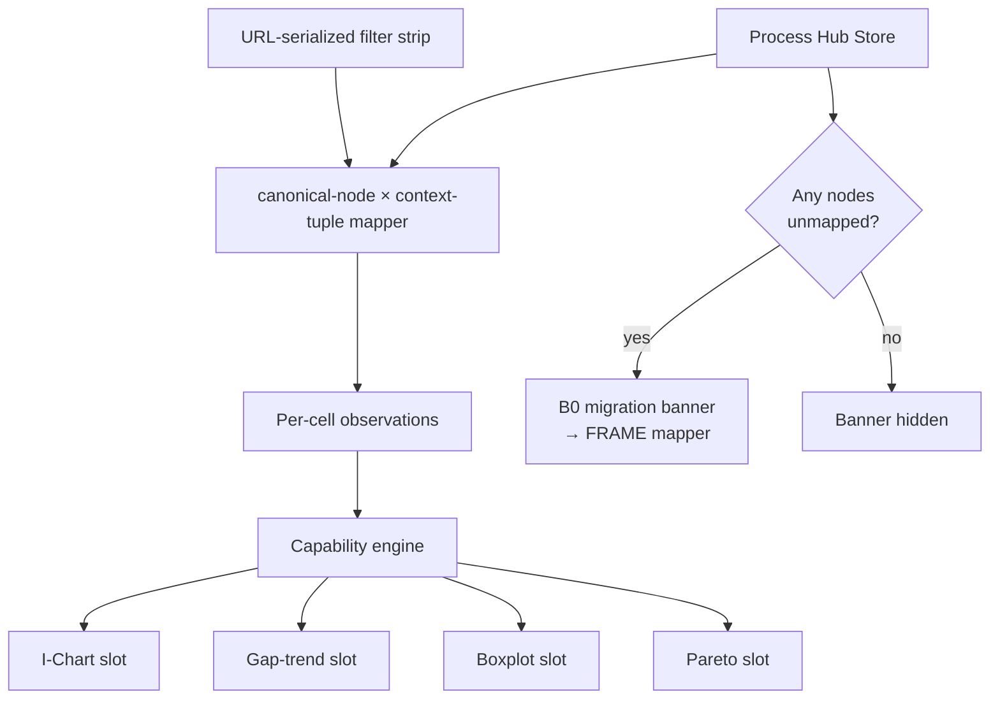

> **L4 engineering design** — extracted from `docs/03-features/analysis/process-hub-capability.md` on 2026-05-18 during SDD M3 audit. Capability summary stays in L3; implementation detail lives here.

# Process Hub Capability Tab Engineering Design

## Goal

Realize the L3 capability that surfaces hub-level capability reading (per-step Cpk distribution, capability over time, defect contribution) as a Hub-mounted workspace tab without ever displaying a single aggregated hub-level Cpk number — preserving the no-aggregation invariant from ADR-073.

## Mount point

Azure-only, mounted under the Process Hub view as a workspace tab at route `/hub/:hubId/capability`. The PWA does not have Hub IA today; this tab is part of the Azure-tier hub-first operating spine. Shipped via PR #106 (Plan C1).

## Components

The tab embeds the `ProductionLineGlanceDashboard` primitive in a fixed 2x2 grid. See [Production-Line-Glance design](../superpowers/specs/2026-04-28-production-line-glance-design.md) for the primitive's contract.

| Slot         | Chart                     | Reads                                                               |
| ------------ | ------------------------- | ------------------------------------------------------------------- |
| Top-left     | **Cpk vs target i-chart** | Per-step Cpk trend with target overlay; "are we hitting the bar?"   |
| Top-right    | **Cp-Cpk gap trend**      | Centering loss over time; "is the gap widening or closing?"         |
| Bottom-left  | **Per-step Cpk boxplot**  | Distribution of Cpk across steps; reveals heterogeneity at a glance |
| Bottom-right | **Per-step error Pareto** | Which steps contribute most to defect/error volume                  |

The boxplot is the load-bearing visualization: it shows the per-step Cpk _distribution_ without collapsing it into a mean. See [ADR-073](../07-decisions/adr-073-no-statistical-rollup-across-heterogeneous-units.md).

## Filter strip

A hub-level context-filter strip sits above the grid. Filter state is URL-serialized so cadence reviews can share the exact lens. The filter limits which (canonical-node × context-tuple) cells the dashboard reads; it never aggregates across heterogeneous spec contexts.

## Data flow

## B0 migration banner

When the hub contains investigations whose nodes are not yet mapped to canonical steps (B0 unmapped scope), a non-blocking banner appears above the dashboard pointing at the FRAME mapper. The dashboard still renders for the mapped portion.

## Drill A semantics

Clicking a step in any of the four charts opens the investigation that maps that step (Drill A: Hub → Step → Investigation). If no investigation maps the step, the drill becomes a "create investigation here" affordance. Drill A semantics are normative across all production-line-glance surfaces; see the [investigation-scope-and-drill-semantics design](../archive/specs/2026-04-29-investigation-scope-and-drill-semantics-design.md).

## Coexistence with Performance mode

Performance mode (per-channel Cpk inside one investigation) is _within-step_: how do the cavities/heads/lanes of a single station compare? The Hub Capability tab is _across-step_: how do the steps of a hub compare? Both can be open at once for the same hub; they answer different questions.

## No-aggregation principle (structural enforcement)

The tab never displays a single hub-level Cpk number. Per-step Cpks come from heterogeneous spec contexts and are not arithmetic-combinable; the boxplot shows their distribution and the analyst's eye does the pattern recognition. The engine exposes no `meanCapability` / `aggregateCpk` primitive. This is the structural enforcement described in [ADR-073](../07-decisions/adr-073-no-statistical-rollup-across-heterogeneous-units.md).

## Alternatives considered

A "Hub Capability Score" rolling all step Cpks into a single number was explicitly rejected in ADR-073. The score would hide heterogeneity — a hub with one terrible step and four excellent steps would score the same as a hub with five mediocre steps. The boxplot preserves the distribution and forces the analyst to see the spread.

## Testing strategy

- Architecture-grep test ensures no `meanCapability` / `aggregateCpk` import exists anywhere in the Hub Capability tab subtree (ADR-073 structural-absence guard).
- E2E test: open hub with B0 scope, verify banner renders + links to FRAME mapper.
- E2E test: URL-serialized filter round-trips (paste shared URL → identical filter strip state).
- Unit tests: per-slot chart contracts (I-Chart trend, gap-trend computation, boxplot quantiles, Pareto sort).

## See also

- [Production-Line-Glance design](../superpowers/specs/2026-04-28-production-line-glance-design.md) — the dashboard primitive.
- [Investigation Scope and Drill Semantics](../archive/specs/2026-04-29-investigation-scope-and-drill-semantics-design.md) — B0/B1/B2 scope, Drill A/B/C.
- [ADR-073](../07-decisions/adr-073-no-statistical-rollup-across-heterogeneous-units.md) — no statistical roll-up across heterogeneous units.
- [Process Hub design](../archive/specs/2026-04-25-process-hub-design.md) — the operating spine the tab plugs into.
