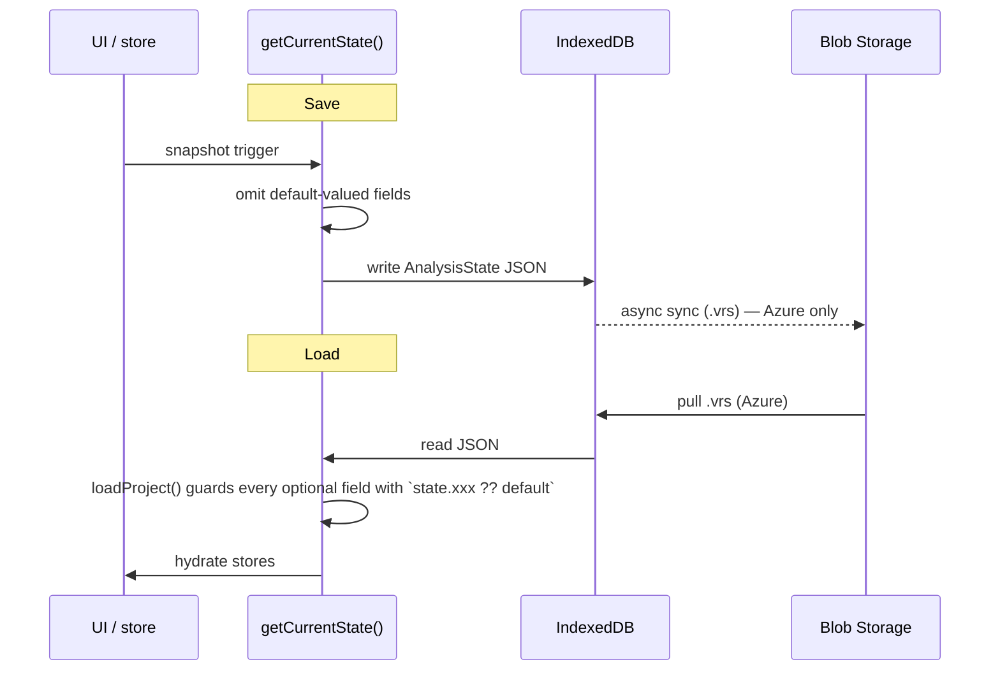

> **L4 engineering design** — extracted from `docs/03-features/data/storage.md` on 2026-05-18 during SDD M3 audit. Capability summary stays in L3; implementation detail lives here.

# Persistence Engine Engineering Design

## Goal

Realize the L3 persistence capability by defining the on-disk schema (`AnalysisState`), its backward-compatibility contract, the save/load flow, and the data-evolution rules that keep persisted state coherent across additive, subtractive, and mutation changes to user data.

## Storage targets

| Product   | Persistence Model                          | File Format |
| --------- | ------------------------------------------ | ----------- |
| PWA       | Session-only (React state, no storage)     | N/A         |
| Azure App | IndexedDB + Blob sync for Team (.vrs JSON) | `.vrs`      |

The PWA is a free training tool — data lives in memory and is lost on page refresh. The Azure App persists full project state to IndexedDB (instant) and syncs Team work to Blob Storage (background). See [ADR-072](../07-decisions/adr-072-process-hub-storage-and-coscout-context.md) for the current storage/context stance.

## AnalysisState schema

Every `.vrs` file contains an `AnalysisState` object. All fields marked optional use the listed default when absent — this is the backward-compatibility contract with older files.

### Core data

| Field          | Type                                      | Default | Notes                       |
| -------------- | ----------------------------------------- | ------- | --------------------------- |
| `version`      | `string`                                  | —       | Schema version              |
| `rawData`      | `DataRow[]`                               | —       | Full dataset (required)     |
| `outcome`      | `string \| null`                          | —       | Y variable column name      |
| `factors`      | `string[]`                                | —       | Selected factor columns     |
| `specs`        | `{ usl?, lsl?, target? }`                 | `{}`    | Global specification limits |
| `measureSpecs` | `Record<string, { usl?, lsl?, target? }>` | `{}`    | Per-measure spec overrides  |

### Filters

| Field         | Type                                 | Default | Notes                                             |
| ------------- | ------------------------------------ | ------- | ------------------------------------------------- |
| `filters`     | `Record<string, (string\|number)[]>` | `{}`    | Flat filter map (always present)                  |
| `filterStack` | `FilterAction[]`                     | `[]`    | Ordered drill trail for breadcrumb reconstruction |

When `filterStack` is present, flat `filters` are derived from it on load. When absent (old `.vrs`), flat `filters` are used directly — breadcrumbs will be empty but data filtering works.

### Display options

| Field            | Type             | Default     | Notes                            |
| ---------------- | ---------------- | ----------- | -------------------------------- |
| `displayOptions` | `DisplayOptions` | (see below) | Toggles, annotations, highlights |

`DisplayOptions` includes: `lockYAxisToFullData` (true), `showControlLimits` (true), `showViolin` (false), `showFilterContext` (true), `showSpecs` (true), `showCpk` (true), boxplot sort/highlights, pareto highlights, and chart annotations (boxplot, pareto, I-Chart).

### Settings

| Field           | Type                                     | Default | Notes                                         |
| --------------- | ---------------------------------------- | ------- | --------------------------------------------- |
| `axisSettings`  | `{ min?, max?, scaleMode? }`             | `{}`    | Y-axis configuration                          |
| `columnAliases` | `Record<string, string>`                 | `{}`    | Renamed column display names                  |
| `valueLabels`   | `Record<string, Record<string, string>>` | `{}`    | Custom value labels                           |
| `chartTitles`   | `ChartTitles`                            | `{}`    | Custom chart names (I-Chart, Boxplot, Pareto) |

### Process context

| Field            | Type             | Default | Notes                                        |
| ---------------- | ---------------- | ------- | -------------------------------------------- |
| `processContext` | `ProcessContext` | `{}`    | Structured process metadata for AI grounding |

`ProcessContext` includes: `description` (free text), `processType` ('manufacturing' | 'service' | 'laboratory' | 'logistics' | 'other'), `industry` (string), `measurementUnit` (string), `factorRoles` (Record<string, FactorRole> — keyed by column name, auto-inferred from column names), `processSteps` (string[]). All fields are optional — backward compatible with older `.vrs` files.

Factor roles are auto-inferred during `detectColumns()` using the parser keyword infrastructure. Users can confirm or correct inferred roles in ColumnMapping. The `description` field is editable in Settings.

### Workflow state

| Field               | Type             | Default     | Notes                          |
| ------------------- | ---------------- | ----------- | ------------------------------ |
| `cpkTarget`         | `number`         | `1.33`      | Performance Mode Cpk threshold |
| `stageColumn`       | `string \| null` | `null`      | Staged analysis column         |
| `stageOrderMode`    | `StageOrderMode` | `'auto'`    | Stage ordering                 |
| `isPerformanceMode` | `boolean`        | `false`     | Performance Mode active        |
| `measureColumns`    | `string[]`       | `[]`        | Selected measurement channels  |
| `selectedMeasure`   | `string \| null` | `null`      | Active channel drill           |
| `measureLabel`      | `string`         | `'Measure'` | Measure axis label             |

### View state

| Field       | Type        | Default     | Notes                         |
| ----------- | ----------- | ----------- | ----------------------------- |
| `viewState` | `ViewState` | `undefined` | Where the analyst was working |

`ViewState` includes: `activeTab` ('analysis' | 'performance'), `isFindingsOpen`, `isWhatIfOpen`, `focusedChart` ('ichart' | 'boxplot' | 'pareto' | null), `boxplotFactor`, `paretoFactor`, `findingsViewMode`. Captures the analyst's working position so reload resumes their context.

## Excluded by design (ephemeral)

These ephemeral UI states reset on each session:

- What-If simulator slider positions
- Point selections (Minitab-style brushing)
- Data quality report (recomputed from raw data)
- Investigation state (recomputes findings display from data)

## Save / load flow

`getCurrentState()` only includes non-default values for compact serialization. `loadProject()` guards every optional field with `state.xxx ?? default` for backward compatibility.

## Export / import

| Format | Contains                          | Use Case             |
| ------ | --------------------------------- | -------------------- |
| `.vrs` | Full AnalysisState (JSON)         | Project backup/share |
| `.csv` | Raw data only (via `downloadCSV`) | Data portability     |
| `.png` | Chart screenshot (2x resolution)  | Reports              |
| `.svg` | Chart vector export               | Print/presentations  |

## Backward compatibility contract

Old `.vrs` files load without error. Every new field is optional with a safe default:

- Missing `processContext` → empty object, no process metadata
- Missing `filterStack` → breadcrumbs empty, flat `filters` still work
- Missing `viewState` → Analysis tab, all panels closed
- Missing `cpkTarget` → defaults to 1.33
- Missing Performance Mode fields → Performance Mode off

## Data evolution rules

What happens to persisted state when data changes mid-analysis:

| Change        | filterStack | viewState         | specs |
| ------------- | ----------- | ----------------- | ----- |
| Edit cells    | valid       | valid             | valid |
| Append rows   | valid       | valid             | valid |
| Add columns   | valid       | valid             | valid |
| Add factor    | valid       | valid             | valid |
| Remove factor | cleaned     | factor refs reset | valid |

**Staleness strategy**:

- **Additive changes** (add rows, add columns, add factors): no invalidation. New data is available, old analysis stays valid.
- **Subtractive changes** (remove factor): clean dependent state (filterStack, viewState factor refs).
- **Mutation changes** (edit cells, add rows): Findings retain their observations but should be reviewed against updated data.

## Privacy / boundary invariants

- **All data stays local** — never sent to VariScout servers. Browser-only invariant from ADR-059.
- **No telemetry** — no usage tracking.
- **Blob sync** — Team data syncs to **customer-tenant** Blob Storage (Azure App only). Customer-owned data.
- **Clear = Gone** — clearing browser data deletes local projects. No recovery.

## Alternatives considered

- **Full storage in PWA** — rejected; the PWA is the free training tool and session-only state matches its pedagogical role. Persistence is an Azure-tier capability.
- **Per-field migration helpers** — rejected for V1 in line with the wedge V1 "no migration / no back-compat" memory entry; default-on-missing is enough until users exist. Strict-assert is the future direction (see `feedback_strict_assert_over_silent_migration`).
- **Eager serialization of all fields** — rejected; `getCurrentState()` omits default-valued fields for compact `.vrs` files. Smaller files round-trip faster through Blob sync.

## Testing strategy

- Round-trip unit tests: synthesize an `AnalysisState`, write via `getCurrentState()`, read via `loadProject()`, assert deep equality (modulo defaults).
- Backward-compat fixtures: hand-crafted old `.vrs` files (each missing one new field) must load without error and produce documented defaults.
- Data-evolution tests: each row in the "What happens to persisted state when data changes" table has a corresponding test asserting the documented staleness outcome.
- Privacy guard: integration test verifies that no AnalysisState bytes traverse a non-customer-tenant endpoint (Blob client must target the configured tenant URL only).

## See also

- [Blob Storage Sync](../08-products/azure/blob-storage-sync.md) — Azure-specific sync mechanism
- [ADR-072: Process Hub Storage and CoScout Context](../07-decisions/adr-072-process-hub-storage-and-coscout-context.md) — Current storage/context stance
- [PWA Session Model](../08-products/pwa/index.md#session-model) — Why the PWA doesn't persist
