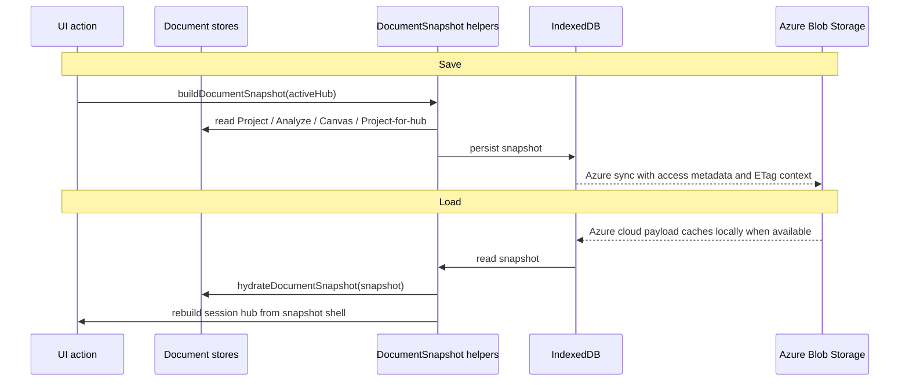

> **L4 engineering design** — extracted from `docs/03-features/data/storage.md` on 2026-05-18 during SDD M3 audit and recalibrated after the R6 `DocumentSnapshot` cutover.

# Persistence Engine Engineering Design

## Goal

Define the portable document persistence boundary around `DocumentSnapshot`: the runtime envelope that can save, export, import, hydrate, and sync one hub-scoped VariScout document without serializing unrelated in-memory mirrors or app-specific shell state.

## Persistence authorities

`@variscout/stores` owns the document boundary:

- `buildDocumentSnapshot()` reads the four Document-layer stores and an optional active hub shell.
- `hydrateDocumentSnapshot()` restores Project, Analyze, Canvas, and the hub-scoped live `ImprovementProject`.
- `resetDocumentStores()` clears the Document-layer state for new-document workflows.
- `.vrs` helpers build and parse snapshot-only document files.

The snapshot carries one document:

- Project config/data from `useProjectStore`
- Analyze findings, categories, hypotheses, causal links, and scopes from `useAnalyzeStore`
- Canvas document state from `useCanvasStore`, excluding undo/redo history
- A minimal hub shell and zero-or-one live `ImprovementProject` for the hub

`useImprovementProjectStore.projectsById` remains a multi-hub in-memory mirror. Portable snapshots never serialize the full mirror.

## Storage targets

| Product / path    | Persistence model                                    | Payload                                                                             |
| ----------------- | ---------------------------------------------------- | ----------------------------------------------------------------------------------- |
| PWA session       | In-memory domain stores                              | Current document only; refresh loses unsaved state unless the user saves or exports |
| PWA browser save  | IndexedDB via explicit "Save to this browser" action | Current `DocumentSnapshot`                                                          |
| PWA `.vrs`        | User-downloaded JSON file                            | Snapshot-only document envelope                                                     |
| Azure local cache | IndexedDB via Dexie                                  | `DocumentSnapshot` plus metadata/access fields used for listing and sync            |
| Azure cloud sync  | Customer-tenant Blob Storage                         | `analysis.json` snapshot payload, access metadata, and ETag sync state              |

The PWA remains browser-local and has no cloud sync. The Azure app syncs through the customer's tenant storage boundary; VariScout-operated infrastructure does not receive customer data.

## Document file envelope

`.vrs` files use a snapshot-only envelope:

```json
{
  "kind": "variscout.document",
  "version": 1,
  "exportedAt": "2026-06-01T00:00:00.000Z",
  "metadata": {
    "exportSource": "pwa"
  },
  "documentSnapshot": {
    "schemaVersion": 1
  }
}
```

The full `documentSnapshot` object includes the hub shell, Project state, Analyze state, Canvas state, and optional hub-scoped `ImprovementProject`. It does not include top-level duplicate hub/raw-data fields.

## Save / load flow



R6d will refine product semantics around Save, Save As, Export `.vrs`, imported-document identity, dirty state, and conflict UX. The runtime boundary above is the shared substrate those flows use.

## Access and concurrency

Azure saved documents are access-aware:

- Quick analyses without a formal `ImprovementProject` are private to the creator/current user.
- Formal Projects derive allowed users from `improvementProject.metadata.members`.
- Project lists filter documents before rendering so non-owned/non-invited users do not see them.

R6c established the data model and client filtering. R6e is the follow-up for server/SAS/storage-boundary enforcement.

Azure document writes use ETags/`If-Match` for conflict detection. When the cloud document changed, the app saves a conflict copy or surfaces the existing conflict path rather than silently overwriting.

## Export / import

| Format | Contains                                    | Use case                          |
| ------ | ------------------------------------------- | --------------------------------- |
| `.vrs` | Snapshot-only `variscout.document` envelope | Full document backup/share/import |
| `.csv` | Raw data only                               | Data portability                  |
| `.png` | Chart screenshot                            | Reports                           |
| `.svg` | Chart vector export                         | Print/presentations               |

The app has not launched, so R6c intentionally made a clean file-format cutover. Invalid or pre-R6 document files follow the normal invalid-file path.

## Excluded by design

Portable document snapshots do not include:

- Canvas undo/redo history
- View-layer state such as current tab, transient panels, and active selection
- Annotation/View stores unless a later decision explicitly moves them into the portable document contract
- Theme, preferences, local device settings, or active-user identity
- The full `projectsById` in-memory mirror

## Privacy / boundary invariants

- **Customer-owned data:** analysis data stays in the browser or the customer's Azure tenant.
- **No VariScout cloud data plane:** Azure sync uses customer-tenant Blob Storage and short-lived SAS tokens.
- **No telemetry payloads:** structural telemetry must not include raw data or PII.
- **Clear local data = local deletion:** clearing browser storage removes local cache; cloud recovery depends on the Azure storage copy and access policy.

## Testing strategy

- Store-level snapshot tests cover Project config fields, Analyze scopes, Canvas history exclusion, hub-scoped Project selection, hydration replacement, and document reset.
- `.vrs` tests prove the snapshot-only envelope builds, parses, and rejects malformed input.
- PWA tests cover export/import and Save-to-Browser reload of raw data, Analyze, Canvas, and Project state.
- Azure tests cover local/cloud snapshot payloads, access-aware listing, private quick analyses, Project roster access, and ETag conflict handling.

## See also

- [Blob Storage Sync](../08-products/azure/blob-storage-sync.md) — Azure-specific sync mechanism
- [Azure App Storage](../08-products/azure/storage.md) — IndexedDB/Blob details
- [ADR-072: Process Hub Storage and CoScout Context](../07-decisions/adr-072-process-hub-storage-and-coscout-context.md) — Storage/context stance
- [ADR-082: Wedge Architecture](../07-decisions/adr-082-wedge-architecture.md) — Single-SKU and Project membership model
