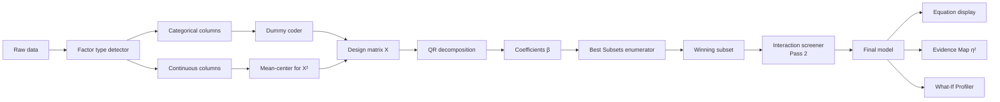

> **L4 engineering design** — extracted from `docs/03-features/analysis/regression-methodology.md` on 2026-05-18 during SDD M3 audit. Capability summary stays in L3; implementation detail lives here.

# Regression GLM Engine Engineering Design

## Goal

Realize the L3 capability that VariScout uses a unified General Linear Model engine to handle categorical + continuous factors and any mix, supporting Best Subsets, Evidence Map ranking, the What-If Profiler, and the regression equation display — all with NIST-StRD-grade numerical stability.

## Two-engine architecture

VariScout uses two statistical engines with distinct roles. The split is intentional: the ANOVA engine optimizes for the Boxplot panel's per-factor η² need; the GLM engine handles everything that needs mixed factor types or continuous prediction.

| Engine          | Used for                                                      | Why                                                         |
| --------------- | ------------------------------------------------------------- | ----------------------------------------------------------- |
| One-way ANOVA   | Boxplot factor display, per-factor η²                         | Fast, categorical-only, familiar to Six Sigma practitioners |
| Unified OLS/GLM | Best subsets, Evidence Map, What-If sliders, equation display | Handles mixed factor types, supports continuous prediction  |

Both engines agree exactly for categorical-only data — the cell-means model from ANOVA and the dummy-coded GLM are the same model expressed differently, so Factor Intelligence rankings computed by the GLM engine agree with the η² values shown in the ANOVA panel (within floating-point precision).

## Components



### Factor type detection

Before building any model, the engine classifies each column. Heuristic table:

| Unique values | Column values      | Classification |
| ------------- | ------------------ | -------------- |
| ≤ 6           | Any                | Categorical    |
| 7–20          | Mix of integers    | Categorical    |
| > 20          | Numeric            | Continuous     |
| Any           | Non-numeric (text) | Categorical    |

The analyst can override classification in the Column Mapping step (date column auto-detected as categorical → override to continuous time trend; head-number column 1–8 → keep categorical even though numeric).

### Best subsets enumerator

For _k_ factors, there are 2^k − 1 possible non-empty subsets. The engine evaluates all of them via **Furnival-Wilson leaps and bounds** to avoid exhaustive enumeration. For small k (≤ 10 factors), the result is exact.

**Group constraint**: a categorical factor with _m_ levels requires _m − 1_ dummy variables. Best subsets treats the entire dummy set as a unit — a categorical factor either enters the model completely or not at all. This prevents nonsensical partial inclusion (e.g., "Machine B" but not "Machine C").

**Selection criterion**: R²adj (adjusted R²):

```
R²adj = 1 − (1 − R²) × (n − 1) / (n − p − 1)
```

Where _n_ is sample count, _p_ is number of model parameters. R²adj is chosen over AIC/BIC because it answers the practitioner's natural question ("how much variation does this model explain?") directly and matches Minitab/Six Sigma convention.

### Regression equation form

For a model with one continuous factor (Temperature) and one categorical factor (Machine with levels A, B, C, D):

```
ŷ = β₀ + β₁ × Temperature + δ_B × [Machine=B] + δ_C × [Machine=C] + δ_D × [Machine=D]
```

Where β₀ is the intercept (baseline: Machine=A at Temperature=0), β₁ is the slope, δ_B/C/D are dummy effects relative to the reference level A (first category alphabetically). [Machine=X] is the indicator function.

**Two display modes**: natural-language view ("Temperature has a strong positive effect (β = 0.42)") and expanded math view (full equation with coefficients + standard errors). Toggle via the equation bar at the top of the Evidence Map.

### Quadratic detection

For each continuous factor, the engine fits two models and compares:

1. Linear-only: ŷ = β₀ + β₁ × X
2. Linear + quadratic: ŷ = β₀ + β₁ × X + β₂ × X²

If adding the quadratic term improves R²adj by a meaningful margin, it stays. The **centered form** `(X − X̄)` is used to reduce numerical correlation between X and X².

**Operating window** (when quadratic detected):

```
Optimum:           X* = −β₁ / (2 × β₂)
Operating window:  [X* − δ, X* + δ]  where δ is the 1%-degradation radius
```

The Sweet Spot card renders the optimum + window; the What-If Profiler shows the operating window as a shaded band on the continuous slider.

### Two-pass interaction detection

The engine uses a two-pass hierarchical approach that matches Minitab Best Subsets with interaction terms and JMP Fit Model.

- **Pass 1 (main effects)**: best subsets evaluates all 2^k−1 factor subsets, identifying the best main-effects model.
- **Pass 2 (interaction screening)**: for each pair of factors in the winning model, a partial F-test compares the main-effects-only model against a model with the interaction term added. If the interaction is significant (p < 0.10 screening threshold), the term enters the final equation.

This is computationally efficient — 6 extra OLS solves for 3 winning factors, vs 2 million for full enumeration — and methodologically sound: interactions between non-significant main effects are rarely meaningful.

**Interaction column types** (handled by the design-matrix builder):

| Pair type                 | Columns             | Example                           |
| ------------------------- | ------------------- | --------------------------------- |
| Continuous × Categorical  | (m−1) products      | Temperature × each Machine dummy  |
| Continuous × Continuous   | 1 centered product  | (Temp − mean)(Pressure − mean)    |
| Categorical × Categorical | (a−1)(b−1) products | Shift dummy × Machine dummy pairs |

### Pattern classification

Interactions are classified by their geometric pattern in the cell means: **ordinal** (ranking preserved, gap changes, lines don't cross) or **disordinal** (ranking reverses, lines cross within the observed range). This classification drives the question language and Evidence Map edge display. Language follows the "contribution, not causation" principle — geometric patterns only, never causal claims.

### Type III SS and partial η²

When a model contains multiple factors, each factor's contribution is computed **adjusted for all other factors** via Type III sum of squares.

```
Partial η² = SS_factor(Type III) / (SS_factor(Type III) + SS_residual)
```

Partial η² determines node size in the Evidence Map (large node = large unique contribution). Type III SS removes order dependency, which is correct for **unbalanced data** — real process data where not all factor-level combinations appear equally often.

### Evidence Map mapping

| Metric                    | Node attribute       | Meaning                                           |
| ------------------------- | -------------------- | ------------------------------------------------- |
| R²adj (best subsets)      | Node radial position | How close to center; stronger factors are central |
| Partial η²                | Node size            | Relative importance within the fitted model       |
| p-value (Type III F-test) | Evidence badge color | Statistical confidence (strong/moderate/weak)     |

## Guardrails

The engine surfaces automatic warnings for conditions that can mislead interpretation.

- **Extrapolation warning**: amber slider indicator + tooltip when What-If slider moves outside observed range for a continuous factor.
- **VIF (Variance Inflation Factor)**: `VIF_j = 1 / (1 − R²_j)`. Bands: 1–5 acceptable, 5–10 moderate concern, > 10 high multicollinearity. Triggers warning copy when VIF > 10.
- **Low R² warning**: when R²adj < 0.30 the engine surfaces a guidance prompt suggesting unobserved factors or time-ordering issues. Low R² is informative, not an error.
- **Overfitting check**: `R² − R²adj > 0.10` triggers warning, typically when k > n/10.

## What-If Profiler

The Prediction Profiler uses the fitted regression model to project outcomes for analyst-set factor values.

- **Continuous sliders** show a response curve: predicted value (blue line), 95% prediction interval (grey band), current operating point (filled dot), scenario point (empty dot dragged by analyst), operating window for quadratic factors (shaded region).
- **Categorical selectors** show a dot plot: one dot per level with predicted outcome; current level filled, others empty.
- **Cpk projection** combines the regression-predicted mean shift with the variance model:

  ```
  Projected Cpk = min(
    (USL − projected_mean) / (3 × σ_within),
    (projected_mean − LSL) / (3 × σ_within)
  )
  ```

- **Current vs scenario comparison**: side-by-side states show predicted outcome, Cpk, and estimated yield. Delta colored green (improvement) or red (degradation).

## Alternatives considered

- **AIC / BIC for model selection** — rejected in favor of R²adj because R²adj answers the practitioner's question directly and matches Minitab/Six Sigma convention.
- **Normal equations `(X'X)⁻¹X'y`** — rejected in favor of **QR decomposition (Householder reflections)** for numerical stability. Normal equations square the condition number of the design matrix; for correlated factors this amplifies numerical errors dramatically. The Longley NIST StRD dataset is the standard test of this.
- **Full enumeration of interactions** — rejected (2 million solves for 3 factors); hierarchical two-pass approach is the production choice.
- **Stepwise selection** — rejected; best subsets is the methodological superior for small k (≤ 10).

## Testing strategy

- **NIST Statistical Reference Datasets (StRD)** — engine validated against the standard set of certified benchmark datasets:

  | Dataset | Type                                  | VariScout accuracy    |
  | ------- | ------------------------------------- | --------------------- |
  | Norris  | Simple linear regression              | 9+ significant digits |
  | Pontius | Quadratic regression                  | 9+ significant digits |
  | Longley | Multiple regression (ill-conditioned) | 9+ significant digits |

- **GLM-ANOVA equivalence** — unit test verifies the GLM engine produces results mathematically equivalent to one-way ANOVA on categorical-only data (within floating-point precision).
- **Interaction detection** — fixture tests against synthetic ordinal + disordinal patterns confirm correct classification.
- **Guardrail thresholds** — unit tests verify each warning fires at its exact threshold (VIF > 10, R²adj < 0.30, R² − R²adj > 0.10, slider outside observed range).
- **Best subsets** — fixture tests against datasets where the optimal subset is known confirm the Furnival-Wilson implementation returns the exact result for k ≤ 10.

## References

| Topic                            | Source                                                                                                 |
| -------------------------------- | ------------------------------------------------------------------------------------------------------ |
| Best subsets regression          | NIST/SEMATECH e-Handbook of Statistical Methods, Section 4.6                                           |
| Furnival-Wilson leaps and bounds | Furnival, G.M. & Wilson, R.W. (1974). "Regressions by Leaps and Bounds." _Technometrics_ 16(4):499–511 |
| Type III SS                      | Montgomery, D.C. (2017). _Design and Analysis of Experiments_, 9th ed., Chapter 8                      |
| VIF and multicollinearity        | Belsley, Kuh & Welsch. _Regression Diagnostics_ (1980). Wiley.                                         |
| NIST StRD benchmark              | NIST Statistical Reference Datasets, https://www.itl.nist.gov/div898/strd/                             |
| Minitab Best Subsets             | Minitab 21 documentation — Best Subsets Regression                                                     |
| JMP Prediction Profiler          | JMP 17 documentation — The Prediction Profiler                                                         |
| QR decomposition                 | Golub, G.H. & Van Loan, C.F. (2013). _Matrix Computations_, 4th ed., Chapter 5                         |

## Benchmark comparison

| Capability                     | Minitab GLM               | JMP Fit Model          | VariScout                      |
| ------------------------------ | ------------------------- | ---------------------- | ------------------------------ |
| Cat × Cat interaction          | Yes                       | Yes                    | Yes                            |
| Cont × Cont interaction        | Yes                       | Yes                    | Yes                            |
| Cont × Cat interaction         | Yes                       | Yes                    | Yes                            |
| Interactions in model equation | Yes                       | Yes                    | Yes                            |
| Type III SS for interaction    | Yes                       | Yes                    | Yes                            |
| Pattern classification         | Manual (interaction plot) | Manual (Profiler)      | Automatic (ordinal/disordinal) |
| Hierarchical gating            | Optional                  | Stepwise               | Built-in (Layer 3 methodology) |
| Response surface / contour     | Yes (DOE)                 | Yes (Surface Profiler) | Not included (DOE scope)       |

## Cross-references

| Topic                                 | Document                                                                      |
| ------------------------------------- | ----------------------------------------------------------------------------- |
| ANOVA and η² (one-factor analysis)    | [Variation Decomposition](../03-features/analysis/variation-decomposition.md) |
| Factor Intelligence ranking           | [Factor Intelligence](../02-journeys/flows/factor-intelligence.md)            |
| Evidence Map spatial layout           | [Evidence Map](../archive/specs/2026-04-05-evidence-map-design.md)            |
| What-If Simulator (direct adjustment) | [Investigation to Action](../03-features/workflows/analyze-to-action.md)      |
| Implementation reference              | [Statistics Technical Reference](statistics-reference.md)                     |
| ADR decision record                   | [ADR-067](../07-decisions/adr-067-unified-glm-regression.md)                  |
