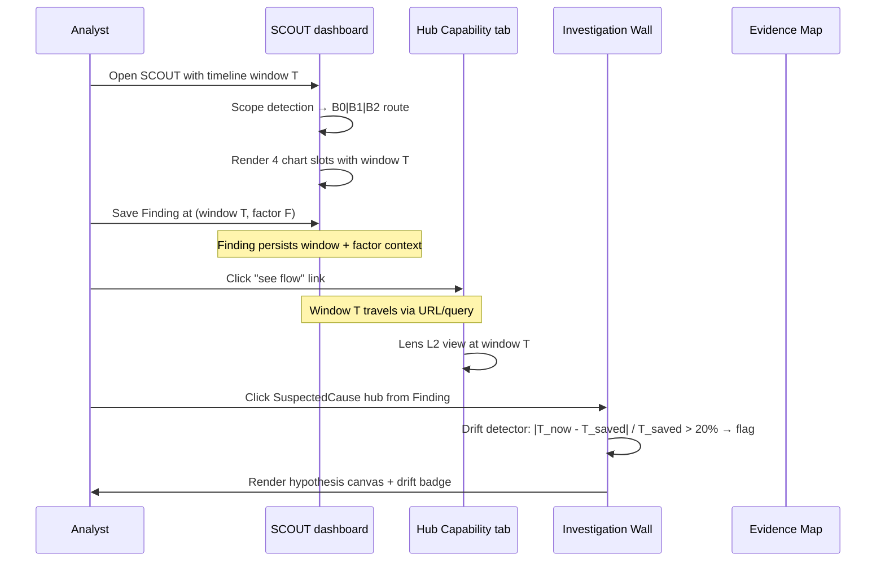

> **L4 engineering design** — extracted from `docs/03-features/analysis/multi-level-dashboard.md` on 2026-05-18 during SDD M3 audit. Capability summary stays in L3; implementation detail lives here.

# SCOUT Level-Spanning Engineering Design

## Goal

Realize the L3 capability that the SCOUT dashboard reads the **system outcome (L1 Y)** while lensing the **process flow (L2 X)** and **local mechanism (L3 x)** without re-rendering the workspace for each level. The boundary policy is enforced structurally — each surface owns exactly one level and lenses the others by linking, never by re-rendering.

## Surface-to-level ownership matrix

Each VariScout surface owns exactly one Process Learning Level and lenses the others by linking. The boundary is enforced structurally; see [ADR-074 — surface boundary policy](../07-decisions/adr-074-scout-level-spanning-surface-boundary-policy.md).

| Level                  | Owned by                                         | Lensed by                                            |
| ---------------------- | ------------------------------------------------ | ---------------------------------------------------- |
| **L1 — Outcome (Y)**   | SCOUT dashboard                                  | Hub Capability tab, Investigation Wall, Evidence Map |
| **L2 — Flow (X)**      | FRAME (authoring) + Hub Capability tab (reading) | SCOUT chrome, Investigation Wall                     |
| **L3 — Mechanism (x)** | Investigation Wall                               | SCOUT (factor selectors), Evidence Map, INVESTIGATE  |

## Components

In SCOUT V1, multi-level reading is delivered by three mechanisms:

1. **Scope detection strategy** — detects whether the data covers a baseline (B0), a single-node investigation (B1), or multiple nodes (B2) and routes data to the four chart slots accordingly. No new charts; the existing four-slot grid stays the same. See `2026-04-29-investigation-scope-and-drill-semantics-design.md` for B0/B1/B2 routing.
2. **Timeline window subsystem** — every chart, every metric, and every Finding agrees on the same temporal scope. See [Timeline Window Architecture](architecture/timeline-window-architecture.md) for the implementation; L3 capability reference at [Timeline Windows in Investigations](../03-features/analysis/timeline-window-investigations.md).
3. **Throughput primitives** — `computeOutputRate` and `computeBottleneck` ship in V1 to give L2 (flow) reading a baseline. Cycle time, FPY, RTY arrive in the second slice; OEE, takt, lead time, and WIP in the third. See the multi-level SCOUT design spec §8.

## Peer-surface relationships

SCOUT, the Process Hub Capability tab, the Evidence Map, and the Investigation Wall are **peers** in V1 — not siblings inside one pane. The dashboard is the entry point; the others are link targets.

| Surface                | Role                                                                                              |
| ---------------------- | ------------------------------------------------------------------------------------------------- |
| **SCOUT dashboard**    | Outcome reading. Four chart slots. Timeline window in chrome. Findings saved with window context. |
| **Hub Capability tab** | Flow reading. Per-step Cpk distribution, capability over time, hub-time rolling default.          |
| **Evidence Map**       | Factor network. Click a factor → focus its statistical context. Receives links from Findings.     |
| **Investigation Wall** | Hypothesis canvas. Hubs accumulate evidence (data + Gemba + expert) per SuspectedCause.           |

## Data flow

Crossing surfaces preserves the active timeline window. When you click from a Finding to its Evidence Map factor, or from a Hub Capability bar to a SuspectedCause hub, the window context travels with you. Drift detection runs on entry: if today's window has shifted more than 20% from the saved Finding context, the Finding flags it.

## Invariants (V1 scope freeze)

- The four chart slots (I-Chart, Variation Sources, Adaptive Lens, Pareto/Capability) keep their roles.
- Drill A (drill into a single factor) keeps its existing semantics.
- No new chart types. No Drill C, no Plan D, no per-mode multi-level expansion beyond Standard EDA.
- FRAME thin-spot helpers stay deferred — see decision-log §5.

## Question-routing table

The dashboard does not try to answer all four questions — it is the L1 reading surface. The other three are one click away.

- **Outcome question** ("Is the customer-facing measurement in spec? When did it shift?") → SCOUT dashboard with the timeline picker.
- **Flow question** ("Which step is the bottleneck? Which step has the worst Cpk?") → Process Hub Capability tab.
- **Mechanism question** ("What evidence supports this suspected cause? What's missing?") → Investigation Wall.
- **Factor question** ("Which factors drive this Y? How are they connected?") → Evidence Map.

## Alternatives considered

Re-rendering the workspace per level (a single pane that swaps mode) was rejected. Reasoning lives in ADR-074: cross-surface linking preserves analyst context (saved Findings, URL share, drift badges) better than mode-switching, and avoids coupling the four surfaces into a fragile super-component.

## Testing strategy

- Cross-surface timeline preservation: E2E tests verify that clicking from a Finding to its Evidence Map factor preserves the timeline window in the URL.
- Drift detection: unit tests in the timeline-window subsystem verify the 20% threshold flag fires when `|T_now - T_saved| / T_saved > 0.20`.
- Scope detection: unit tests against B0/B1/B2 fixture data confirm the strategy routes each scope to the expected chart-slot configuration.
- Boundary policy: architecture-grep test ensures no surface imports another surface's level-owned primitive (e.g., SCOUT must not import `meanCapability`; that's owned by the Hub Capability tab and gated by ADR-073 anyway).

## See also

- [Multi-level SCOUT design spec](../superpowers/specs/2026-04-29-multi-level-scout-design.md)
- [Investigation Scope and Drill Semantics](../superpowers/specs/2026-04-29-investigation-scope-and-drill-semantics-design.md) — B0/B1/B2 scope, Drill A/B/C
- [ADR-074 — surface boundary policy](../07-decisions/adr-074-scout-level-spanning-surface-boundary-policy.md)
- [Timeline Window Architecture](architecture/timeline-window-architecture.md)
