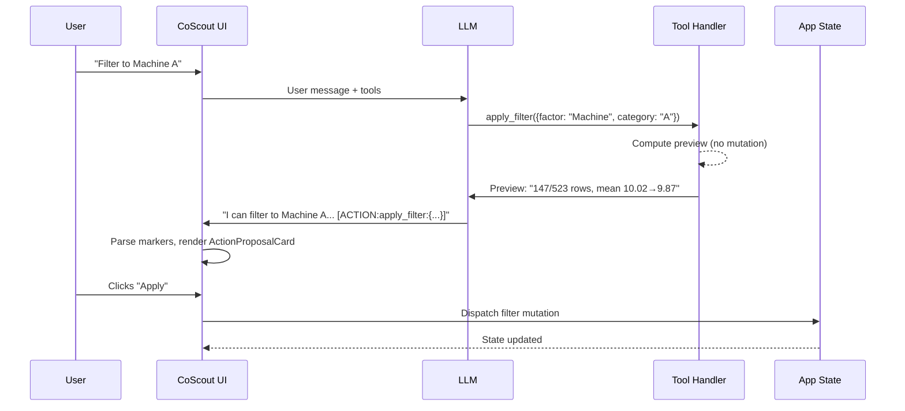

# ADR-029: AI Action Tools for CoScout

**Status**: Accepted

**Date**: 2026-03-19

## Context

CoScout currently has 3 read-only tools (ADR-028): `get_chart_data`, `get_statistical_summary`, and `suggest_knowledge_search`. These allow the AI to read analysis state and search for organizational knowledge — but CoScout cannot propose actions. An analyst asking "filter to Machine A" or "create a finding for this outlier" gets a text description instead of an executable proposal.

The gap is particularly visible in the investigation workflow (ADR-020), where the natural flow is: observe pattern → drill down → hypothesize → act. CoScout participates in observation and description but drops out at the action stage, forcing the analyst to manually translate AI suggestions into clicks.

The Responses API infrastructure (ADR-028) already supports function calling with tool call loops and strict JSON schemas — the foundation for action tools is in place.

## Decision

### Proposal Pattern

Action tools use a **proposal pattern** rather than optimistic mutation or background queuing:

1. **Tool execution phase** — The tool handler computes a preview (e.g., "Filter to Machine A would show 147 of 523 rows, mean shifts from 10.02 to 9.87") but does **not** mutate state.
2. **LLM response phase** — The model receives the preview and embeds `[ACTION:tool_name:params_json]` markers in its response text alongside natural language explanation.
3. **UI rendering phase** — `CoScoutMessages` parses ACTION markers and renders `ActionProposalCard` components inline with the message text.
4. **User confirmation** — The analyst clicks "Apply" on the proposal card, which dispatches the actual state mutation.

This preserves VariScout's core philosophy: **AI suggests, analyst confirms**. No state mutation occurs during the tool call loop.

### Tools Added

Ten new tools organized by type:

#### Read Tools (2)

| Tool                    | Purpose                                               | Parameters                           |
| ----------------------- | ----------------------------------------------------- | ------------------------------------ |
| `get_available_factors` | List factor columns with unique categories and counts | —                                    |
| `compare_categories`    | Compute stats for two categories side-by-side         | `factor`, `category_a`, `category_b` |

#### Action Tools (8)

| Tool                   | Purpose                                               | Parameters                                    |
| ---------------------- | ----------------------------------------------------- | --------------------------------------------- |
| `apply_filter`         | Propose drilling into a factor/category               | `factor`, `category`                          |
| `clear_filters`        | Propose removing all active filters                   | —                                             |
| `create_finding`       | Propose a new finding with title, description, status | `title`, `description`, `status`, `severity`  |
| `create_hypothesis`    | Propose a question or hypothesis linked to a finding  | `finding_id`, `statement`, `mechanism`        |
| `suggest_action`       | Propose an action item on a finding                   | `finding_id`, `title`, `owner`, `due_date`    |
| `share_finding`        | Propose sharing a finding to a Teams channel          | `finding_id`, `channel`, `message`            |
| `publish_report`       | Propose publishing the current report to SharePoint   | `title`, `include_charts`, `include_findings` |
| `notify_action_owners` | Propose sending notifications to action item owners   | `finding_ids`, `message`                      |

All tool schemas use `strict: true` and `additionalProperties: false` with null unions for optional fields, following OpenAI structured output requirements.

### Phase-Gating

Tool availability follows the journey phase model, ensuring tools match the analyst's workflow stage:

| Phase           | Available Tools                                                                                                                    |
| --------------- | ---------------------------------------------------------------------------------------------------------------------------------- |
| **FRAME**       | `get_chart_data`, `get_statistical_summary`, `suggest_knowledge_search`, `get_available_factors`, `compare_categories` (read-only) |
| **SCOUT**       | + `apply_filter`, `clear_filters`, `create_finding`                                                                                |
| **INVESTIGATE** | + `create_hypothesis` (questions or hypotheses), `suggest_action`, `share_finding`                                                 |
| **IMPROVE**     | + `publish_report`, `notify_action_owners`                                                                                         |

Sharing tools (`share_finding`, `publish_report`, `notify_action_owners`) are additionally gated to Team plan or higher via `isTeamPlan()`.

### Entry Scenario Routing

The system prompt adjusts tool emphasis based on the detected entry scenario (from `detectEntryScenario()`):

- **Problem**: Emphasize `create_finding` and `apply_filter` — help isolate the issue
- **Hypothesis**: Emphasize `create_hypothesis` (questions or hypotheses) and `compare_categories` — help validate the theory
- **Routine**: Emphasize `get_statistical_summary` and read tools — support monitoring

## Implementation

### File Changes

| File                                                             | Changes                                                                                                      |
| ---------------------------------------------------------------- | ------------------------------------------------------------------------------------------------------------ |
| `packages/core/src/ai/actionTools.ts`                            | New file — `ActionProposal` type, `parseActionMarkers()`, preview computation functions for each action tool |
| `packages/core/src/ai/prompts/coScout.ts`                        | Extended `buildCoScoutTools()` with phase-gating logic, tool routing instructions in system prompt           |
| `packages/hooks/src/useAICoScout.ts`                             | Accepts `toolsOptions: { phase, plan }` for phase-gating; passes to `buildCoScoutTools()`                    |
| `packages/ui/src/components/CoScoutPanel/ActionProposalCard.tsx` | New component — renders proposal preview with Apply/Dismiss buttons, status feedback                         |
| `packages/ui/src/components/CoScoutPanel/CoScoutMessages.tsx`    | Parses `[ACTION:...]` markers from message content, renders `ActionProposalCard` inline                      |
| `apps/azure/src/features/ai/useAIOrchestration.ts`               | 10 new tool handlers in the `toolHandlers` map; preview computation for each action tool                     |
| `apps/azure/src/pages/Editor.tsx`                                | Proposal state management, execution dispatch connecting proposal Apply to actual state mutations            |

### Tool Call Lifecycle

### Tool Availability by Phase

```mermaid
graph LR
    subgraph FRAME["FRAME (Read Only)"]
        A[get_chart_data]
        B[get_statistical_summary]
        C[suggest_knowledge_search]
        D[get_available_factors]
        E[compare_categories]
    end

    subgraph SCOUT["SCOUT (+Filters, Findings)"]
        F[apply_filter]
        G[clear_filters]
        H[create_finding]
    end

    subgraph INVESTIGATE["INVESTIGATE (+Questions/Hypotheses, Actions)"]
        I[create_hypothesis]
        J[suggest_action]
        K[share_finding]
    end

    subgraph IMPROVE["IMPROVE (+Notifications)"]
        L[publish_report]
        M[notify_action_owners]
    end

    FRAME --> SCOUT --> INVESTIGATE --> IMPROVE
```

## Consequences

### Positive

- **Actionable AI** — CoScout can propose concrete next steps, not just descriptions
- **Philosophy preserved** — "AI suggests; analyst confirms" via proposal pattern; no silent mutations
- **Phase-appropriate** — Tools match workflow stage; analysts are not overwhelmed with irrelevant actions
- **Composable** — Each tool is independent; adding new tools requires only a handler and schema
- **Auditable** — Every AI-proposed action is visible in the conversation log before execution

### Negative

- **System prompt growth** — 10 additional tool definitions increase prompt token usage (~800 tokens for full tool set)
- **Message parsing complexity** — `CoScoutMessages` must parse ACTION markers alongside markdown rendering
- **Preview computation cost** — Action tools compute previews (e.g., filtered stats) during the tool loop, adding latency

### Future

- **Autonomy dial** — User-controlled setting for AI independence: "suggest only" (current), "apply with notification", "apply silently for low-risk actions"
- **Progressive autonomy** — System learns which proposals are always accepted and suggests increasing autonomy for those patterns
- **Undo stack** — Action proposals could integrate with an undo system for reversible mutations
- **Multi-step proposals** — LLM could chain multiple ACTION markers into a workflow proposal ("filter, then create finding, then hypothesize")
