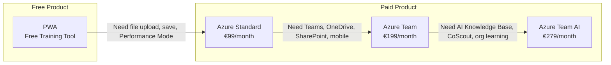

# Products

VariScout is a 2-product model: **free PWA** for learning and training, **paid Azure App** for teams.

> **GTM:** "Try it free at variscout.com. When you're ready for your team, get it on Azure Marketplace."

---

## Distribution Hierarchy

Per [ADR-007](../07-decisions/adr-007-azure-marketplace-distribution.md):



## Product Matrix

| Product                              | Status      | Distribution      | Use Case                                   | Pricing        |
| ------------------------------------ | ----------- | ----------------- | ------------------------------------------ | -------------- |
| **[Azure Standard](azure/index.md)** | **PRIMARY** | Azure Marketplace | Full analysis, local files                 | €99/month      |
| **[Azure Team](azure/index.md)**     | **PRIMARY** | Azure Marketplace | + Teams, OneDrive, mobile                  | €199/month     |
| **[Azure Team AI](azure/index.md)**  | **PRIMARY** | Azure Marketplace | + AI Knowledge Base, CoScout, org learning | €279/month     |
| [PWA](pwa/index.md)                  | Production  | Direct URL        | Training & education                       | FREE (forever) |
| [Power BI](powerbi/index.md)         | Planned     | AppSource         | Dashboard integration                      | TBD            |
| [Website](website/index.md)          | Production  | Public            | Marketing & docs                           | N/A            |

!!! tip "Getting Started"
**Free**: Start with the [PWA](pwa/index.md) — free training tool with copy-paste input and 16 sample datasets. Upgrade to the [Azure App](azure/index.md) for file upload, save/persistence, Performance Mode, and team features.

---

## Distribution Strategy

```
┌─────────────────────────────────────────────────────────────┐
│  VariScout on Azure Marketplace (PRIMARY)                   │
│                                                             │
│  Standard Plan     €99/month    Full analysis, local files  │
│  Team Plan         €199/month   + Teams, OneDrive, mobile   │
│  Team AI Plan      €279/month   + AI Knowledge Base, CoScout│
│                                  Unlimited users in tenant  │
│                                                             │
│  Offer type: Managed Application                           │
│  Billing: Microsoft (3% fee, monthly)                      │
│  Data: Stays in customer's Azure tenant                    │
└─────────────────────────────────────────────────────────────┘
```

---

## Feature Comparison

| Feature          | Azure App | PWA (Free) | Power BI         |
| ---------------- | --------- | ---------- | ---------------- |
| I-Chart          | ✓         | ✓          | Planned          |
| Boxplot          | ✓         | ✓          | Planned          |
| Pareto           | ✓         | ✓          | Planned          |
| Capability       | ✓         | ✓          | Planned          |
| Performance Mode | ✓         | -          | -                |
| File Upload      | ✓         | -          | -                |
| Save/Persistence | ✓         | -          | Power BI Service |
| Drill-Down       | ✓         | ✓          | Native           |
| Linked Filtering | ✓         | ✓          | Native           |
| Offline          | Cached    | ✓          | -                |
| Cloud Sync       | OneDrive  | -          | Power BI Service |
| SSO              | Microsoft | -          | Microsoft        |

---

## Pricing (Azure App)

| Plan     | Price      | Net Revenue         | Includes                                               |
| -------- | ---------- | ------------------- | ------------------------------------------------------ |
| Standard | €99/month  | €96.03/month (−3%)  | Full analysis, file upload, save, SSO, offline         |
| Team     | €199/month | €193.03/month (−3%) | + Teams, OneDrive, SharePoint, mobile, photos          |
| Team AI  | €279/month | €270.63/month (−3%) | + AI Knowledge Base, AI-enhanced CoScout, org learning |

| Aspect  | Value                                              |
| ------- | -------------------------------------------------- |
| Billing | Monthly (Microsoft handles billing, 3% fee)        |
| Model   | Per-deployment (one subscription per Azure tenant) |

**Standard** — all chart types, Performance Mode, Microsoft SSO, offline support, data stays in customer's Azure tenant.

**Team** — everything in Standard, plus Teams integration, OneDrive/SharePoint sync, mobile access, and photo evidence.

**Team AI** — everything in Team, plus AI Knowledge Base, AI-enhanced CoScout assistant, and organizational learning.

---

## Architecture

Both products share the same core packages:

```
@variscout/core     → Statistics, parsing, types
@variscout/charts   → Visx chart components
@variscout/hooks    → Shared React hooks
@variscout/ui       → UI utilities
```

This ensures:

- Identical statistical calculations across platforms
- Consistent chart appearance
- Shared methodology (Four Lenses)

---

## Deployment Models

| Product   | Deployment                             | Data Location               | License                          |
| --------- | -------------------------------------- | --------------------------- | -------------------------------- |
| Azure App | Managed Application to customer tenant | Customer's Azure + OneDrive | Deployment config (all features) |
| PWA       | Static hosting (public)                | Browser (session only)      | Free forever (training)          |
| Power BI  | AppSource                              | Power BI Service            | TBD                              |

---

## Support Model

| Level     | Included In | Support Channel      |
| --------- | ----------- | -------------------- |
| Community | PWA         | GitHub Issues        |
| Standard  | Azure App   | Email (24h response) |

---

## See Also

- [ADR-007: Azure Marketplace Distribution](../07-decisions/adr-007-azure-marketplace-distribution.md)
- [Azure Marketplace Guide](azure/marketplace.md)
