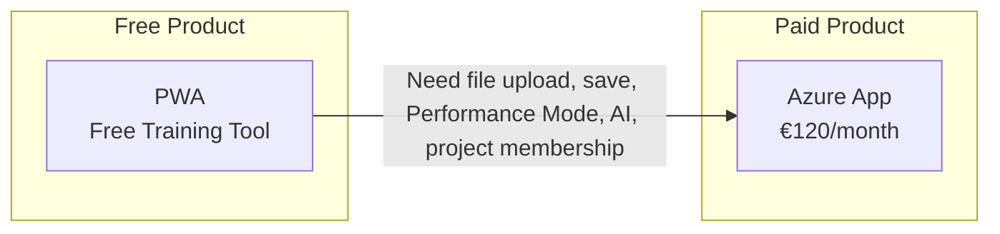

> **⚠️ Queued for V1 rewrite (Phase C.3)** — see [V1 architecture spec](../superpowers/specs/2026-05-16-wedge-architecture-design.md) + [ADR-082](../07-decisions/adr-082-wedge-architecture.md) for V1 canonical anatomy. tier/product summary collapses to PWA + €120 single SKU; VariScout Process noted as future product. Full content rewrite queued for Phase C.3 batch 4 (subagent-driven).

---

# Products

VariScout is a 2-product model: **free PWA** for learning and training, **paid Azure App** for teams.

> **GTM:** "Try it free at variscout.com. When you're ready for your team, get it on Azure Marketplace."

---

## Distribution Hierarchy

Per [ADR-007](../07-decisions/adr-007-azure-marketplace-distribution.md):



## Product Matrix

| Product                         | Status      | Distribution      | Use Case                                                                     | Pricing        |
| ------------------------------- | ----------- | ----------------- | ---------------------------------------------------------------------------- | -------------- |
| **[Azure App](azure/index.md)** | **PRIMARY** | Azure Marketplace | Full analysis, CoScout AI, Blob sync, project membership, Knowledge Catalyst | €120/month     |
| [PWA](pwa/index.md)             | Production  | Direct URL        | Training & education                                                         | FREE (forever) |
| Power BI (archived)             | Shelved     | —                 | Dashboard integration (not in development)                                   | —              |
| [Website](website/index.md)     | Production  | Public            | Marketing & docs                                                             | N/A            |

:::tip[Getting Started]
**Free**: Start with the [PWA](pwa/index.md) — free training tool with copy-paste input and 16 sample datasets. Upgrade to the [Azure App](azure/index.md) for file upload, save/persistence, Performance Mode, and team features.
:::

---

## Distribution Strategy

```
┌─────────────────────────────────────────────────────────────┐
│  VariScout on Azure Marketplace (PRIMARY)                   │
│                                                             │
│  VariScout         €120/month   Full analysis + CoScout AI  │
│                                 + Blob sync, project        │
│                                   membership, Knowledge     │
│                                   Catalyst                  │
│                                 Unlimited users in tenant   │
│                                                             │
│  Offer type: Managed Application                           │
│  Billing: Microsoft (3% fee, monthly)                      │
│  Data: Stays in customer's Azure tenant                    │
└─────────────────────────────────────────────────────────────┘
```

---

## Feature Comparison

| Feature          | Azure App | PWA (Free) |
| ---------------- | --------- | ---------- |
| I-Chart          | ✓         | ✓          |
| Boxplot          | ✓         | ✓          |
| Pareto           | ✓         | ✓          |
| Capability       | ✓         | ✓          |
| Performance Mode | ✓         | -          |
| File Upload      | ✓         | -          |
| Save/Persistence | ✓         | -          |
| Drill-Down       | ✓         | ✓          |
| Linked Filtering | ✓         | ✓          |
| Local cache      | ✓         | Session    |
| Cloud Sync       | Blob      | -          |
| SSO              | Microsoft | -          |

---

## Pricing (Azure App)

| SKU       | Price      | Net Revenue         | Includes                                                                                             |
| --------- | ---------- | ------------------- | ---------------------------------------------------------------------------------------------------- |
| VariScout | €120/month | €116.40/month (−3%) | Full analysis, CoScout AI, file upload, save, SSO, Blob sync, project membership, Knowledge Catalyst |

| Aspect  | Value                                              |
| ------- | -------------------------------------------------- |
| Billing | Monthly (Microsoft handles billing, 3% fee)        |
| Model   | Per-deployment (one subscription per Azure tenant) |

**Azure App (single SKU)** — all chart types, Performance Mode, CoScout AI, Microsoft SSO, Blob Storage sync, project membership (Lead / Member / Sponsor), photo evidence, Knowledge Catalyst, and organizational learning. Unlimited users in your Azure tenant. The legacy Standard (€79) / Team (€199) two-plan model is retired per [ADR-082](../07-decisions/adr-082-wedge-architecture.md).

---

## Architecture

Both products share the same core packages:

```
@variscout/core     → Statistics, parsing, types
@variscout/charts   → Visx chart components
@variscout/hooks    → Shared React hooks
@variscout/ui       → UI utilities
```

This ensures:

- Identical statistical calculations across platforms
- Consistent chart appearance
- Shared methodology (Four Lenses)

---

## Deployment Models

| Product   | Deployment                             | Data Location                    | License                          |
| --------- | -------------------------------------- | -------------------------------- | -------------------------------- |
| Azure App | Managed Application to customer tenant | Customer's Azure + browser cache | Deployment config (all features) |
| PWA       | Static hosting (public)                | Browser (session only)           | Free forever (training)          |

---

## Support Model

| Level     | Included In | Support Channel      |
| --------- | ----------- | -------------------- |
| Community | PWA         | GitHub Issues        |
| Standard  | Azure App   | Email (24h response) |

---

## Membership Philosophy

How V1 access control works — one product, role-based access inside. Lead / Member / Sponsor ACL replaces the prior multi-tier feature-gating model.

[:octicons-arrow-right-24: Membership Philosophy](membership-philosophy.md)

---

## See Also

- [ADR-007: Azure Marketplace Distribution](../07-decisions/adr-007-azure-marketplace-distribution.md)
- [ADR-082: V1 architecture (was: Wedge architecture)](../07-decisions/adr-082-wedge-architecture.md)
- [Azure Marketplace Guide](azure/marketplace.md)
- [Membership Philosophy](membership-philosophy.md)
- [Product Evaluation Narrative](presentations/variscout-product-evaluation-narrative-plan.md)
