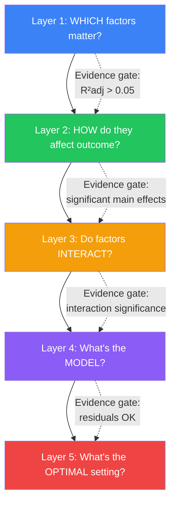
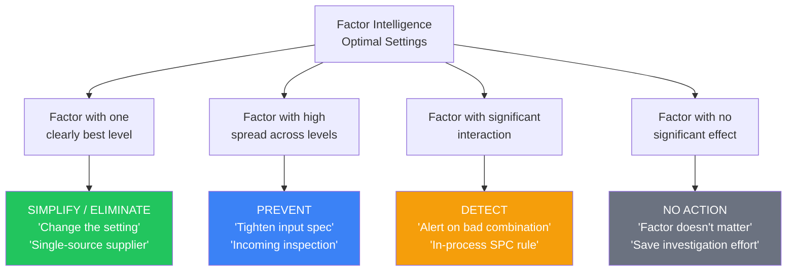
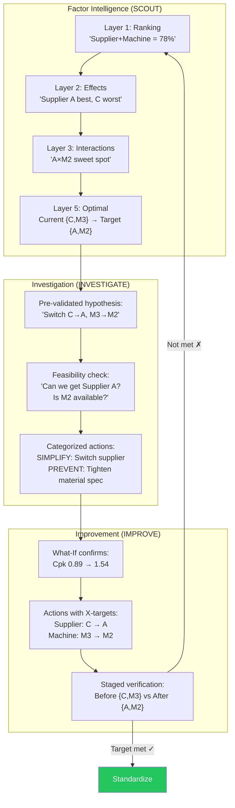

# The Ideal Factor Analysis Experience in VariScout

## The Teaching Progression as Design Principle

From the methodology discussion:

> "Don't search for the function first. Don't search for the equation first. Search for which variables make a difference... So that's best subsets regression. That's what you teach first."

Most statistics software gets this backwards — they start with regression modeling. The ideal VariScout feature follows the **teaching progression**: understanding before modeling.

---

## Five Layers of Progressive Factor Intelligence



Each layer **unlocks only when evidence from the previous layer supports it**. This prevents the "MBA student who wants an equation" anti-pattern and guides the analyst through disciplined thinking.

---

### Layer 1: WHICH Factors Matter?

**The question**: "Which variables contribute to overall explanation of variation?"

**Visualization**: Best Subsets Ranking Chart

```
                    R² adjusted
Supplier + Machine  ████████████████████  78%
Supplier            ██████████████        62%
Machine             ████████              41%
Supplier + Shift    ████████              39%
Shift               ██                    11%
Machine + Shift     ████████              38%
All three           ████████████████████  76%  ← penalty! less than Supplier+Machine
```

**Key insight the chart surfaces**: The 3-factor model (76%) scores _lower_ than the 2-factor model (78%) because R² adjusted penalizes for the extra parameter. Shift is noise. **This is the entire point of best subsets** — the simpler model wins when the extra factor doesn't contribute significant new information.

**What the analyst learns**: "I should focus on Supplier and Machine. Shift doesn't explain new variation."

**Evidence gate → Layer 2**: At least one subset has R²adj > 5% and is statistically significant.

---

### Layer 2: HOW Do They Affect the Outcome?

**The question**: "Now that I know which factors matter — in what direction and how much?"

**Visualization**: Main Effects Plot

```
            Supplier                        Machine
   ──────────────────────        ──────────────────────
   │                    │        │                    │
100│  ●                 │    100│                    │
   │   \               │        │          ●        │
 80│    \              │     80│         / \       │
   │     ●             │        │        /   \      │
 60│                    │     60│  ●   /     ●     │
   │                    │        │   \ /            │
 40│              ●    │     40│    ●              │
   │                    │        │                    │
   └───────────────────┘        └───────────────────┘
    A     B       C              M1   M2   M3   M4
```

Each factor gets a panel. The Y-axis shows the outcome mean for each level. **Steeper slopes = bigger effects.** This is what Minitab shows as "Main Effects Plot" and is one of the most widely taught Six Sigma visuals.

**What the analyst learns**: "Supplier A is best (highest mean), Supplier C is worst. Machine M2 is optimal."

**Complementary view: Dot Plot with CI** — Same data but showing individual observations + confidence intervals per level, not just means. Reveals whether the effect is real or just noise amplified by small samples.

**Evidence gate → Layer 3**: At least two factors have significant main effects (p < 0.05).

---

### Layer 3: Do Factors INTERACT?

**The question**: "Does the effect of one factor depend on the level of another?"

**Visualization**: Interaction Plot

```
         Supplier × Machine Interaction
   ──────────────────────────────────────
   │                                      │
100│  ●─────────●─────────●  Supplier A  │
   │                   ╱                  │
 80│            ╱─────●     Supplier B    │
   │    ●──────╱                          │
 60│  ╱                                   │
   │ ● ─ ─ ─ ─●─ ─ ─ ─ ─●  Supplier C  │
 40│                                      │
   └──────────────────────────────────────┘
        M1         M2         M3
```

**Non-parallel lines = interaction**. If Supplier A performs well on Machine M2 but poorly on M3, while Supplier C shows the opposite pattern — that's an interaction. You can't optimize one factor without considering the other.

**Quantification**: ΔR² — how much additional variation does the interaction term explain beyond the main effects? This is exactly what `interaction.ts` computed before it was deleted.

**What the analyst learns**: "Supplier A is best overall, but on Machine M3 specifically, Supplier B is actually better. The combination matters."

**Evidence gate → Layer 4**: Interaction ΔR² is significant. If no interactions, Layer 4 simplifies to main-effects-only model.

---

### Layer 4: What's the MODEL?

**The question**: "What's the equation, and can I trust it?"

This is where regression enters — but **only after the analyst understands the structure**. The model is a confirmation of what Layers 1-3 already revealed, not a discovery tool.

**Visualizations**:

1. **Fitted Line Plot** — Predicted vs. actual values. Points near the diagonal = good fit.
2. **Residual Plots** — Normal probability plot of residuals + residuals vs. fitted values. Patterns in residuals = model is missing something.
3. **Coefficient Table** — The regression equation coefficients with p-values and confidence intervals.

```
Model: Y = 87.2 + 12.4(Supplier A) - 8.1(Supplier C) + 6.3(Machine M2)

R²adj = 0.78    F(3,56) = 72.4    p < 0.001

Residuals: Normal (Shapiro-Wilk p = 0.34) ✓
           Homoscedastic ✓
           No autocorrelation ✓
```

**What the analyst learns**: The equation, but more importantly — **whether the equation is trustworthy** (residual diagnostics).

**Evidence gate → Layer 5**: Residuals pass normality and homoscedasticity checks.

---

### Layer 5: What's the OPTIMAL Setting?

**The question**: "What combination of factor settings gives the best outcome?"

**Visualizations**:

1. **Contour Plot** — 2D heatmap showing outcome as a function of two factors. The "sweet spot" is visible as a color region.
2. **Response Surface** — 3D version of the contour plot.
3. **Optimization Table** — Factor settings that maximize/minimize the outcome, with prediction intervals.

```
Optimal Settings:
  Supplier:  A
  Machine:   M2
  Predicted: 98.4 ± 3.2 (95% PI)
  Current:   72.1
  Δ:         +26.3

This corresponds to What-If projection: Cpk 0.89 → 1.54
```

**What the analyst learns**: The specific actionable recommendation — and its uncertainty.

**Connection to existing VariScout**: This feeds directly into the **What-If Simulator** and the **IMPROVE phase**. The optimization result becomes an improvement idea with a projected Cpk.

---

## How It Feels as a User Journey

```mermaid
flowchart LR
    subgraph SCOUT["SCOUT Phase"]
        S1["Load data, see I-Chart"]
        S2["Open Factor Intelligence"]
        S3["Layer 1: See ranking\n'Supplier+Machine = 78%'"]
        S4["Layer 2: See main effects\n'Supplier A is best'"]
        S3 --> S4
    end

    subgraph INVESTIGATE["INVESTIGATE Phase"]
        I1["Pin finding:\n'Supplier drives 62% of variation'"]
        I2["Layer 3: Check interactions\n'A×M2 is the real driver'"]
        I3["Hypothesis confirmed\nwith interaction evidence"]
        I1 --> I2 --> I3
    end

    subgraph IMPROVE["IMPROVE Phase"]
        IM1["Layer 4: Build model\n'Y = 87 + 12×A + 6×M2'"]
        IM2["Layer 5: Optimize\n'Switch to A + M2'"]
        IM3["What-If: Cpk 0.89 → 1.54"]
        IM1 --> IM2 --> IM3
    end

    S1 --> S2 --> S3
    S4 --> I1
    I3 --> IM1
```



The key UX insight: **It doesn't feel like "doing statistics"**. It feels like answering progressively deeper questions about your process. The math is invisible; the understanding is visible.

---

## What Existing VariScout Strengths This Builds On

| Existing Strength                          | How Factor Intelligence Uses It                                       |
| ------------------------------------------ | --------------------------------------------------------------------- |
| **Drill-down loop** (η² → filter → repeat) | Layer 1 replaces sequential guessing with systematic ranking          |
| **ANOVA engine** (anova.ts)                | Layers 1-3 are built on ANOVA sum-of-squares decomposition            |
| **Target Discovery** (TargetDiscoveryCard) | Layer 5 optimization → What-If → IMPROVE pipeline                     |
| **Hypothesis tree** (HypothesisTreeView)   | Layers 1-3 seed hypotheses with statistical evidence                  |
| **Staged analysis** (StagedComparisonCard) | Layer 5 verification: before vs. after optimization                   |
| **CoScout AI**                             | Each layer generates domain-aware coaching prompts                    |
| **Evidence-gated progression**             | Mirrors the Investigation Diamond (Initial→Diverge→Validate→Converge) |

---

## What Would Need to Be Built

| Layer               | Math                                   | Charts                 | Status                    |
| ------------------- | -------------------------------------- | ---------------------- | ------------------------- |
| **1: Ranking**      | `computeBestSubsets()`                 | R²adj bar chart        | ✅ Math done, chart = new |
| **2: Main Effects** | Group means per level (~50 lines)      | Main effects plot      | New                       |
| **3: Interactions** | ΔR² interaction (recoverable from git) | Interaction plot       | Recoverable               |
| **4: Model**        | Full regression (recoverable from git) | Fitted line, residuals | Recoverable               |
| **5: Optimization** | Constrained optimization (~100 lines)  | Contour plot, table    | New                       |

The interesting thing: **Layers 1-3 don't need the full regression engine at all.** They're pure ANOVA + effect calculations. Only Layer 4 needs regression, and Layer 5 needs optimization. The progressive disclosure means we can ship Layers 1-3 now and add 4-5 when the GLM engine is restored.

---

## From Statistical Intelligence to Process Action

### X-Level Targets: The Missing Link

Today VariScout has **Y-level targets** — "get Cpk to 1.33". Factor Intelligence adds **X-level targets** — specific factor levels or conditions to aim for:

| Target Type       | Today (Y-targets)         | With Factor Intelligence (X-targets)            |
| ----------------- | ------------------------- | ----------------------------------------------- |
| **Goal**          | "Improve the outcome"     | "Switch to Supplier A + Machine M2"             |
| **Evidence**      | Cpk gap                   | R²adj ranking + interaction analysis            |
| **Actionability** | Vague (what do I change?) | Specific (change _this_ factor to _that_ level) |
| **Verification**  | Before/after Cpk          | Before/after per-factor level                   |

### Optimal Settings → Categorized Improvement Strategies

Layer 5's optimal settings don't just tell you _what_ to change — the _type of gap_ per factor tells you **what kind of process action is needed**:



| Pattern in Data                                                | Process Perspective                        | Four Directions          | Example                                          |
| -------------------------------------------------------------- | ------------------------------------------ | ------------------------ | ------------------------------------------------ |
| **One level clearly best** (steep main effect)                 | Change machine settings, switch supplier   | **Simplify / Eliminate** | "Run at 180°C instead of 220°C"                  |
| **High spread across levels** (all means similar but σ varies) | Input quality, incoming material variation | **Prevent**              | "Tighten incoming steel spec from ±5% to ±2%"    |
| **Significant interaction** (non-parallel lines)               | Bad combinations that create defects       | **Detect**               | "Alert when Supplier C material hits Machine M3" |
| **No significant effect** (flat main effect)                   | Factor doesn't drive variation             | **No action**            | "Shift doesn't matter — stop investigating it"   |

### The Closed-Loop Flow



### What the Analyst Experiences

1. **SCOUT**: Open Factor Intelligence → instantly see "Supplier + Machine explains 78%" → see main effects → see the interaction → see optimal = {A, M2}

2. **INVESTIGATE**: Hypotheses arrive **pre-validated** with statistical evidence. The investigation focuses on _feasibility_ ("Can we switch?") not _reality_ ("Is this real?"). Each factor gets a categorized action type (simplify/prevent/detect/eliminate) based on the gap pattern.

3. **IMPROVE**: Each X has a **current → target** with predicted Y impact. Actions are specific ("Qualify Supplier A for Line 2"), not vague ("Improve quality"). What-If confirms Cpk impact. Staged analysis verifies per-factor.

4. **Verification**: Staged analysis checks not just "did Y improve?" but "did each X actually move to its target level?" — closing the loop completely.

### Mapping to Existing VariScout Types

Each optimal setting maps directly to a VariScout concept that already exists:

| Optimal Setting                       | Maps To                            | Existing Type                              |
| ------------------------------------- | ---------------------------------- | ------------------------------------------ |
| Factor A optimal level = "Supplier A" | Hypothesis with validated evidence | `Hypothesis` (status: `supported`)         |
| Current vs optimal gap per factor     | Improvement idea with direction    | `ImprovementIdea` (direction: `eliminate`) |
| Predicted Y at optimal                | What-If projection                 | `FindingProjection` (projected Cpk)        |
| Actual change to optimal              | Corrective action                  | `ActionItem` (owner, date, tracking)       |
| Before vs after verification          | Staged analysis                    | `StagedComparisonCard`                     |

No new data types are needed — Factor Intelligence _produces_ instances of types that already flow through the INVESTIGATE → IMPROVE pipeline.

### The Investigation Diamond Partially Collapses

The investigation diamond (Initial → Diverge → Validate → Converge) is designed for open-ended exploration. Factor Intelligence **pre-computes the diverge-validate cycle statistically**:

- **Diverge** (generate hypotheses) → Factor Intelligence already enumerated all 2^k-1 factor combinations
- **Validate** (test with evidence) → R²adj + p-values already answered "is this real?"

The analyst enters INVESTIGATE with **pre-validated hypotheses**. The investigation then focuses on **feasibility** ("Can we actually switch to Supplier A?") rather than **is this real?** — because the statistics already answered that.

### The Remaining Human Questions

Factor Intelligence answers the _statistical_ question but not the _practical_ ones:

- "We can't switch to Supplier A — they're 3× more expensive" → adjust to the **second-best subset** that's feasible
- "Machine M2 is at capacity" → a constraint that changes the optimization
- "There's a quality concern with A+M2 we know from experience" → Gemba knowledge the model doesn't capture
- "We could change the settings, but also improve input quality" → process perspective opens multiple solution types

That's where the INVESTIGATE phase still earns its place — it's the bridge between statistical optimality and operational reality. CoScout helps here: _"Factor Intelligence suggests Supplier A + Machine M2. Is this feasible for your process?"_

### What Makes This Different From Any Other SPC Tool

No SPC tool today makes this complete connection:

- **Minitab**: Does best subsets + regression but stops at the equation. No link to improvement actions.
- **JMP**: Has prediction profiler but no investigation/hypothesis framework.
- **SPC tools** (InfinityQS, Enact): Monitor Y but don't analyze X combinations.

VariScout with Factor Intelligence would be the first tool that goes from **"which factors matter"** all the way through to **"verify the fix worked, per factor"** in one continuous workflow — with the investigation/hypothesis framework bridging statistical intelligence and operational reality.
