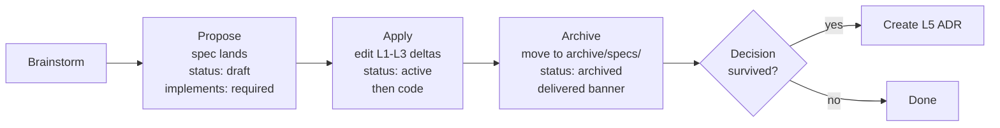

# Spec-Driven Development for VariScout

## Context

Today's authoring flow runs _backwards_: brainstorm → `docs/superpowers/specs/<date>-<topic>-design.md` → plan → code → product docs amended LAST (via Phase A/C cleanup sweeps). The Wedge V1 pivot (2026-05-16) was the textbook case: 8-round brainstorm → wedge-architecture-design.md → 6 PRs → Phase A canonical-anchor cleanup → Phase C 90-doc amendment sweep. Product docs were drift-followers, not source-of-truth.

User framing: _"we should have just one source of truth for specs, so we should update the real product specs first and then code"_ + _"we need high-level UI views integrated into these"_.

This spec flips the order: **vision → journeys → features → code**, with design specs as _proposed deltas_ to those layers (not parallel SSoT). UI views integrate as mandatory **Mermaid/ASCII intent diagrams inside L3 specs** — no Figma, no Storybook. The goal: Phase C audits stop existing because product docs are updated _before_ code, not after.

Grounded by 2024-2026 industry research: GitHub Spec Kit / AWS Kiro / OpenSpec / Tessl, Sean Grove's "The New Code" thesis, Anthropic Constitution precedent, Martin Fowler's spec-first/anchored/as-source framing, Stripe/Linear/Amazon/Anthropic authoring-stack patterns, Marty Cagan + Teresa Torres + Lean UX Canvas V2 + JTBD discovery patterns, and the emergent Wireloom/WireMD wireframes-in-markdown convention.

## The 5-Layer Stack

```
L1 Vision      docs/01-vision/        WHY VariScout exists       Stable; edit-in-place
L2 Journeys    docs/02-journeys/      WHO does WHAT              Living
L3 Features    docs/03-features/      WHAT system has            Living; intent diagram MANDATORY
L4 Engineering docs/05-technical/     HOW it's built (complex)   Stable once built; optional
L5 ADRs        docs/07-decisions/     WHY decision survived      Append-only; immutable

Design specs   docs/superpowers/specs/   Propose deltas to L1-L3; archive after delivery
Cards          docs/cards/               Atomic memory across layers
```

**The cascade**: Vision constrains Journeys; Journeys constrain Features; Features constrain Code. A change can only be coded if the cascade exists. No journey → orphan code. No feature → drift.

**Design specs are not a fourth SSoT layer** — they are _change proposals + plans-of-record_. After delivery, deltas are _absorbed_ into L1-L3 and the spec moves to `docs/archive/specs/` with a delivered banner.

### Frontmatter additions (universal)

```yaml
layer: L1 | L2 | L3 | L4 | L5         # new — enables validator + Steward routing
kind:  ui | workflow | engine |        # new — L3 only; gates intent-diagram type
       infrastructure
serves: [docs/02-journeys/X.md, ...]   # new — L3 references upstream L2
implements: [docs/0X-.../Y.md, ...]    # new — design specs only; required, non-empty
```

The existing schema (`purpose / tier / status / audience`) stays.

## Per-Layer Contracts

### L1 Vision — `docs/01-vision/`

**Purpose**: WHY VariScout exists. Strategic positioning, methodology, principles, market story.
**Audience**: human (humans + agents).
**Lifecycle**: stable; edit in place. Major edits PR-reviewed.
**Existing canonical files** (do not duplicate):

- `constitution.md` — non-negotiable principles
- `philosophy.md` — investigation philosophy
- `methodology.md` — operational methodology
- `product-overview.md` — V1 product orientation
- `business-bible.md` — market positioning + pricing
- `positioning.md`, `market-analysis.md`, `eda-mental-model.md`, `progressive-stratification.md` — supporting docs

**M2 reconciliation**: `constitution.md` is the existing principles canonical — extend it with V1 wedge principles (3 in-project personas, light-colors UI invariant) rather than creating a parallel `PRINCIPLES.md`. The light-colors rule also lives in `.claude/INVARIANTS.md` + `packages/ui/CLAUDE.md` for agent-context + build-time consumers.

**Intent diagram**: optional (prose-heavy by nature).

### L2 Journeys — `docs/02-journeys/`

**Purpose**: WHO does WHAT, in what sequence, to what outcome. Per-persona JTBD + Mermaid sequence + IA touchpoints.
**Audience**: both (humans + agents).
**Lifecycle**: living.

**Current state** (substantial, not thin):

- 4 top-level files (`index.md`, `case-based-learning.md`, `traceability.md`, `ux-research.md`)
- `personas/` (10 legacy persona files — Green Belt Gary, OpEx Olivia, etc.)
- `flows/` (18 flow files — first-time, azure-daily-use, etc.)
- `use-cases/` (14 use-case files)

**Wedge V1 reshape** (post-2026-05-16 pivot):

- **V1 in-project personas (3)**: Lead, Member, Sponsor — create per-persona journey files:
  - `personas/lead.md` — drives project end-to-end: Charter → Approach → Sustainment, 7-tab nav, active-IP cascade ownership
  - `personas/member.md` — contributes within a project: hypothesis evidence, measurement plan rows, action items
  - `personas/sponsor.md` — read-mostly + approval: Charter sign-off, Sustainment review
- **V1 ICP (buyer/champion)**: stays in L1 vision (`product-overview.md`), not L2. L2 is in-product journeys; L1 is market story.
- **Legacy personas (10)**: retire for V1 (mark `status: named-future` or move to `docs/archive/journeys/personas/`). Some (Trainer Tina, Engineer Eeva) graduate to VariScout Process (named-future).
- **Flows + use-cases**: re-anchor against the 3 V1 personas where applicable. Use-cases stay as L2-adjacent reference.
- **New L2 file**: `ia-nav-model.md` — Mermaid graph of 7-tab nav (`Home · Project · Process · Explore · Analyze · Improve · Report`) + active-IP cascade.
- **`index.md`** becomes a one-page journey index linking the V1 persona files + IA model + use-cases reference.

**Body shape per persona journey file**:

- Persona statement (who, in V1 in-project role terms)
- JTBD statement (canonical form: "When I [situation], I want to [motivation], so I can [outcome]")
- Mermaid sequence diagram (the steps the persona takes across 7-tab nav)
- Feature touch-points (cross-links to L3 features)
- Outcomes / success signals

**Intent diagram**: Mermaid sequence diagram mandatory per persona journey file; Mermaid nav graph mandatory in `ia-nav-model.md`.

### L3 Features — `docs/03-features/`

**Purpose**: WHAT capabilities the system has. One spec per feature.
**Audience**: both.
**Lifecycle**: living. Evolves from _hypothesis_ (pre-PMF) to _factual capability_ (post-shipment).

**Required structure per feature spec**:

1. **Problem** — what user need this addresses; cites L2 journey via `serves:` frontmatter
2. **Capability claim** — Lean UX hypothesis flavor pre-PMF; factual capability description post-shipment
3. **Intent diagram (MANDATORY)** per `kind:`:

   | `kind:`          | Required diagram                                    | Example                        |
   | ---------------- | --------------------------------------------------- | ------------------------------ |
   | `ui`             | ASCII / Mermaid wireframe of the key surface        | Investigation Wall card layout |
   | `workflow`       | Mermaid sequence diagram                            | Improve tab active-IP cascade  |
   | `engine`         | Mermaid flowchart / data-flow                       | Cpk compute path               |
   | `infrastructure` | "no surface — see L4 design doc" + 1-line rationale | pre-commit hook                |

4. **Acceptance signals** — testable conditions (link to E2E tests where applicable)
5. **Out of scope / non-goals** — explicitly named
6. **Links** — `serves:` upstream → L2 journey; `enables:` downstream → L4 design doc (if exists); `decisions:` → ADRs (if any)

**Frontmatter additions** (L3-specific):

```yaml
layer: L3
kind: ui | workflow | engine | infrastructure
serves: [docs/02-journeys/personas/lead.md, ...]
```

**Current state**: 48 files, deeply nested (`analysis/`, `workflows/`, plus root files). M3 will audit: ~30 stay as L3 (capability descriptions); ~18 move to L4 (implementation notes) OR fold into archived design-spec history.

### L4 Engineering — `docs/05-technical/`

**Purpose**: HOW it's built. Architecture, data model, API contracts, alternatives considered.
**Audience**: agent (primarily) + human.
**Lifecycle**: stable once the system is built; updated on architecture changes.
**Conditional**: only complex features get an L4 doc. Simple features have only L3.

**Body shape**:

- Goal (what L3 capability this realizes)
- Components (files, types, key functions)
- Data flow (Mermaid sequence or state diagram)
- Alternatives considered
- Testing strategy

**Intent diagram**: Mermaid data-flow or sequence diagram mandatory.

### L5 ADRs — `docs/07-decisions/`

**Purpose**: WHY decision survived implementation. Immutable record.
**Audience**: both.
**Lifecycle**: append-only. Superseded ADRs stay with banner pointing to the successor.

**No structural change** — just add `layer: L5` to existing ADR frontmatter. ADR-082 (wedge architecture), ADR-073 (no Cpk aggregation across heterogeneous specs), ADR-078 (Zustand store split) remain canonical decision records.

**Intent diagram**: optional.

## Design-Spec Lifecycle: Propose → Apply → Archive



### Propose phase

- Spec lands at `docs/superpowers/specs/YYYY-MM-DD-<slug>-design.md`.
- Frontmatter required:
  - `status: draft`
  - `layer: spec` (explicit — change-proposal, not L1-L5)
  - `implements: [...]` — non-empty array of L1/L2/L3 (and occasionally L4/agent-context) paths this spec proposes deltas to.
- Body has explicit **"Deltas"** section listing what changes in each `implements:` target. The deltas are _named_ at brainstorm time, not deferred.

### Apply phase

- **BEFORE code**: the `implements:` target docs are edited to reflect the new state.
- Spec status flips to `active`.
- The Apply phase may be one PR (docs + code) or two (docs-first, then code). The discipline: **L1-L3 update lands no later than code in the same merge group**.
- Validator can WARN if `status: active` for >30 days without `implements:` target touch (likely stalled).

### Archive phase

- After delivery: spec moves to `docs/archive/specs/<date>-<slug>-design.md`.
- Frontmatter flips to `status: archived`.
- Banner at top of file: `🗄 Archived YYYY-MM-DD — deltas absorbed into [list of implements: paths]`.
- ADR captured at this phase IF a decision survives (not every spec produces an ADR).

## UI Integration Policy

The 2025-2026 industry signal (Wireloom, WireMD, Anthropic Constitution markdown precedent): **wireframes inside markdown, hi-fi outside in design tools, never embedded raster screenshots**. For a single-founder + AI-agent operation, the lightest viable take:

| Artifact                                   | Policy                                                                                                                                                                  |
| ------------------------------------------ | ----------------------------------------------------------------------------------------------------------------------------------------------------------------------- |
| Mermaid / ASCII intent diagram per L3 spec | **Mandatory** (per `kind:`). Diffs cleanly, parseable by agents, ages well.                                                                                             |
| Hi-fi mockups (Figma)                      | **Not adopted.** The running app at `:5173` + `claude --chrome` is the hi-fi reference. Re-evaluate if multi-designer team.                                             |
| Component playground (Storybook)           | **Deferred.** Adopt when `@variscout/ui` exceeds ~30 primitives or a designer joins. Until then: Vitest test files + `packages/ui/CLAUDE.md` document behavior.         |
| Embedded raster screenshots in specs       | **Forbidden.** They go stale within a sprint. Cards may capture screenshots for visual milestones; specs may not.                                                       |
| Light-colors palette                       | **Invariant.** Tailwind 50-300 for surfaces; 400-700 for text/strokes. No dark mode V1. Lives in `.claude/INVARIANTS.md` + `constitution.md` + `packages/ui/CLAUDE.md`. |

**`claude --chrome` is the verification path** for UI features end-to-end (per the established `feedback_browser_e2e_use_official_extension` convention).

## Enforcement (3 mechanisms, single-founder pace)

### Validator additions (`scripts/check-doc-frontmatter.mjs`)

| Rule                                                                              | Severity  | Catches                                        |
| --------------------------------------------------------------------------------- | --------- | ---------------------------------------------- |
| Spec missing `implements:`                                                        | HARD-FAIL | "we'll update product docs later" anti-pattern |
| `implements:` paths that don't exist as files                                     | HARD-FAIL | broken cross-refs / typos                      |
| `layer:` outside enum                                                             | HARD-FAIL | layer-confusion                                |
| L3 `kind:` outside enum                                                           | HARD-FAIL | typos                                          |
| L3 missing intent diagram (heuristic: at least one ` ```mermaid ` OR ASCII block) | WARN      | feature spec without visual intent             |
| L3 missing `serves:`                                                              | WARN      | feature without journey anchor                 |
| Spec `status: active` 30+ days, no `implements:` target touch                     | WARN      | stalled spec                                   |

**Phased enforcement**: rules WARN-only during M1-M4 retrofit; flip to HARD-FAIL in M5.

### Pre-push hook + PR template (docs/code co-touch nudge)

- `.husky/pre-push`: WARN (non-blocking) if commit set touches `packages/*/src/` for feature work without any `03-features/` or `02-journeys/` touch. Single-founder hotfix pace needs non-blocking.
- `.github/pull_request_template.md` checkbox: _"L1-L3 docs updated for this change (or this PR is infrastructure-only)"_ — self-check.

### Steward loop extensions (read-only proposals)

Existing weekly Steward run (`pnpm docs:steward` + Mondays 09:00 UTC GH Action) gains 3 drift checks:

- Active design specs with no `implements:` target touch in 30+ days → propose Archive
- L3 specs without intent diagram → propose amendment
- `serves:` references pointing to non-existent journey files → propose fix or removal

Posts to existing `docs-steward` GH Issue label. No auto-edits (Steward stays read-only per existing design).

## Brainstorm-to-Code Flow Updates

| Skill                                     | Change                                                                                                                      |
| ----------------------------------------- | --------------------------------------------------------------------------------------------------------------------------- |
| `superpowers:brainstorming`               | Spec output now requires `implements:` frontmatter — brainstormer identifies L1-L3 deltas at spec-write time                |
| `superpowers:writing-plans`               | Plan output gains mandatory first task: _"Apply phase — edit `implements:` target docs to reflect new state"_               |
| `superpowers:subagent-driven-development` | Executes Apply task first (often a docs-only commit or opening commits of the feature branch) before any code-touching task |

These are upstream Superpowers skills. Recommend **VariScout-local override** under `.claude/skills/superpowers/` rather than upstream PR (decoupled from upstream cadence). Decide at M5.

## Migration (M0-M5 phases, executed in order)

### Phase M0 — Inventory + Capture Confidence (gates everything else)

Produce one card: `docs/cards/investigations/2026-05-18-sdd-migration-inventory.md` with three tables:

**Table 1 — Code → Feature coverage**: enumerate every `packages/*/` + `apps/*/src/` surface and map to L3 doc(s). Surface gaps where code exists but L3 doesn't.

**Table 2 — Existing `03-features/` classification**: 48 files, each classified as `capability-description / implementation-notes / stub` with action per file.

**Table 3 — Active design specs status**: 46 specs in `docs/superpowers/specs/`, each classified as `delivered / active / can't-retrofit` with `implements:` candidates.

Generated by 3 parallel Explore subagents + human review. **Confidence gate**: 90% code coverage + 90% feature classification + 95% spec status before M1 starts.

### Phase M1 — Frontmatter retrofit (1 PR, low risk)

- Extend `scripts/docs-frontmatter-schema.mjs` with `layer`, `kind`, `serves`, `implements`. All rules WARN-only initially.
- Script: `scripts/docs/retrofit-layer.mjs` auto-populates `layer:` from file path.
- Touch count: ~143 docs (12 vision + 4+42 journeys + 48 features + 5 technical + 74 ADRs — exact count from M0).

### Phase M2 — L1 reconciliation + L2 reshape (1 PR)

- **L1**: extend `docs/01-vision/constitution.md` with V1 wedge principles + light-colors invariant. **Do not create PRINCIPLES.md** — `constitution.md` is the existing canonical.
- **L2**: create V1 persona journey files (`personas/lead.md`, `member.md`, `sponsor.md`) + `ia-nav-model.md`. Mark legacy persona files (`green-belt-gary.md`, `opex-olivia.md`, etc.) as `status: named-future` or archive to `docs/archive/journeys/personas/`. Re-anchor `flows/` + `use-cases/` references against V1 personas.
- Rewrite `docs/02-journeys/index.md` as journey-index linking V1 personas + IA model + use-cases reference.
- Add `.claude/INVARIANTS.md` light-colors entry.
- Add `packages/ui/CLAUDE.md` Tailwind shade pattern.

### Phase M3 — L3 audit + reshape (incremental, 1-3 sub-PRs)

Execute Table 2 actions from M0:

- ~30 capability-description files stay as L3 — add `serves:` + `kind:` frontmatter; intent diagram added on next edit (no retroactive sweep).
- ~18 implementation-notes files graduate to L4 `docs/05-technical/` OR fold into nearest design-spec history.

### Phase M4 — Active design specs retrofit (incremental)

Execute Table 3 actions from M0:

- For each of 46 active specs: best-effort add `implements:` frontmatter pointing to L1-L3 docs.
- If delivered: archive with banner (moves to `docs/archive/specs/`).
- If can't be retrofitted (legacy specs predating the model): allowlist OR archive.
- Expected: 46 → ~10-15 truly active + ~30 archived + a few allowlisted.

### Phase M5 — Enforcement go-live (1 PR)

- Flip validator from WARN to HARD-FAIL for: missing `implements:` on specs, missing `layer:` on product docs, broken cross-refs, layer/kind enum.
- Add Steward drift checks (stalled active specs, missing intent diagrams, broken `serves:` refs).
- Local-override `.claude/skills/superpowers/{brainstorming,writing-plans,subagent-driven-development}/SKILL.md` with workflow changes above.
- Add PR template checkbox.
- Update `docs/agent-context/doc-discipline.md` with Propose → Apply → Archive lifecycle.
- Update `docs/llms.txt` to document 5-layer routing.

### PR clustering

| PR       | Phase                                        | Estimated effort    |
| -------- | -------------------------------------------- | ------------------- |
| PR-SDD-0 | M0 inventory card                            | ~half day           |
| PR-SDD-1 | M1 + M2 (schema + L1 reconcile + L2 reshape) | ~1-2 days           |
| PR-SDD-2 | M3 (L3 reshape)                              | Few days; can split |
| PR-SDD-3 | M4 (active specs retrofit)                   | Few days            |
| PR-SDD-4 | M5 (enforcement go-live + skill updates)     | ~half day           |

5 PRs over 2-4 weeks at single-founder pace.

## Deltas (named per `implements:` target)

This section makes the spec self-consistent: each `implements:` path lists the concrete edit.

### `docs/01-vision/constitution.md`

Extend with V1 wedge principles section: 3 in-project personas (Lead/Member/Sponsor), single-SKU pricing (€120/mo Azure tenant-wide), light-colors-only UI invariant. Add `layer: L1` frontmatter.

### `docs/02-journeys/index.md`

Rewrite as one-page journey-index listing V1 personas (Lead/Member/Sponsor) + IA model + use-cases reference. Add `layer: L2` frontmatter.

### `docs/02-journeys/personas/index.md`

Rewrite to list V1 personas as primary; legacy 10 personas marked `named-future` or archived. Add `layer: L2` frontmatter.

### `docs/03-features/index.md`

Update header: remove "Queued for V1 rewrite (Phase C.3)" warning (Phase C retires under this spec). Document feature spec body shape (problem/capability/intent-diagram/acceptance/scope/links). Add `layer: L3` frontmatter.

### `docs/05-technical/index.md`

Document L4 contract: conditional, only when implementation is non-trivial. Add `layer: L4` frontmatter.

### `docs/agent-context/doc-discipline.md`

Add new section: "Design-spec lifecycle — Propose → Apply → Archive". Document `implements:` frontmatter requirement. Cross-reference 5-layer stack.

### `docs/llms.txt`

Add 5-layer routing section: which layer agents should read for which question (L1 for principles, L2 for personas/journeys, L3 for features, L4 for engineering, L5 for decisions).

### `.claude/INVARIANTS.md`

Add "Visual design" entry: light-colors-only palette, Tailwind 50-300 surfaces / 400-700 text, no dark mode V1.

### `packages/ui/CLAUDE.md`

Add Tailwind shade pattern under a "Color discipline" section: use 50-300 surface utilities, pair with 600-800 text per accessibility (cross-ref `feedback_green_400_light_contrast`).

### `scripts/docs-frontmatter-schema.mjs`

Add `LAYER`, `KIND` constants and exports. Extend `serves:`/`implements:` as optional array fields. Initial WARN-only; flip to HARD-FAIL in M5.

### `scripts/check-doc-frontmatter.mjs`

Add rules per the Enforcement table above. WARN-only during M1-M4; HARD-FAIL after M5.

### `.github/pull_request_template.md`

Create (likely doesn't exist). Add checkbox: _"L1-L3 docs updated for this change (or this PR is infrastructure-only)"_.

### `.husky/pre-push`

Add non-blocking WARN check: if commit set touches `packages/*/src/` without `03-features/` or `02-journeys/` touch.

## Verification (end-to-end smoke test, after M5)

Run a small dummy brainstorm (e.g., "add a new placeholder feature foo"):

1. Confirm spec lands with `implements:` frontmatter.
2. Confirm plan includes Apply task first (before any code task).
3. Confirm subagent dispatches Apply before code.
4. Confirm ADR captured if applicable.
5. Confirm spec archived after delivery with banner.

This dogfoods the loop — the first new feature post-M5 validates end-to-end. Tests already enumerated in the plan file (`/Users/jukka-mattiturtiainen/.claude/plans/what-is-the-status-streamed-fountain.md`).

## Open Questions / Deferred

- **Storybook adoption** — deferred until `@variscout/ui` exceeds ~30 primitives or designer joins.
- **Figma adoption** — explicitly NOT adopting; revisit only if multi-designer team.
- **Steward auto-edit mode** — out of scope (already deferred in docs-strategy-2026 Phase 4).
- **Skill changes upstream vs local override** — default is local override under `.claude/skills/superpowers/`; revisit at M5.
- **Light-colors enforcement automation** — Steward could grep for Tailwind 700+ surface utilities; nice-to-have post-M5.
- **L2 use-cases relationship to L3 features** — use-cases (14 files) are journey-adjacent reference material; M3 may clarify their lifecycle (stay in L2 / graduate to L3 / archive).

## Sources

**Tools / repos surveyed**:

- GitHub Spec Kit — github.com/github/spec-kit
- AWS Kiro — kiro.dev
- OpenSpec — github.com/Fission-AI/OpenSpec
- Tessl — tessl.io
- Cursor rules + AGENTS.md unified standard
- Anthropic Claude Code best practices + Constitution (Jan 2026, CC0)
- Wireloom + WireMD — markdown wireframes

**Methodology references**:

- Sean Grove, "The New Code" (AI Engineer World's Fair 2025) — spec is the durable artifact
- Martin Fowler / Birgitta Böckeler — SDD 3 tools framing (spec-first / anchored / as-source)
- Marty Cagan (SVPG) — Opportunity Assessment over Lean Canvas
- Teresa Torres — Opportunity Solution Tree
- Jeff Gothelf — Lean UX Canvas V2 (replaces traditional PRD)
- NN/g — Personas vs Jobs-to-Be-Done (2025 position)
- Linear methodology — write issues not user stories; 1-2 page specs
- Amazon Working Backwards — PR-FAQ before any architecture

**VariScout precedent**:

- ADR-083 — frontmatter schema canonical
- `docs/superpowers/specs/2026-05-16-docs-strategy-design.md` — Phase 1-3 delivered; Phase 4 deferred
- `docs/superpowers/specs/2026-05-16-wedge-architecture-design.md` — Wedge V1 textbook case for the backwards-flow problem
- `docs/agent-context/doc-discipline.md` — "edit in place" principle; this spec extends to the lifecycle
- `docs/cards/` substrate (Phase 3) — generated-aggregate pattern reused for M0 inventory
- `feedback_check_shipped_patterns_first`, `feedback_systemic_before_patching`, `feedback_no_backcompat_clean_architecture` — informing the design
